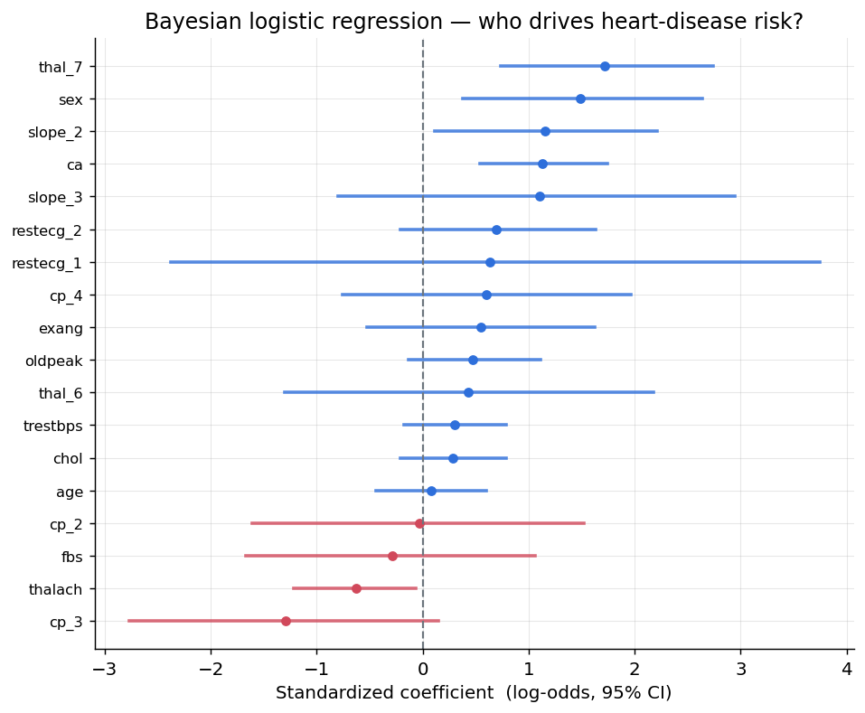
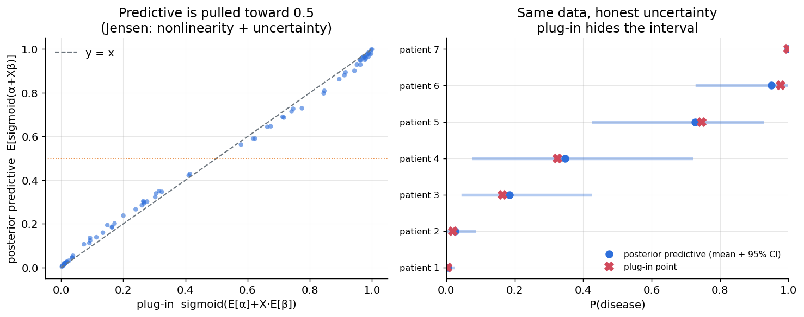
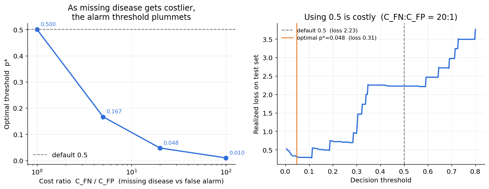
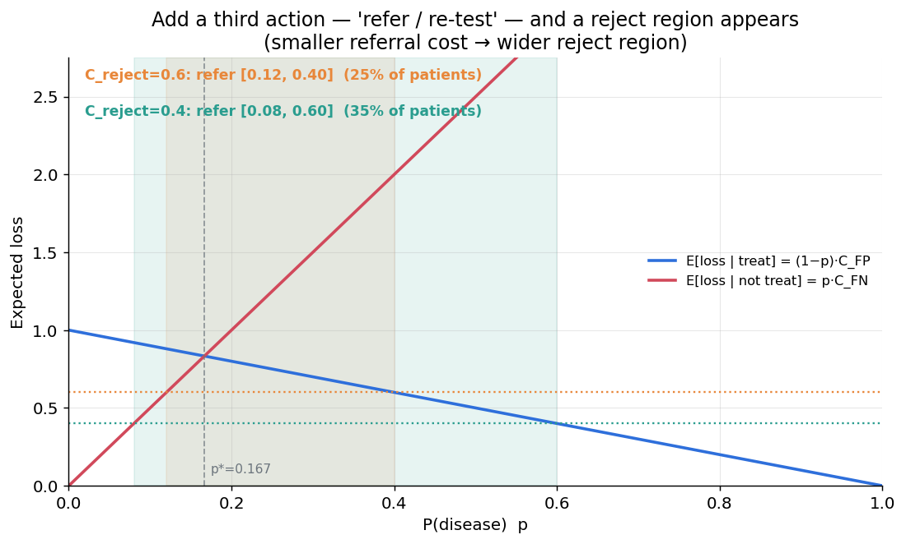
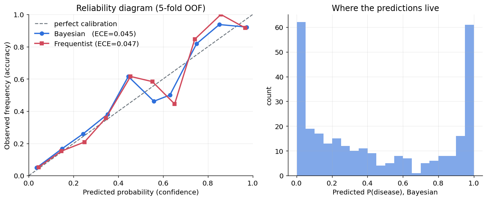
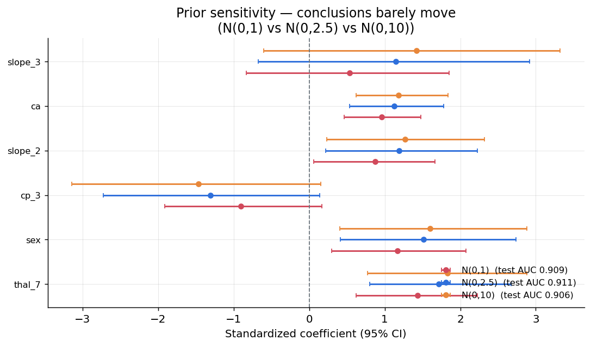

# A1 · 診斷決策系統：從後驗到「該不該治療」

## 一句話

> 用**貝葉斯邏輯迴歸 + 決策理論**，把心臟病診斷模型的告警門檻從預設的 0.5，
> 依成本比推導到**漏診:誤診 = 20:1 時的 0.048**（100:1 時降到 **0.01**），
> 在測試集上把期望損失**降低 86%**，並自動把 **25% 的高不確定病例導向轉診**。

對應計劃書 [`../貝葉斯推論_實作訓練計劃.md`](../貝葉斯推論_實作訓練計劃.md) §2 專案 A1。

## 為什麼這個問題需要貝葉斯

一個分類器可以有很高的 AUC，但那只回答「排序準不準」。臨床決策要的是三件 AUC 不管的事：

1. **這個機率有多可信？** —— 貝葉斯後驗預測給每個病人一條可信區間，plug-in 只給一個點。
2. **機率的絕對值準不準（校準）？** —— 期望損失直接吃 $p$，校準差就算錯。
3. **該用什麼門檻行動？** —— 由**成本比**決定，不是預設的 0.5。

資料：Heart Disease (Cleveland)，297 筆、one-hot 後 18 特徵、陽性率 46%。貝葉斯與頻率派 AUC 相近（0.908 vs 0.907）——**故事不在鑑別度，而在把機率變成決策的那一步。**

## 關鍵結果

### 1 · 後驗：誰驅動風險（帶不確定性）


`thal_7`（可逆缺損）、`sex`（男性）、`ca`（造影血管數）為正風險因子，`thalach`（最大心率）為保護因子——醫學上合理。類別稀少的特徵可信區間很寬，是**誠實的不確定性**。

### 2 · 後驗預測分佈 vs plug-in


因 sigmoid 非線性（Jensen），後驗預測被不確定性**拉向 0.5**。最極端的病人：plug-in 自信地說 **0.845**，後驗預測說 **0.798**，且附 95% CI **[0.37, 0.98]**——plug-in 把這個不確定性藏起來了（CI 平均寬度 0.35，plug-in 恆為 0）。

### 3 · 損失矩陣與最優門檻 ⭐


$p^* = C_{FP}/(C_{FP}+C_{FN})$。漏診越貴，門檻越低：

| 漏診:誤診 (C_FN:C_FP) | 1:1 | 5:1 | 20:1 | 100:1 |
|---|:-:|:-:|:-:|:-:|
| 最優門檻 p* | 0.500 | 0.167 | 0.048 | **0.0099** |

100:1 時門檻掉到 **≈0.01**，和預設 0.5 差**兩個數量級**。在 20:1 下，用 0.5 當門檻的測試集實際損失是 **2.23**，用最優 p*=0.048 是 **0.31**——**降低 86%**。

### 4 · 棄權選項（轉診 / 再檢查）


第三個行動固定成本 $C_{reject}$；當治療與不治療的期望損失**都**高於它時就棄權。棄權成本越小 → 棄權區越寬（$C_{reject}$=0.6 → 轉診 25% 病人；=0.4 → 35%）。這把「模型不確定就轉人工」變成一條可計算的規則。

### 5 · 校準 & 6 · 先驗敏感度



- **校準**（5-fold OOF，297 筆全用）：貝葉斯 ECE **0.045** vs 頻率派 **0.047**，兩者都貼近對角線——**誠實地說，此平衡資料上兩者相近**，貝葉斯的優勢在不確定性量化而非校準本身。
- **先驗敏感度**：N(0,1)/N(0,2.5)/N(0,10) 下測試 AUC 僅 0.906–0.911；較緊的先驗把係數往 0 收縮（正則化），但**符號、排序、AUC 穩定**——結論不依賴先驗的精確選擇。

## 方法

- **貝葉斯邏輯迴歸**（PyMC）：β~N(0,2.5)（標準化後的標準弱資訊先驗）、α~N(0,5)、y~Bernoulli(logit)。收斂 r̂=1.000、min ESS≈3900。
- **後驗預測**：用全部後驗樣本各預測再平均 `E[sigmoid(α+Xβ)]`，對比 plug-in `sigmoid(E[α]+XE[β])`。
- **決策**：損失矩陣 → 期望損失最小化 → p*；棄權為第三行動。
- **校準**：5-fold 交叉驗證 OOF 預測（per-fold 標準化避免洩漏）+ ECE。
- 對照組：sklearn `LogisticRegression`（頻率派基準）。

程式：[`src/data.py`](src/data.py) · [`bayes_logreg.py`](src/bayes_logreg.py) · [`decision.py`](src/decision.py) · [`calibration.py`](src/calibration.py) · [`plots.py`](src/plots.py) · [`run_all.py`](src/run_all.py)。

## 限制與誠實的部分

1. **校準**：此資料較平衡，貝葉斯與頻率派校準相近——不宜過度宣稱貝葉斯「校準更好」。它的主要價值在**不確定性量化**（每個病人的可信區間）。
2. **損失矩陣是外部假設**：$C_{FN}/C_{FP}$、$C_{reject}$ 由決策者輸入，結論隨之改變。這正是決策理論的價值：**把假設攤在陽光下**，而不是把 0.5 當成理所當然。
3. **樣本量**：297 筆、測試 75 筆，門檻的實際損失估計有抽樣噪音（校準已用 5-fold 緩解）。
4. **特徵工程**：名目類別已 one-hot，但未做交互作用/非線性——重點在決策層，不在特徵工程。

## 通關標準（計劃書 §2）

- [x] 損失比 100:1 時最優門檻掉到 **0.0099 ≈ 0.01**（和 0.5 差兩個數量級）
- [x] 用 0.5 當門檻的期望損失（2.23）**明顯高於**最優門檻（0.31），降低 86%
- [x] 棄權區在圖上清楚可見，$C_{reject}$ 越小區間越寬（0.28 → 0.52）
- [x] Reliability diagram 貼近對角線（ECE ≈ 0.045）

## 如何重現

```bash
conda activate bayes
python src/run_all.py        # 擬合 + 六張圖 + 所有數字（約 3 分鐘，含 5-fold 校準）
jupyter lab notebooks/       # 01 診斷決策 · 02 校準與敏感度
```

環境見專案根目錄 [`../README.md`](../README.md)；相依見 [`requirements.txt`](requirements.txt)。資料首次執行自動下載至 [`../data/A_medical/`](../data/A_medical)。

## 檔案結構

```
A1_diagnostic_decision/
├── README.md
├── requirements.txt
├── notebooks/
│   ├── 01_diagnostic_decision.ipynb          後驗 → 後驗預測 → 門檻 → 棄權
│   └── 02_calibration_and_sensitivity.ipynb  校準 + 先驗敏感度
├── src/
│   ├── data.py           載入 / 預處理 Heart Disease
│   ├── bayes_logreg.py   PyMC 貝葉斯邏輯迴歸 + 後驗預測 vs plug-in
│   ├── decision.py       損失矩陣 / 最優門檻 / 棄權選項
│   ├── calibration.py    reliability diagram + ECE
│   ├── plots.py          六張圖
│   └── run_all.py        一鍵重現
└── figures/              01–06 六張關鍵圖
```
