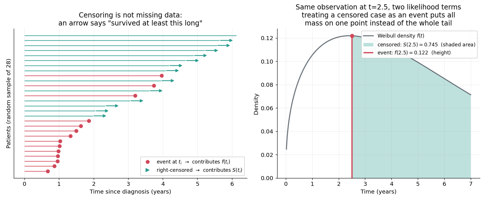
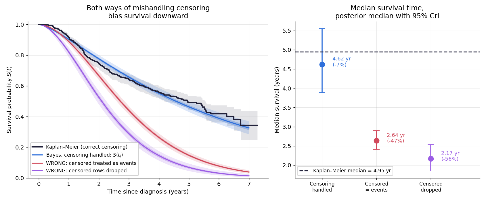
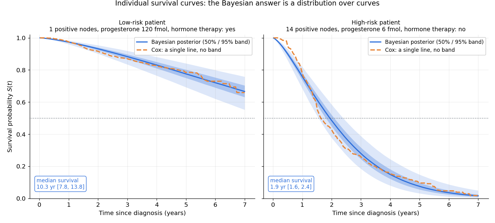
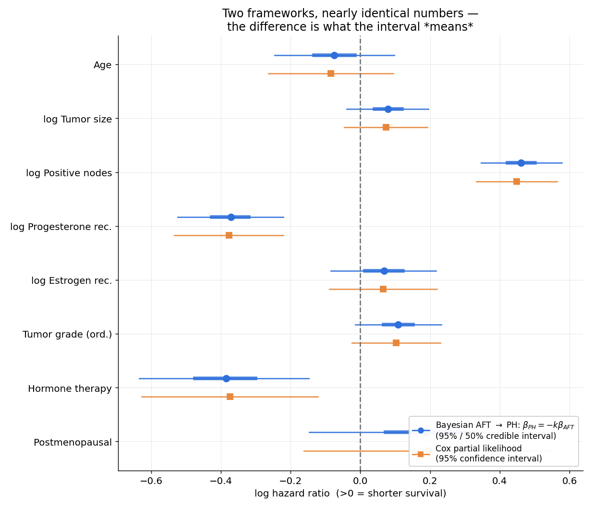
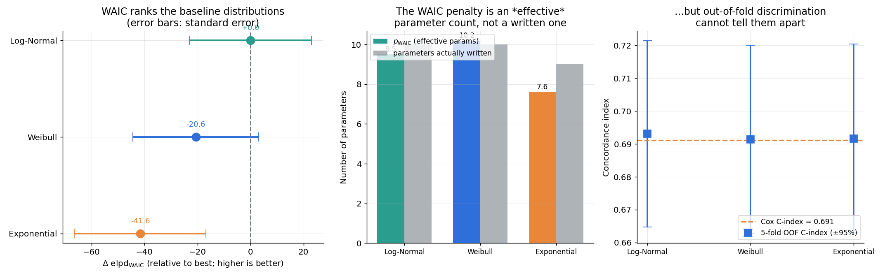
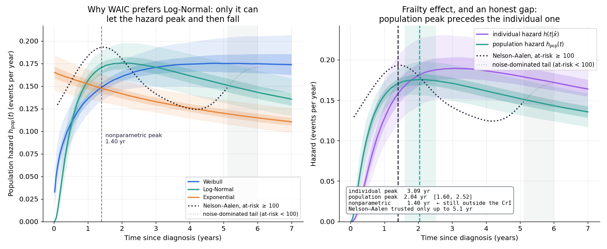
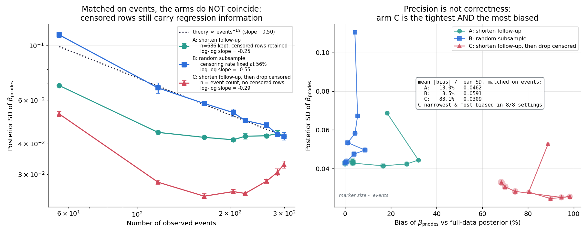

# A2 · 貝葉斯生存分析：不只預測會不會，還要預測何時

## 一句話

用 686 位乳癌病人的資料（**56.4% 在追蹤期結束時仍無事件**）示範右刪失如何進入似然：
正確處理刪失的貝葉斯 Weibull AFT 模型給出中位存活 **4.62 年**（Kaplan–Meier 基準 4.95 年，差 −6.6%），
而兩種常見的錯誤處理——把刪失當成事件、或把刪失整批丟掉——分別低估 **−46.7%** 與 **−56.2%**；
更關鍵的是，丟掉刪失的那個版本後驗**最窄**（sd 0.0309 vs 0.0462），偏差卻高達 **83%**：
**精度不是正確性**。

## 為什麼這個問題需要貝葉斯

追蹤期結束時還活著的病人，這筆資料不是「沒事件」，是「我還不知道」。

> 🔑 **刪失不是遺失資料。** 它攜帶真實資訊：「至少活到了 $t_i$」。

點估計在這裡不夠，有三個具體理由：

1. **病人問的是「我還能活多久」，不是「風險比是 1.4」。** 要回答前者需要一整條存活曲線，
   而且要帶不確定性——本專案的低風險病人中位存活 10.30 年 **[7.84, 13.82]**，
   高風險病人 1.94 年 **[1.57, 2.40]**。區間寬度本身就是臨床資訊。
2. **Cox 模型結構性地給不出這條帶。** 它用 partial likelihood 把基準風險 $h_0(t)$ 當成
   無窮維討厭參數消掉，代價是沒有 $h_0(t)$ 的估計就無法傳播它的不確定性。
3. **不確定性要能進下游決策。** 後驗可以直接積分算期望損失（A1 專案的主題），
   信賴區間需要額外論證。

## 資料：GBSG2

German Breast Cancer Study Group 2，lifelines 內建（`load_gbsg2`），免下載。

| | |
|---|---|
| 樣本 | 686 位淋巴結陽性乳癌病人 |
| 事件 | 299（復發或死亡） |
| **右刪失** | **387（56.4%）** |
| 追蹤 | 0.02 – 7.28 年 |
| 特徵 | 荷爾蒙治療、年齡、停經狀態、腫瘤大小、腫瘤分級、陽性淋巴結數、黃體素受體、雌激素受體 |

選它而非 lifelines 的 Rossi，就是因為這個高刪失率——主題要夠明顯。

**一個決定敘事方向的事實**：

```
事件者的中位觀察時間 : 1.77 年
刪失者的中位追蹤時間 : 3.95 年
```

刪失者被觀察得更久卻還沒發生事件——他們是**活得比較久**的那群人。
這解釋了為什麼兩種錯誤處理都往**同一個方向**錯（低估），儘管機制不同。

預處理：`progrec` / `estrec` / `pnodes` / `tsize` 極度右偏（skew 1.8–4.8），做 log1p 後降到 |skew|<0.6；
連續變數標準化（弱資訊先驗需要一致的尺度語意）；`tgrade` 當**有序**變數編碼 0/1/2
（省參數，686 筆裡 grade I 只有 81 人）。時間一律換算成**年**——Weibull 的 λ 是「特徵時間」，
用年為單位時 λ≈4.6 這種量級才配得上合理的弱資訊先驗。

## 刪失怎麼進入似然（本專案的靈魂）

事件與右刪失貢獻**不同的項**：

$$\mathcal{L} = \prod_{i:\,\text{事件}} f(t_i) \;\cdot\; \prod_{i:\,\text{刪失}} S(t_i),\qquad S(t)=1-F(t)$$

刪失貢獻 $S$ 而不是 $f$，因為觀察到的不是「在 $t_i$ 死亡」，而是**區間事件**
「真實事件時間 $T_i > t_i$」，其機率就是 $S(t_i)$。

參數化採 **AFT**（accelerated failure time）：$\log \lambda_i = \beta_0 + x_i\beta$，
係數語意是「$x_j$ 增加一個標準差，存活時間乘以 $\exp(\beta_j)$」。

### 手刻，然後驗證 `pm.Censored` 真的在算這件事

`pm.Censored` 是黑箱。手刻的目的不是取代它，而是**確認自己知道它在算什麼**——
不能重現它，就無法在它出錯（或我把參數化搞錯）時發現。**逐點**比對，不只比總和：

| 分佈 | 逐點最大絕對誤差 | 通過 |
|---|---|:-:|
| Weibull | 2.22 × 10⁻¹⁶ | ✅ |
| Log-Normal | 2.26 × 10⁻⁸ | ✅ |
| Exponential | 4.44 × 10⁻¹⁶ | ✅ |

Log-Normal 的誤差稍大是 scipy 與 pytensor 的 `erfc` 實作差異，不是邏輯錯誤。

實作關鍵：`pm.Censored` 的 `upper` 界對事件筆設 `inf`、對刪失筆設**它自己的觀察時間**，
就自動切換到存活函數（`observed == upper` → `logp = log S(upper)`）。

## 關鍵結果

### 1 · 刪失似然的直覺



左：隨機 28 位病人的時間軸，圓點是事件、箭頭是刪失（「至少活到這裡」）。
右：同一個觀察時間的兩種似然貢獻——**事件是一個高度 $f(t)$，刪失是一整條尾巴的面積 $S(t)$**。
把刪失當成事件，等於把全部機率質量押在一個點上，而真實事件時間必然在它右邊。

### 2 · 通關標準 1：忽略刪失 → 存活時間被系統性低估



| 做法 | 用到的資料 | 中位存活 | 95% CrI | vs KM |
|---|---|---|---|---|
| **正確處理刪失** | 686 筆全用 | **4.62 年** | [3.89, 5.55] | **−6.6%** |
| 錯誤 B：刪失當成事件 | 686 筆（387 筆時間被當成死亡時間） | 2.64 年 | [2.41, 2.90] | **−46.7%** |
| 錯誤 A：丟掉刪失 | 只剩 299 筆事件 | 2.17 年 | [1.85, 2.53] | **−56.2%** |

Kaplan–Meier（正確處理刪失的非參數基準）中位存活 **4.95 年**。

左圖裡正確處理的曲線貼著 KM，兩種錯誤做法都掉到 KM 下方。**通關標準 1 達成。**

### 3 · 通關標準 2：個體存活曲線帶不確定性帶



| 病人 | 特徵 | 中位存活 | 95% CrI | $S(t)$ 在 1.78 年的 95% 帶寬 |
|---|---|---|---|---|
| 低風險 | 1 顆陽性淋巴結、黃體素 120 fmol、有荷爾蒙治療 | 10.30 年 | [7.84, 13.82] | 0.045 |
| 高風險 | 14 顆陽性淋巴結、黃體素 6 fmol、無荷爾蒙治療 | 1.94 年 | [1.57, 2.40] | 0.200 |

高風險病人的帶寬是低風險的 **4.4 倍**——「這個預測有多可信」隨病人而異，
單一條 Cox 曲線無法表達這件事。**通關標準 2 達成。**

### 4 · 兩派對話：AFT → PH 換算後與 Cox 幾乎重合



Weibull 是少數**同時是 AFT 也是 PH** 的分佈族，所以係數可以換算成 hazard ratio 直接對照：

$$h(t|x)=\frac{k}{\lambda^k}t^{k-1},\ \lambda=e^{\beta_0+x\beta_{AFT}}\ \Longrightarrow\
h(t|x)=k\,t^{k-1}e^{-k(\beta_0+x\beta_{AFT})}\ \Longrightarrow\ \boxed{\beta_{PH}=-k\,\beta_{AFT}}$$

換算後與 Cox 的 partial likelihood 估計比對：**平均 |差| = 0.0078，最大 0.0124**。
頻率派 Weibull AFT 的 MLE shape $\rho = 1.423$ 對上貝葉斯後驗 $k = 1.391$ [1.260, 1.528]。

數字幾乎重合——**這件事本身就是結論**：先驗確實是弱資訊的，沒有偷偷主導；
資料充足時兩派收斂。貝葉斯的價值不在「答案不同」，而在答案能被正確地當成機率解讀、
且能自然傳播到個體預測與下游決策。

臨床方向也對得上：`pnodes` 的 $\beta_{AFT}=-0.332$（淋巴結數每多一個標準差，
存活時間 ×0.72）、`horTh` $=+0.279$（荷爾蒙治療延長 1.32 倍）、`progrec` $=+0.268$。

**區間的意義不同（主題三）**：Cox 的 95% 信賴區間，機率屬於**程序**——重複研究很多次，
95% 的區間會覆蓋真值，對手上這一個區間不能說「有 95% 機率落在裡面」。
貝葉斯的 95% 可信區間，機率屬於**參數**——給定資料與先驗，參數在區間內的後驗機率就是 95%。
數值上幾乎一樣，意義上不同，而要做決策時意義才是重點。

### 5 · 通關標準 3：WAIC / LOO 排序三個基準分佈



| 模型 | elpd_WAIC | se | $p_\mathrm{WAIC}$ | 寫出的參數 | max Pareto $k$ |
|---|---|---|---|---|---|
| **Log-Normal** | **−790.99** | 23.01 | 9.50 | 10 | 0.44 |
| Weibull | −811.64 | 23.79 | 10.18 | 10 | 0.39 |
| Exponential | −832.61 | 24.84 | 7.60 | 9 | 0.29 |

Log-Normal 勝出：$\Delta\mathrm{elpd} = 20.65$、$\mathrm{dse} = 4.26$ → **4.8σ**。
max Pareto $k = 0.44 < 0.7$，LOO 估計可靠。

**$p_\mathrm{WAIC}$ 的意義**：它是「有效參數個數」，等於逐點 log-likelihood 的後驗變異數之和——
不是你寫了幾個參數，而是資料實際用掉多少自由度。參數被資料緊緊約束，
該點 log-lik 在後驗上變動就小，懲罰也小。這是它比 AIC（固定懲罰 $k$）
與 BIC（$k\log n/2$）更貼近實情的地方；B2 專案就實測到 BIC 在邊緣案例上判到反邊。
三者的 $p_\mathrm{WAIC}$ 都與寫出的參數數同量級但不相等，Exponential 少一個形狀參數、
$p_\mathrm{WAIC}$ 也確實最小。**通關標準 3 達成。**

> 💡 為什麼不用貝氏因子？它對先驗太敏感（Lindley 悖論）。B2 專案用 injection–recovery
> 實測過：先驗只放寬 3 倍就能讓結論翻盤。WAIC/LOO 估計樣本外預測表現，
> 對弱資訊先驗的具體寬度遠不敏感——本專案的先驗敏感度測試證實了這點（見第 9 節）。

### 6 · 為什麼 Log-Normal 贏：看風險函數，不是看分數



排名沒有解釋力。真正的問題是「這個疾病的風險隨時間怎麼走」，而三個分佈對此的假設被硬性限制：

| 分佈 | $h(t)$ 的形狀 |
|---|---|
| Exponential | **恆定** |
| Weibull | **單調**（$k>1$ 遞增、$k<1$ 遞減）。實測 $k=1.391$，$P(k>1)=1.000$ → 只能遞增 |
| Log-Normal | **先升後降**，有單一峰值 |

**一個容易搞錯的比較**：要跟非參數的 Nelson–Aalen 估計比，必須用**族群層級**風險

$$h_{\mathrm{pop}}(t)=\frac{\sum_i S_i(t)h_i(t)}{\sum_i S_i(t)}$$

而不是平均病人的 $h(t|\bar{x})$。兩者不同不是誤差，是真實現象：族群裡有異質性，
高風險者先離開風險集合，剩下低風險者 → **族群風險峰值比任何個體的峰值都更早**
（unobserved heterogeneity / frailty 效應）。實測差距很大：

```
Log-Normal 個體峰值    3.09 年
Log-Normal 族群峰值    2.04 年  [1.60, 2.52]
非參數（Nelson–Aalen）  1.40 年   ← 對核寬度 0.3–0.6 完全穩定
```

Log-Normal 是三者中**唯一**能讓風險先升後降的，族群峰值 2.04 年比 Weibull
（被推到追蹤期末端）與 Exponential（水平線）都遠遠接近非參數的 1.40 年，
方向上也對應腫瘤學已知的乳癌早期復發高峰。**這才是 WAIC 排序的機制解釋**，
不是分數的偶然。殘餘的失配見「限制與誠實的部分」第 1 點。

### 7 · 誠實面：WAIC 排得很開，判別力卻分不出來

| 模型 | OOF C-index | bootstrap SE | IBS |
|---|---|---|---|
| Log-Normal | 0.6931 | 0.0145 | **0.1680** |
| Exponential | 0.6917 | 0.0147 | 0.1695 |
| Weibull | 0.6914 | 0.0146 | 0.1694 |
| Cox（頻率派） | 0.6912 | 0.0145 | — |

配對 bootstrap（同一批重抽樣本上一起評估，抵消共同噪聲）：
Log-Normal − Weibull 的 $\Delta$C-index $= +0.0017$ **[−0.0031, +0.0066]**，P(前者較好) = 0.74。
**區間跨 0 → 判別力上分不出來。**

這不是矛盾，是兩個指標在問不同的問題：

- **C-index** 只問「能不能把高風險病人排在前面」。三個模型的線性預測子 $x\beta$
  幾乎相同 → 排序能力當然一樣，連 Cox 都一樣。
- **WAIC / Brier** 問「$t$ 時刻還活著的機率預測得準不準」，這需要時間軸上的**形狀**正確，
  而形狀正是三者的差別。

> **選模型前先問「我要它回答什麼」。** 若只要依風險排序病人（誰該優先治療），
> 三個分佈與 Cox 無差別，挑最簡單的即可。若要回答「他兩年後還活著的機率是多少」
> （校準機率、進期望損失計算），基準分佈的形狀才開始有影響。

刪失的代價也直接顯示在評估上：C-index 的**可比較配對只有 133,072 / 234,955 = 56.6%**，
其餘配對因為刪失無法判斷誰先發生事件。

### 8 · 刪失的資訊代價：兩個被推翻的假設



生存分析有句老智慧：**檢定力由觀察到的事件數決定，不是收了幾個病人**
（所以臨床試驗用 event-driven 設計）。我設計三臂實驗來驗證它：

| 臂 | 做法 | 樣本數 | 刪失列 |
|---|---|---|---|
| **A** | 截短追蹤期（行政刪失時間往前推） | **固定 686** | 全部保留 |
| **B** | 分層隨機丟掉病人（事件率維持 56%） | 隨事件數縮小 | 按比例保留 |
| **C** | 先截短，再把刪失整批丟掉 | = 事件數 | **完全沒有** |

**兩個假設都被推翻**，而推翻的過程才是這一節的價值：

**假設一：A、B 應該重合（「精度只由事件數決定」）→ 錯。**
事件數對齊後 A 明顯比 B 窄（平均 −17.9%）。log-log 斜率 A $=-0.250$、B $=-0.547$，
只有 B 貼合理論 $\propto\text{events}^{-1/2}$。
機制：A 只把**結果**資訊粗化成「$T>h$」，686 個**特徵向量全部保留**，
而迴歸係數的精度吃的正是協變量變異度；B 把整個人拿掉，設計矩陣的變異度跟著縮小。

**假設二：C 應該最寬（刪失列最少）→ 錯得更有意思。C 的後驗最窄。**

| 臂 | 平均 \|偏差\|（vs 全資料後驗） | 平均後驗 sd |
|---|---|---|
| A 截短（保留刪失） | 13.0% | 0.0462 |
| B 隨機子抽樣 | **3.5%** | 0.0591 |
| **C 截短後丟掉刪失** | **83.1%** | **0.0309** |

**C 同時「最窄」且「偏差最大」，在 8/8 個設定上成立。**

C 只留下「在追蹤期內就發生事件」的人——一個系統性偏向短存活的樣本。
模型看到一份乾淨、一致、沒有刪失的資料，於是它**很有信心**；它只是很有信心地錯著。

把兩處結果放在一起看：

| | 第 2 節（偏差） | 第 8 節（精度） |
|---|---|---|
| 丟掉刪失 | 中位存活偏 **−56.2%** | 後驗 sd **最小** |

> ⚠️ **若用「後驗區間寬度」當模型品質的指標，會挑到最錯的那一個。**
> 窄的區間只代表模型對自己的假設有信心，不代表假設是對的。

**最乾淨的對照是 A vs C**：同樣的截短、同樣的事件數，唯一差別是刪失列在不在。
偏差從 13.0% 暴增到 83.1%，而 sd 反而變小——這就是刪失資料的資訊含量，定量版。

所以那句老智慧要講得更精確：

> **事件數主導的是基準風險與絕對時間尺度的精度；迴歸係數的精度同時吃事件數與
> 協變量變異度，而刪失觀測對後者有實質貢獻。**

B 臂平均偏差只有 3.5%，符合理論——隨機子抽樣不引入偏差，只損失精度。
A 臂的 13.0% 偏差則是真實的代價（見限制章節第 4 點）。

這也是通關標準 1 的第三個面向：第 2 節用**偏差**證明「刪失不是遺失資料」，
A vs B 用**精度**證明它，而 C 臂證明**這兩件事必須一起看**。

### 9 · 先驗敏感度

| 先驗 $\beta$ sd | $\beta_\mathrm{pnodes}$ 後驗均值 | 後驗 sd | 中位存活 |
|---|---|---|---|
| 0.25 | −0.3235 | 0.0428 | 4.56 年 |
| **0.50（基準）** | **−0.3328** | 0.0439 | 4.62 年 |
| 1.00 | −0.3333 | 0.0426 | 4.64 年 |
| 2.00 | −0.3335 | 0.0438 | 4.64 年 |

先驗放寬 8 倍，$\beta_\mathrm{pnodes}$ 的最大相對位移只有 **2.78%** → 結論由資料驅動。

對照 B2 專案：那裡的貝氏因子先驗放寬 3 倍就翻盤。差別在於這裡是**參數估計**
（資料充足時先驗被淹沒），B2 是**模型比較**（先驗體積直接進入邊緣似然，不會被淹沒）。
同一個「先驗敏感度」問題，在兩種任務上的答案完全不同。

## 方法

```
GBSG2（lifelines 內建，快取成 data/A_medical/gbsg2.csv）
  → 預處理：log1p 右偏變數 → 標準化 → 時間換算成年
  → 手刻刪失似然，逐點驗證 pm.Censored 等價
  → PyMC AFT 模型 × 3 基準分佈 × 3 種刪失處理，NUTS（4 鏈 × 2000 draws）
  → 收斂守門（divergences / r_hat / ESS 三道）
  → 頻率派對照：Cox、Weibull AFT MLE、Kaplan–Meier、Nelson–Aalen、Schoenfeld PH 檢定
  → 模型比較：WAIC/LOO（全資料）+ 5-fold OOF C-index / IPCW Brier（配對 bootstrap）
  → 族群 vs 個體風險函數 + 非參數對照
  → 資訊代價三臂實驗（8 個追蹤上限 × 3 臂 × 3 seeds = 72 次推論）
  → 先驗敏感度（4 個先驗寬度）
  → 落盤：data/A_medical/a2_plotdata.npz + figures/results.json
  → 出圖（7 張）
```

先驗：$\beta \sim N(0, 0.5)$（標準化後，一個標準差的特徵變化造成 0.6~1.65 倍存活時間）、
$\beta_0 \sim N(1.5, 1)$（λ 先驗中位數約 4.5 年）、Weibull $k \sim \mathrm{LogNormal}(0, 0.5)$。

**推論結果與出圖資料落盤分離**（沿用 B2 的設計原則）：完整推論 390 秒，
但 `python src/replot.py` 只要 **3 秒**——調配色、標籤、版面都不必重跑推論。
本專案光是修正圖 5 與圖 7 的遮擋與敘事就重畫了數次，這個設計直接省下十幾分鐘。

### 數值可靠性

- 全資料三個模型：**0 divergences**、max $\hat{r} = 1.000$、min ESS ≥ 4325。
- **收斂守門是必要的，不是保險**：見下方踩坑一。所有進入本 README 的推論
  都先過 divergences < 0.5% / $\hat{r}$ ≤ 1.01 / ESS ≥ 400 三道檢查；
  三臂實驗共 72 次推論，**重試次數 0**。
- LOO 的 max Pareto $k = 0.44 < 0.7$，無高影響力觀測值破壞估計。

### 踩坑

**一 · `init="jitter+adapt_diag"`（PyMC 預設）會讓單一鏈整條卡死。**
在高刪失率資料上，預設的 jitter 偶發地把某條鏈丟進 $(t/\lambda)^k$ 數值溢出的區域，
該鏈 800 draws **全部 divergent**、後驗 sd 膨脹到約等於先驗 sd（0.5），
而另一條鏈完全正常。因為只影響部分 random seed，單跑一次很容易沒發現——
但在多 seed 實驗裡會偽裝成「刪失越多越不確定」的漂亮趨勢。
第一版 A 臂的 log-log 斜率就是這樣被污染的（污染值 −0.310，修正後 −0.250）。
改用 `init="adapt_diag"` + `target_accept=0.95` 後，原本失敗的 seed 全部歸零。

**二 · 拿個體風險 $h(t|\bar{x})$ 去對 Nelson–Aalen 會誤判模型失配。**
第一版看到個體峰值 3.09 年 vs 非參數 1.40 年，差距大到像是模型壞了。
實際上該比的是族群層級的 $h_\mathrm{pop}(t)$（2.04 年）——差距大部分來自 frailty 效應，
不是失配。

**三 · Nelson–Aalen 曲線的尾端是噪聲，會長出一個假的「第二個風險高峰」。**
GBSG2 在 $t=5.5$ 年只剩 74 人在風險中、6–7.3 年間總共只有 3 個事件。
未加標示時，圖上會出現一個看似真實的晚期復發高峰。圖 5 現在把 at-risk < 100
的區段（> 5.1 年）畫成淡線並明確標註。

| 區間 | 觀測數 | 事件數 | 區間起點的 at-risk |
|---|---|---|---|
| 4–5 年 | 107 | 22 | 228 |
| 5–6 年 | 85 | 11 | 121 |
| 6–7.3 年 | 36 | **3** | 36 |

## 限制與誠實的部分

1. **Log-Normal 的族群風險峰值仍未涵蓋非參數估計。** 2.04 年 **[1.60, 2.52]**
   對上非參數的 1.40 年——CrI 沒有蓋到。而且即使在 Nelson–Aalen 可信的範圍內（≤ 5.1 年），
   非參數曲線在 2.5–4.2 年下降得比 Log-Normal 快，也就是 **Log-Normal 的尾部太厚**。
   WAIC 選它是因為它在三個僵硬的選項中失配最小，**不是因為它對**。
   要真正修好得換更靈活的基準風險（piecewise-constant 或 spline hazard），
   那超出本專案範圍。

2. **比例風險假設在邊界上。** Schoenfeld 殘差檢定的最小 $p = 0.053$（`age`，`tgrade` 亦接近 0.055）。
   沒有在 0.05 下明確違反，但也談不上安全。這同時影響 Cox **與**我的 Weibull AFT
   （Weibull 是 PH 模型），**兩邊一起錯**——這不是「用貝葉斯」能解決的問題。

3. **`tgrade` 當有序變數是一個模型選擇，不是事實。** 用 0/1/2 編碼假設了
   grade I→II 與 II→III 的效應相同。省了一個參數（686 筆裡 grade I 只有 81 人），
   但如果分級的效應是非線性的，這個假設會吸收掉一部分訊號。

4. **A 臂 13.0% 的偏差沒有被完全解釋。** 截短追蹤期理論上不該引入這麼大的偏差
   （B 臂只有 3.5%）。最可能的原因是 Weibull 在不同觀察窗內會做出不同的形狀妥協——
   已知 Log-Normal 才是更好的描述，而 Weibull 對「只看前 1.5 年」與「看完 7.3 年」
   的最佳擬合位置不同。這個解釋沒有進一步驗證。

5. **IPCW Brier 的刪失分佈用同一份資料估計。** OOF 預測本身是樣本外的，
   但 IPCW 權重的 censoring 分佈是用全資料的 Kaplan–Meier 估計。
   對權重估計而言這不需要樣本外，但嚴格來說不是完全乾淨的分離。

6. **單一資料集、單一疾病。** 所有關於「刪失資料攜帶多少迴歸資訊」的定量結論
   （A vs C 的 13% vs 83%）都是 GBSG2 上的。機制論證應該可以外推，
   具體數字不行——它取決於刪失率、協變量分佈、以及模型是否失配。

7. **`progrec` / `estrec` 的 log1p 處理了偏態，但零值很多**（`progrec` 的 25% 分位數 = 7）。
   log1p(0)=0 與 log1p(1)=0.69 的差距，在臨床上是「完全沒有受體」vs「幾乎沒有」，
   意義可能不對等。未做「零值指示變數 + log 連續部分」的兩段式處理。

## 通關標準（計劃書 §2）

- [x] **忽略刪失（當成事件）→ 存活時間被系統性低估**：−46.7%（當成事件）、
      −56.2%（丟掉刪失），對照正確處理的 −6.6%（vs Kaplan–Meier）
- [x] **貝葉斯個體存活曲線帶不確定性帶，Cox 只給一條線**：
      高風險病人的 95% 帶寬 0.200 是低風險病人 0.045 的 4.4 倍
- [x] **`az.compare` 明確排序三個模型，且能解釋 WAIC 懲罰項**：
      Log-Normal > Weibull > Exponential，$\Delta$elpd = 20.65（4.8σ）；
      $p_\mathrm{WAIC}$ 的有效參數數意義已解釋並與寫出的參數數對照

額外做到（超出通關標準）：AFT→PH 換算與 Cox 交叉驗證（平均 |差| 0.0078）、
族群 vs 個體風險函數的 frailty 效應、WAIC 排序 vs 判別力的誠實對照、
刪失資訊代價的三臂實驗（含兩個被推翻的假設）、先驗敏感度。

## 如何重現

```bash
conda activate bayes          # 或用 ~/miniconda3/envs/bayes/bin/python 直接呼叫

# 完整推論 + 出圖（約 390 秒；資訊代價實驗佔一半）
python src/run_all.py

# 只重畫圖表（約 3 秒，讀落盤資料，不跑 MCMC）
python src/replot.py
```

資料自動從 lifelines 內建載入並快取成 `data/A_medical/gbsg2.csv`，無需手動下載。
推論結果落盤成 `data/A_medical/a2_plotdata.npz`（10.4 MB，已被 `.gitignore` 排除）
與 `figures/results.json`（**本 README 的每個數字都可在此核對**）。

Notebook 從 `results.json` 讀數字，執行只需數秒：

```bash
jupyter lab notebooks/01_censoring_likelihood.ipynb
```

## 檔案結構

```
A2_survival_analysis/
├── README.md                  ← 本檔
├── requirements.txt
├── src/
│   ├── data.py                ← GBSG2 載入、預處理、三種刪失處理、截短追蹤期
│   ├── censoring.py           ← 手刻刪失似然 + pm.Censored 等價驗證（靈魂）
│   ├── models.py              ← AFT 模型 × 3 基準分佈、取樣、收斂守門、AFT→PH 換算
│   ├── frequentist.py         ← Cox / Weibull AFT MLE / Kaplan–Meier / PH 檢定
│   ├── evaluate.py            ← WAIC/LOO、C-index、IPCW Brier、風險函數、5-fold OOF
│   ├── information.py         ← 刪失資訊代價的三臂實驗
│   ├── plots.py               ← 7 張圖（只吃 numpy，不接觸 PyMC）
│   ├── replot.py              ← 從落盤資料重畫（3 秒）
│   └── run_all.py             ← 一鍵重現
├── notebooks/
│   ├── 01_censoring_likelihood.ipynb              ← 靈魂 + 通關標準 1、2
│   └── 02_model_comparison_and_information.ipynb  ← 通關標準 3 + 資訊代價
└── figures/                   ← 7 張圖 + results.json（所有數字）
```
