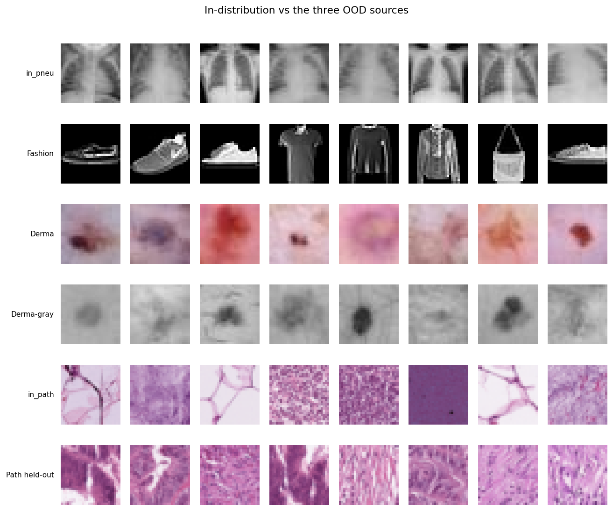
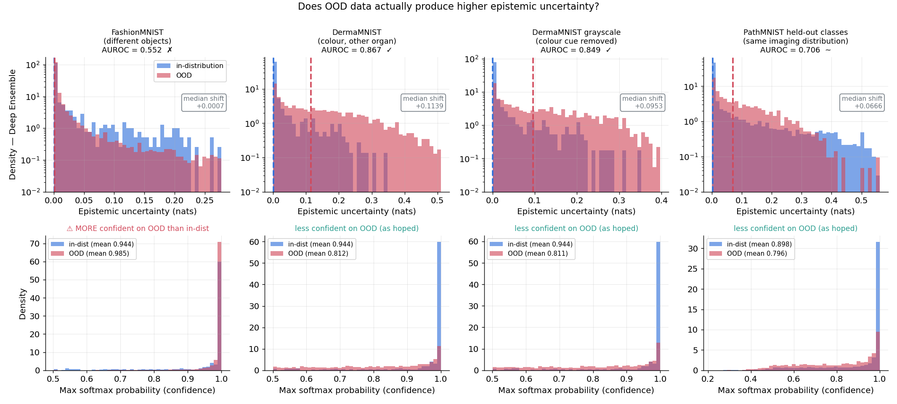
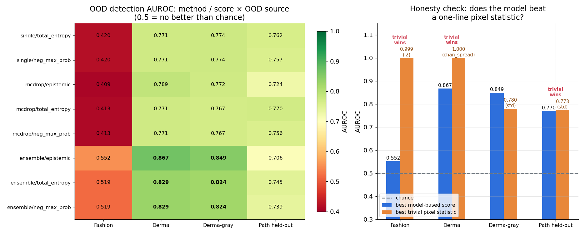
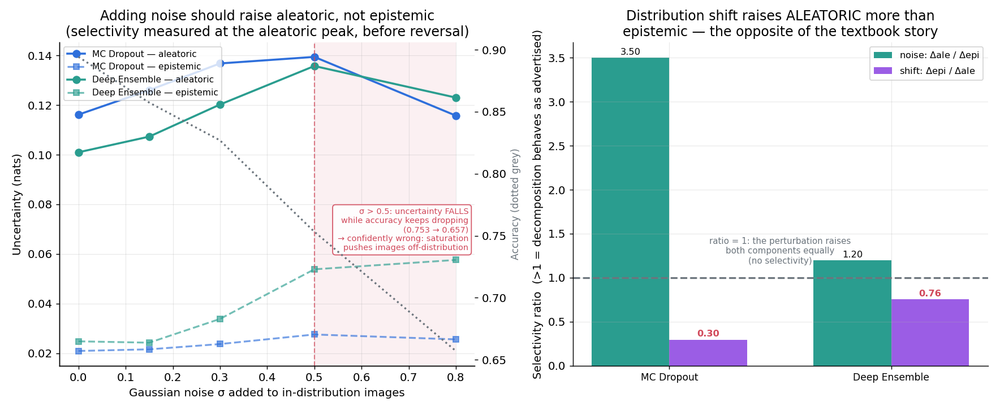
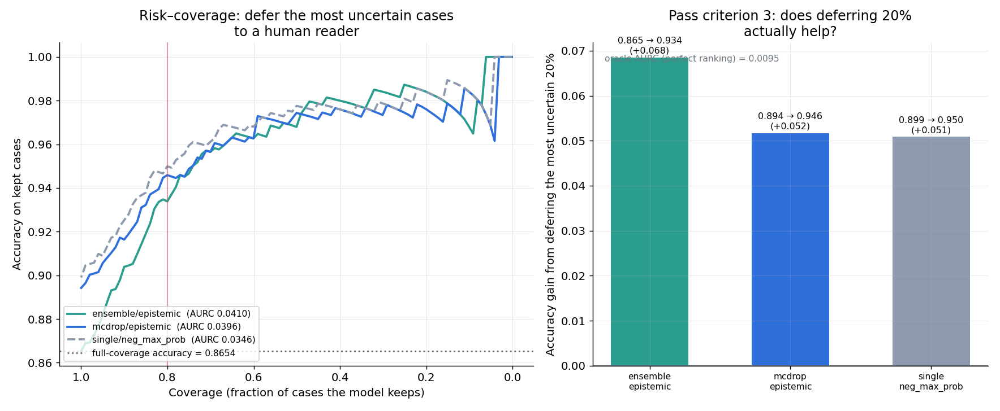
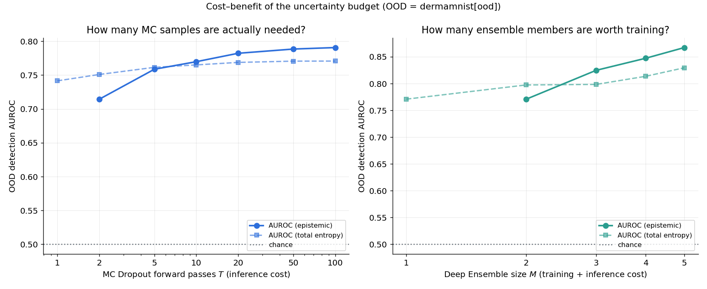
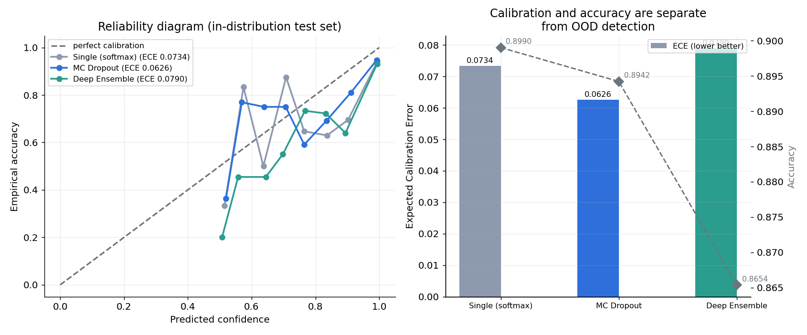

# A3 · 醫學影像的不確定性與 OOD 偵測

## 一句話

在 PneumoniaMNIST 與 PathMNIST 上做 MC Dropout 與 Deep Ensemble 的熵分解，
測四組 OOD 偵測，結論是**負面而具體的**：模型對從沒見過的 FashionMNIST
**比對真實胸片更自信**（0.985 vs 0.944），AUROC 只有 0.552；
而一行 numpy（影像 L2 norm）達到 **0.999**。
四組裡有三組被 trivial 像素統計打敗，唯一模型勝出的是我另外加的
「拔掉顏色捷徑」受控組（0.849 vs 0.780）。
不確定性仍然有用 —— 放棄最不確定的 20% 病例讓準確率從 0.899 升到 0.950 ——
但它有用的方式和教科書說的不一樣。

## 為什麼這個問題需要貝葉斯

模型在訓練分佈內表現很好。**餵它一張從沒見過的影像，它知道自己在瞎猜嗎？**

點估計的 softmax 給不出答案，因為它把兩種完全不同的不確定性壓成一個數字：

- **aleatoric**：這張影像本身模糊，兩類都像。再多資料也救不了。
- **epistemic**：我沒見過這種東西。這個可以靠更多資料改善。

臨床上這個區別決定不同的行動：aleatoric 高 → 需要更好的成像或更多檢查；
epistemic 高 → **這個病例超出模型的能力範圍，轉人工判讀**。
貝葉斯方法（在權重上放分佈）讓這個分解在原則上可行 ——
本專案的工作就是檢驗它在實務上是否真的可行。

## 熵分解（計劃書主題六）

給定一組預測分佈樣本 $\{p_t(y|x)\}_{t=1}^T$（不同 dropout mask 或不同 ensemble 成員）：

$$\underbrace{H\big[\mathbb{E}_t[p_t]\big]}_{\text{total}}
= \underbrace{\mathbb{E}_t\big[H[p_t]\big]}_{\text{aleatoric}}
+ \underbrace{\big(H[\mathbb{E}_t[p_t]] - \mathbb{E}_t[H[p_t]]\big)}_{\text{epistemic}}$$

> 🔑 分類問題的分解用**熵**而不是變異數。`epistemic = 總熵 − 平均熵`
> 在資訊理論裡就是**互資訊** $I(y;w)$ ——「知道權重能減少多少對 $y$ 的不確定性」。
> 由 Jensen 不等式 $\geq 0$，只在所有 $p_t$ 完全相同時為 0。

三種方法：**單一模型 softmax**（$T{=}1$，epistemic 恆為 0）、
**MC Dropout**（$T{=}50$，同一組權重的不同 mask）、
**Deep Ensemble**（$M{=}5$，獨立訓練的網路）。
三者共用**同一個**訓練好的網路當單模型與 MC Dropout 的載體，
避免「MC Dropout 輸是因為它那個網路剛好比較差」。

## 資料與四組 OOD

| 軌道 | in-distribution | OOD | 設計意圖 |
|---|---|---|---|
| 1 | PneumoniaMNIST（4708 訓練 / 624 測試，2 類） | FashionMNIST（10000） | 「完全不同的東西」 |
| 1 | 同上 | DermaMNIST（2005，彩色） | 「醫學影像但不同器官」 |
| 1 | 同上 | **DermaMNIST 灰階** | 同上，但**拔掉顏色捷徑** |
| 2 | PathMNIST 留出 2 類（20000 訓練 / 5526 測試，7 類） | 留出的 2 類（1654） | 「同一分佈的未見類別」 |

第三組是我加的**受控版本**，起因是一個資料層面的問題：

```
                通道間標準差（灰階影像 = 0）
PneumoniaMNIST(in-dist)  0.0000     ← 灰階
FashionMNIST             0.0000
DermaMNIST               0.2128     ← 彩色
PathMNIST(in-dist)       0.1695
PathMNIST 留出類別        0.2081
```

in-distribution 的胸片是灰階，DermaMNIST 是彩色 —— 模型只要學會偵測
「這張圖有顏色」就能拿到接近完美的 AUROC，那不是語意理解，是捷徑。
把 Derma 轉灰階（BT.601 亮度權重）後兩邊通道統計一致，
**彩色版與灰階版的 AUROC 差距就是顏色捷徑的貢獻量** ——
這把一個混淆因子變成可測量的效應。

留出的 2 類是 `cancer-associated stroma` 與 `colorectal adenocarcinoma epithelium`，
都是癌症相關組織。臨床上這正是最該擔心的情境：**模型沒見過癌症，它會不會自信地說「正常」？**



## 一個必須先處理的實作陷阱：BatchNorm

MC Dropout 的標準寫法是 `model.train()`。但 `train()` 是**全域開關**，
會連帶把 BatchNorm 切到訓練模式，造成兩個安靜但嚴重的錯誤：

1. BatchNorm 在訓練模式用**當前 batch** 的統計量 → 一個樣本的預測依賴同 batch 的其他樣本。
   於是「同一張影像餵兩次得到不同答案」會被誤認為模型的 epistemic 不確定性。
2. 每次 MC 前向都會更新 running statistics → 跑 50 次 MC Dropout 等於偷偷用
   測試資料訓練了 50 步正規化層。**這是測試集洩漏。**

本專案改用 **GroupNorm**（不依賴 batch、沒有 running statistics），
並用 `enable_dropout_only()` 只把 Dropout 子模組切回訓練模式。
兩個性質都經過驗證而非口頭聲稱：

| 檢查 | 結果 |
|---|---|
| 關掉 Dropout 後 `train()` 與 `eval()` 的 logits 差異 | **0.0**（完全相同） |
| 一次餵 64 張 vs 逐張餵，單張 logits 差異（CPU） | 4.8 × 10⁻⁷ |
| 模型是否含 BatchNorm | 否（6 個 GroupNorm） |

⚠️ 第二項**必須在 CPU 上測**。CUDA 的 cuDNN 會依 batch size 選不同卷積演算法，
即使模型完全沒有 batch 依賴也會出現 ~1e-4 的浮點差異（實測 CUDA 1.7e-4 vs CPU 6.3e-7）。
在 GPU 上跑這個檢查只會測到 cuDNN 的實作細節，測不到要驗證的性質。

## 關鍵結果

### 1 · 通關標準 1：OOD 的 epistemic 直方圖「明顯右移」？—— 部分成立



| OOD | epistemic 中位數位移 | AUROC | in-dist 平均信心 | OOD 平均信心 |
|---|---|---|---|---|
| FashionMNIST | **−0.0002** | **0.552** | 0.9444 | **0.9845** ⚠️ |
| DermaMNIST | +0.1748 | 0.867 | 0.9444 | 0.8117 |
| DermaMNIST 灰階 | +0.0721 | 0.849 | 0.9444 | 0.8114 |
| PathMNIST 留出類 | +0.0808 | 0.770 | 0.8980 | 0.7957 |

三組如預期右移，**FashionMNIST 組完全沒有** —— 而下排揭露了原因：
**模型對從沒見過的服飾影像比對真實胸片更自信**（0.985 vs 0.944）。

這不是 bug。Hein et al. (2019) 證明帶 ReLU 的網路在**遠離**訓練資料的區域
可以產生任意大的 logits，因而任意自信。FashionMNIST 的像素統計與胸片天差地遠
（平均亮度 −0.43 vs +0.13、對比 0.64 vs 0.30），它落在網路的「遠處」，
而遠處恰好是網路最沒有根據卻最自信的地方。

> 圖上排用 log y 軸：epistemic 分佈在 0 附近有巨大尖峰（多數樣本毫無異議），
> 線性軸會把決定 AUROC 的尾部壓成看不見的一條線，而成敗完全發生在尾部。

### 2 · 通關標準 2：三組難度 AUROC 依序下降？—— 被推翻

計劃書預期難度遞增：FashionMNIST（易）→ DermaMNIST（中）→ 留出類別（難）。
實測順序**完全顛倒了第一項**：

```
DermaMNIST     0.867   ← 預期「中等」
Derma 灰階      0.849
留出類別        0.770   ← 預期「最難」
FashionMNIST   0.552   ← 預期「最容易」，實際最難
```

**「語意距離遠」不等於「容易偵測」。** 決定難度的不是概念上差多少，
而是 OOD 樣本落在網路的哪個區域：落在決策邊界附近會產生高不確定性，
落在遠處反而觸發外插的過度自信。這個機制與第 1 節是同一個。

### 3 · 誠實檢查：模型打得贏一行 numpy 嗎？



我用四個最笨的低階影像統計當 OOD 分數 —— 平均亮度、對比、L2 norm、通道間標準差
—— **完全不看模型**。分數方向未知，所以允許事後翻轉取 `max(auc, 1−auc)`：
這對 baseline 是**有利**的設定，讓對照更嚴格而非更寬鬆。

| OOD | 模型最佳 | trivial 冠軍 | 勝者 |
|---|---|---|---|
| FashionMNIST | 0.552（ensemble/epistemic） | **0.999**（L2 norm） | **TRIVIAL** |
| DermaMNIST | 0.867（ensemble/epistemic） | **1.000**（通道差異） | **TRIVIAL** |
| **DermaMNIST 灰階** | **0.849**（ensemble/epistemic） | 0.780（對比） | **模型** ✓ |
| PathMNIST 留出類 | 0.770（mcdrop/total_entropy） | 0.773（對比） | TRIVIAL（平手） |

三組被一行 numpy 打敗。但這張表最有價值的是**第三列與第二列的對比**：

- 彩色版：通道差異達到 **1.000（完美分離）** —— 因為「有顏色 vs 灰階」是個
  確定性的判別式。這組實驗的高 AUROC 是資料集的假影，不是模型能力。
- 灰階版：顏色捷徑拔掉後 trivial 掉到 0.780，**而模型只從 0.867 掉到 0.849** →
  **模型用的不是顏色**。這是對模型有利的乾淨證據，也是唯一模型明確勝出的一組。

> **結論不是「模型沒用」，而是「常見 OOD benchmark 的成功大部分來自低階統計差異」。**
> 沒有 trivial baseline 對照就無法區分這兩件事，而區分它們正是這個專案的價值。

### 4 · 分解名符其實嗎？—— 一半成立



大部分作品算了 aleatoric / epistemic 就結束。但那個公式是**恆等式**，它一定成立；
問題是兩邊的量是否真的對應宣稱的語意。受控對照：

| 操作 | 理論預期 | MC Dropout | Deep Ensemble |
|---|---|---|---|
| 加高斯噪聲（σ=0.5） | 主要抬 **aleatoric** → 比值 >1 | **3.50** ✓ | **1.20** ✓ |
| 換分佈（真 OOD） | 主要抬 **epistemic** → 比值 >1 | **0.30** ✗ | **0.76** ✗ |

選擇性用**比值**而非差值，因為兩個分量的絕對尺度不同（epistemic 通常小一個量級），
直接比 Δ 大小會系統性偏向 aleatoric。

**加噪聲的方向如預期，換分佈的方向相反。** OOD 影像主要抬升的是 **aleatoric** ——
模型把「我沒見過這種東西」錯誤地記錄成「這張圖本身很模糊」。
這直接解釋了第 1、3 節：**用 epistemic 當 OOD 分數效果有限，
因為 OOD 訊號大部分沒有進到 epistemic 這個分量裡。**

**一個非單調反轉**（圖左的粉紅區）：σ > 0.5 之後 aleatoric 反而**下降**，
而準確率繼續從 0.753 惡化到 0.657 —— 模型變成**自信地錯誤**。
機制與 FashionMNIST 組同源：大噪聲讓像素飽和到 ±1，把影像推離訓練分佈，
觸發同樣的外插過度自信。

> 這個反轉也暴露了我第一版實驗設計的缺陷：原本用**最大** σ 算選擇性，
> 那個取樣點落在反轉之後，測到的是飽和假影而不是「加噪聲」的效果。
> 現在改在 aleatoric 的峰值處量測，並把反轉明確畫出來。

### 5 · 通關標準 4：Deep Ensemble 比 MC Dropout 好？—— 3/4 成立

配對 bootstrap（兩方法在同一批重抽樣本上一起評估，抵消共同噪聲）：

| OOD | ΔAUROC (Ens − MC) | 95% CI | 結論 |
|---|---|---|---|
| FashionMNIST | **+0.1435** | [+0.128, +0.159] | Ensemble 勝 |
| DermaMNIST | +0.0792 | [+0.069, +0.092] | Ensemble 勝 |
| DermaMNIST 灰階 | +0.0771 | [+0.065, +0.090] | Ensemble 勝 |
| **PathMNIST 留出類** | **−0.0172** | [−0.026, −0.009] | **MC Dropout 勝** |

前三組 Ensemble 明確勝出，符合預期（成員可落在完全不同的損失盆地，
多樣性大於 dropout mask 能表達的範圍）。但**在最難的那一組相反且顯著**。
計劃書說「如果你的結果相反，要去查為什麼」——
我的解讀是：留出類別與訓練類別共享低階特徵，區分它們需要的是
**決策邊界附近的細緻分歧**，而不是 Ensemble 那種大尺度的功能多樣性；
MC Dropout 在同一組權重鄰域內取樣，剛好更貼近這種細緻分歧。這個解釋沒有進一步驗證。

### 6 · 通關標準 3：接上決策層 —— 成立



不確定性超過門檻 → 轉人工判讀（A1 專案棄權選項的影像版）：

| 排序分數 | 全覆蓋準確率 | 80% 覆蓋準確率 | 提升 | AURC |
|---|---|---|---|---|
| single/total_entropy | 0.8990 | **0.9499** | **+0.0509** | **0.0346** |
| mcdrop/aleatoric | 0.8942 | 0.9479 | +0.0537 | 0.0372 |
| ensemble/epistemic | 0.8654 | 0.9339 | +0.0685 | 0.0410 |

放棄最不確定的 20% → 準確率提升 5 個百分點。**通關標準 3 達成。**
oracle AURC（完美排序的下界）是 0.0053，所以還有很大距離 ——
報告 oracle 是必要的，否則無法判斷 AURC 的好壞：一個準確率 99% 的模型
即使排序完全隨機，AURC 也會很小。

**一個值得注意的細節**：用 `epistemic` 排序病例的 AURC 比用
`total_entropy` 或 `1 − max_prob` **更差**。這與第 4 節完全一致 ——
既然 OOD 與困難樣本的訊號大部分落在 aleatoric，那麼要挑出「模型會答錯的病例」時，
包含 aleatoric 的總熵自然更有用。

> **實務含意**：如果目標是「決定哪些病例轉人工」，直接用總熵或 max-prob 就好，
> 不必付 MC Dropout（50 倍推論成本）或 Ensemble（5 倍訓練成本）的代價。
> epistemic 回答的是一個**不同**的問題（「這是不是我沒見過的資料類型」），
> 而那個問題的答案在本專案的實測中並不可靠。

### 7 · 計算成本的取捨



| 預算 | AUROC（OOD = DermaMNIST） |
|---|---|
| MC Dropout $T$ = 2 / 5 / 10 / 20 / 50 / 100 | 0.714 / 0.759 / 0.770 / 0.782 / 0.789 / **0.791** |
| Deep Ensemble $M$ = 2 / 3 / 4 / 5 | 0.771 / 0.825 / 0.847 / **0.867** |

- **MC Dropout 在 $T \approx 20$ 後幾乎飽和**（20→100 只多 0.009）。跑 50 次以上是浪費。
- **Deep Ensemble 到 $M{=}5$ 仍在上升**，邊際效益還沒耗盡 —— 但每個成員都是一次完整訓練。

兩者的成本結構不同：$T$ 是**推論**成本（每個病例都要付的延遲），
$M$ 是**訓練**成本（一次性）**加上**推論成本。臨床部署上前者通常更難接受。

### 8 · 校準與準確率



| 軌道 | 方法 | 準確率 | ECE |
|---|---|---|---|
| 1（Pneumonia，624 測試） | single | **0.8990** | 0.0734 |
| | mcdrop | 0.8942 | **0.0626** |
| | ensemble | 0.8654 | 0.0790 |
| 2（PathMNIST，5526 測試） | single | 0.8388 | 0.0835 |
| | mcdrop | 0.8402 | **0.0252** |
| | ensemble | **0.8820** | 0.0275 |

軌道 2（測試集 5526 張）符合預期：Ensemble 準確率最高，且 MC Dropout 與 Ensemble
的 ECE 都遠優於單一模型（0.025 / 0.028 vs 0.084）—— 平均多個預測確實改善校準。

**軌道 1 的 Ensemble 準確率反而最低（0.8654）**，這與預期相反，誠實記在限制章節第 2 點。

校準與 OOD 偵測是**不同**的事：軌道 1 的模型在 in-distribution 上校準合理（ECE 0.06–0.08），
卻完全偵測不到 FashionMNIST。分開報告才看得出來。

## 方法

```
PneumoniaMNIST / PathMNIST / DermaMNIST（medmnist，自動下載）+ FashionMNIST（torchvision）
  → 統一成 3 通道 28×28、正規化到 [-1,1]；Derma 另做 BT.601 灰階版（受控組）
  → PathMNIST 移除 2 類、剩餘標籤重新映射、分層子抽樣到 20000
  → DropoutCNN（3 個 conv block，GroupNorm + Dropout2d，435,746 參數）
  → 每軌道訓練 M=5 個成員（AdamW + cosine schedule + early stopping on val）
  → 模式不變性與 batch 組成不變性驗證（證明沒有 BatchNorm 的兩個病徵）
  → 熵分解 × 3 方法 × 4 組 OOD；AUROC + bootstrap + 配對 bootstrap
  → trivial 像素統計 baseline（誠實對照）
  → 分解驗證（噪聲 vs 換分佈的選擇性）
  → 成本效益掃描（T=1..100、M=1..5）
  → risk–coverage + ECE
  → 落盤：data/A_medical/a3_plotdata.npz + figures/results.json
  → 出圖（7 張）
```

**推論結果與出圖資料落盤分離**（沿用 A2/B2 的原則）：完整管線 180 秒，
但 `python src/replot.py` 只要 **3.5 秒**。本專案光是修正圖 1 的 y 軸尺度
與圖 3 的反轉標示就重畫了數次，這個設計直接省下十幾分鐘。

### 可重現性（踩坑）

**只設隨機種子不足以讓訓練可重現。** 兩次「相同」的完整執行給出的
PneumoniaMNIST ensemble 測試準確率是 **0.885 與 0.901**。
原因是 cuDNN 預設自動挑選最快的卷積演算法，其中部分非決定性
（浮點歸約順序隨執行變動），微小差異在 30 個 epoch 裡累積後
改變了 early stopping 選到哪一個 epoch。

加上 `cudnn.deterministic=True`、`cudnn.benchmark=False`、
`torch.use_deterministic_algorithms(True)`（搭配 `CUBLAS_WORKSPACE_CONFIG=:4096:8`，
必須在 import torch 之前設）之後，連續兩次完整執行的**每一個**數字完全相同 ——
準確率、AUROC、選擇性比值、cost-benefit 掃描、risk–coverage 全部逐位一致。

誠實聲明：我沒有逐一隔離這三個旗標各自的貢獻，只驗證了整組設定有效。

## 限制與誠實的部分

1. **本專案的主要結論是負面的，而且我認為那是它最有價值的部分。**
   MC Dropout 與 Deep Ensemble 的 epistemic 不確定性在 4 組 OOD 中有 3 組
   輸給一行 numpy。這與近年批評 MC Dropout OOD 效能被高估的文獻一致。
   但要說清楚適用範圍：這是**一個小 CNN、28×28 影像、二元或 7 類任務**上的結果，
   不能外推到大模型或高解析度影像。

2. **軌道 1 的 Deep Ensemble 準確率最低（0.8654 vs single 0.8990），與預期相反。**
   最可能的原因是 PneumoniaMNIST 的 val（524）與 test（624）都很小且分佈有差異，
   而每個成員都以 val accuracy 選最佳權重 → 集體過擬合 val。
   軌道 2（測試集 5526）就沒有這個現象（Ensemble 0.8820 最高）。
   這個解釋沒有進一步驗證（例如改用固定 epoch 數重跑）。

3. **PathMNIST 子抽樣到 20000（原始 89996）是計算預算的選擇。**
   全用會讓 Deep Ensemble 的訓練時間主導整個專案。子抽樣是分層的（保持類別比例），
   縮小了問題但不改變結論方向 —— 不過留出類別那組的絕對 AUROC 可能被低估。

4. **`3 通道統一` 的決策有代價。** 把 PneumoniaMNIST 的灰階複製成三份是冗餘的，
   模型的第一層有 3 倍於必要的參數。另一個選項是 1 通道模型 + Derma 轉灰階，
   但那會讓「中等難度」那組永久失去顏色資訊。我選了保留資訊 + 額外做受控組。

5. **留出類別的選擇（7, 8）不是隨機的。** 我挑了兩個癌症相關類別因為臨床敘事最強，
   但這也意味著 OOD 集合在語意上是「相關的一組」而非隨機兩類。
   換成其他類別組合，AUROC 可能不同。未做多組留出的敏感度分析。

6. **trivial baseline 允許事後翻轉方向（取 `max(auc, 1−auc)`）。**
   這對 baseline 有利，是刻意的嚴格設定。但嚴格來說這給了 baseline
   一個模型沒有的優勢（模型的分數方向是先驗固定的）。
   即使不允許翻轉，FashionMNIST 的 L2 norm 仍遠勝模型。

7. **MC Dropout 勝過 Ensemble 的那一組（PathMNIST 留出類）我只給了假設性解釋**，
   沒有做實驗驗證（例如量測兩者預測分佈的多樣性結構）。

8. **沒有做溫度校準（temperature scaling）對照。** 它是改善 ECE 最便宜的方法，
   而本專案的 ECE 數字若與它比較會更有參考價值。

## 通關標準（計劃書 §2）

- [x] **OOD 樣本的 epistemic 直方圖明顯右移** —— **部分成立**：3/4 組右移，
      FashionMNIST 組中位數位移 −0.0002（因為模型對它更自信）
- [ ] **三組難度 AUROC 依序下降** —— **被推翻**：實際順序是
      Derma 0.867 > Derma灰階 0.849 > 留出類 0.770 > **Fashion 0.552**，
      預期「最容易」的那組最難
- [x] **Risk-coverage：放棄 20% 最不確定樣本，準確率明顯提升** ——
      0.8990 → 0.9499（+5.1 個百分點）
- [x] **Deep Ensemble 通常優於 MC Dropout** —— 3/4 組成立（配對 bootstrap 顯著），
      最難的那組相反且顯著（−0.0172）

額外做到（超出通關標準）：**trivial 像素統計 baseline**（揭露 3/4 組的
「成功」來自低階統計）、**顏色捷徑的受控消除實驗**、
**分解是否名符其實的驗證**（發現換分佈主要抬 aleatoric）、
**BatchNorm 陷阱的結構性驗證**、**完整決定性的可重現性修正**、
T/M 成本效益掃描。

## 如何重現

```bash
conda activate bayes          # 或用 ~/miniconda3/envs/bayes/bin/python 直接呼叫

# 完整管線：下載資料 → 訓練 10 個模型 → 全部實驗 → 出圖（約 180 秒，需 GPU）
python src/run_all.py

# 只重畫圖表（約 3.5 秒，讀落盤資料，不訓練）
python src/replot.py
```

資料全部自動下載（MedMNIST 約 219 MB → `data/A_medical/medmnist/`，
FashionMNIST 約 82 MB → `data/A_medical/fashion/`，均已被 `.gitignore` 排除）。
推論結果落盤成 `data/A_medical/a3_plotdata.npz`（2.0 MB）與
`figures/results.json`（**本 README 的每個數字都可在此核對**）。

Notebook 從 `results.json` 讀數字，執行只需數秒：

```bash
jupyter lab notebooks/01_uncertainty_and_ood.ipynb
```

## 檔案結構

```
A3_image_uncertainty_ood/
├── README.md                  ← 本檔
├── requirements.txt
├── src/
│   ├── data.py                ← MedMNIST / FashionMNIST 載入、灰階受控組、留出類別、噪聲注入
│   ├── model.py               ← DropoutCNN（GroupNorm）、只開 Dropout、模式不變性驗證、決定性設定
│   ├── train.py               ← 訓練迴圈、Deep Ensemble、類別權重
│   ├── uncertainty.py         ← 熵分解、三種預測分佈、OOD 分數、trivial 像素 baseline
│   ├── evaluate.py            ← AUROC（含配對 bootstrap）、risk–coverage、ECE
│   ├── experiments.py         ← OOD 套組、分解驗證、成本效益、選擇性預測
│   ├── plots.py               ← 7 張圖（只吃 numpy，不接觸 torch）
│   ├── replot.py              ← 從落盤資料重畫（3.5 秒）
│   └── run_all.py             ← 一鍵重現
├── notebooks/
│   ├── 01_uncertainty_and_ood.ipynb        ← 分解、OOD、trivial 對照、通關標準 1/2/4
│   └── 02_validation_and_decisions.ipynb   ← 分解驗證、校準、risk–coverage、成本
└── figures/                   ← 7 張圖 + results.json（所有數字）
```
