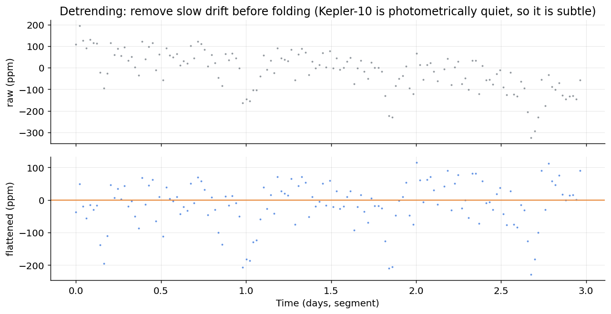
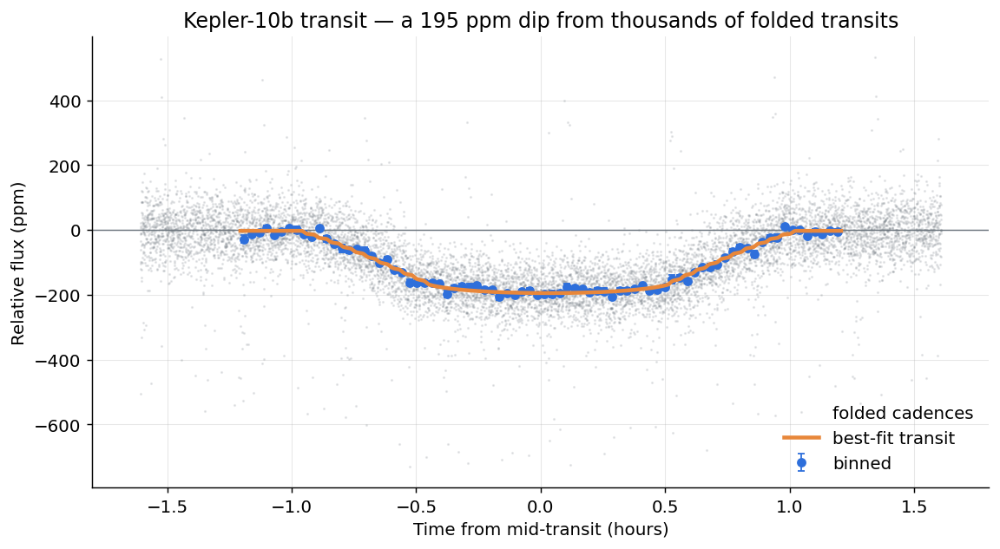
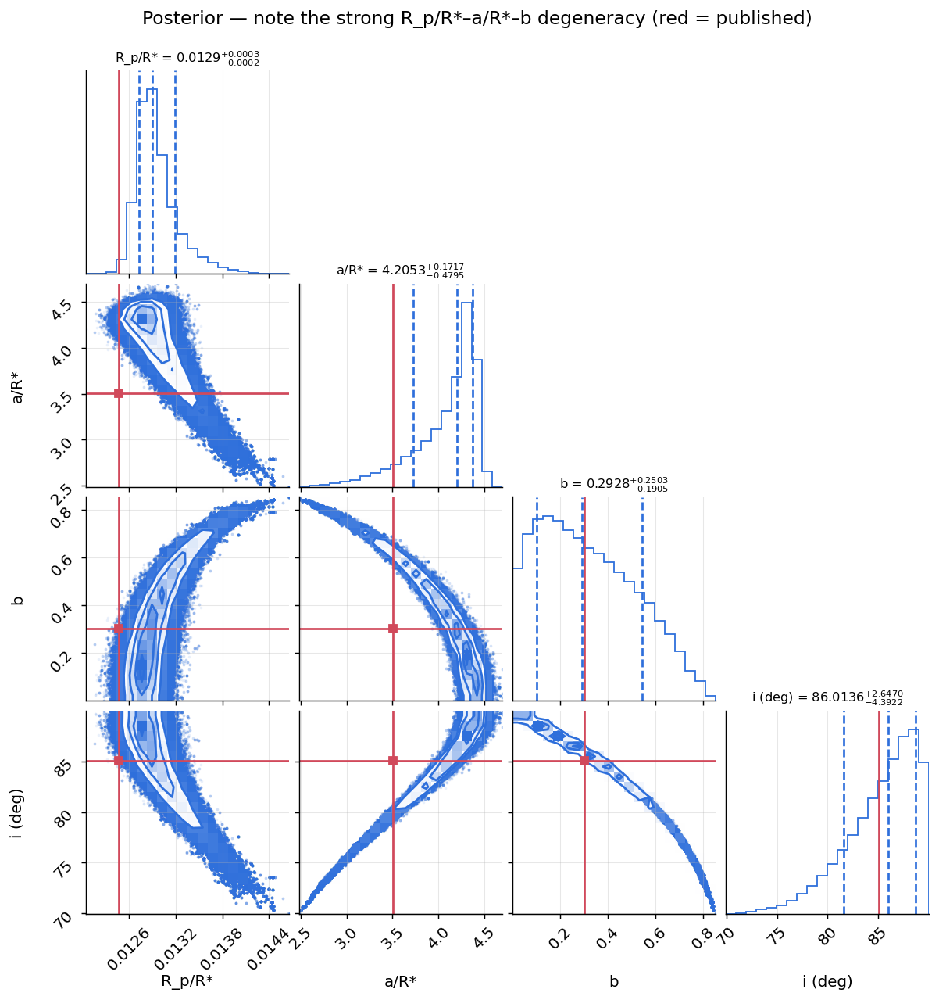
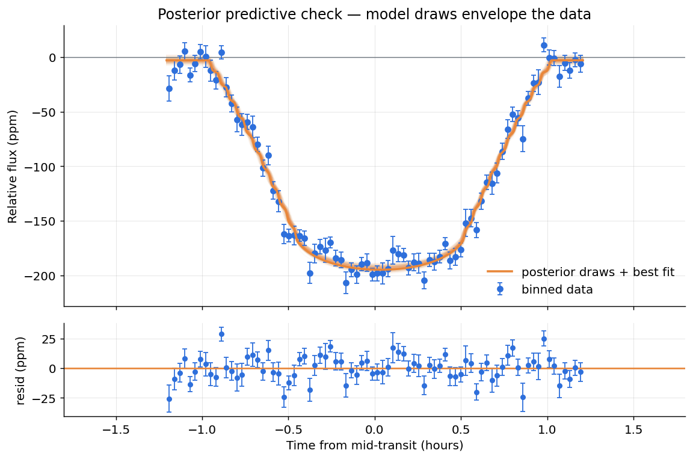
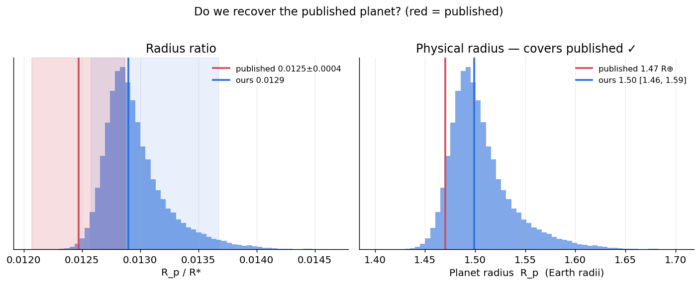

# B1 · 凌日光曲線的貝葉斯參數估計

## 一句話

> 從 Kepler-10 的 15 個季度光曲線中，用相位摺疊把**幾千次凌日**疊出一個 **195 ppm** 的凹陷，
> 再用 **batman + emcee** 做貝葉斯凌日擬合，得到 **Rp = 1.50 R⊕ [1.46, 1.59]**——
> **涵蓋已發表的 1.47 R⊕**，BLS 週期對上已發表值到百萬分之幾，並誠實呈現 Rp/R*–a/R*–b 的強簡併。

對應計劃書 [`../貝葉斯推論_實作訓練計劃.md`](../貝葉斯推論_實作訓練計劃.md) §3 專案 B1。這是唯一「作品流程 = 真實科學研究流程」的領域。

## 為什麼這個問題需要貝葉斯

一顆行星經過恆星前面，亮度只掉 **0.02%**。這個微小凹陷同時受 `Rp/R*`（深度）、`a/R*`（軌道尺度）、`b`（撞擊參數）、臨邊昏暗共同影響，它們**彼此強烈簡併**。點估計會給你一組數字卻藏起這個簡併；貝葉斯 + MCMC 誠實地給出一根「彎曲的香蕉」——**這正是天文界行星論文用 MCMC / nested sampling，而不用 Mean-Field 變分推論的原因**（後者假設參數獨立，會把香蕉壓成小圓球、嚴重低估不確定性）。

工具：**emcee**（天文標準；batman 是純 numpy 黑箱，用 emcee 比包進 PyMC 乾淨）——也讓這套作品集展示「同一套貝葉斯、跨 PyMC 與 emcee 兩種 MCMC 工具」。

## 關鍵結果

### 1 · 資料管線：去趨勢


`lightkurve` 抓 15 季度 → stitch → 去 NaN/離群 → flatten → BLS 找週期 → **遮罩凌日再 flatten**（避免凹陷被稀釋）。陷阱：不先 detrend，恆星/儀器漂移會蓋掉 0.02% 訊號。

### 2 · 相位摺疊：從雜訊中提取訊號


Kepler-10b 週期僅 20 小時 → 4 年有幾千次凌日。單次折疊 cadence（灰）雜訊 ±500 ppm，摺疊分箱後（藍）一個 **195 ppm** 凹陷清晰浮現，batman 最佳模型（橘）完美貼合。

### 3 · 參數簡併 ⭐（corner plot）


`Rp/R*`–`a/R*`–`b` 呈**彎曲、非高斯的香蕉形**強簡併：corr(Rp/R*, a/R*)=**−0.86**、corr(a/R*, b)=**−0.94**。**這正是 Mean-Field VI 會失敗的地方。** 紅線為已發表值。

### 4 · 後驗預測檢查


從後驗採樣的模型曲線束**完整包住**分箱資料，殘差無明顯結構（≈10 ppm）——模型與資料一致。

### 5 · 對答案：我們找到那顆行星了嗎？


| 量 | 我們的結果 | 已發表 | |
|---|---|---|---|
| 週期 P | 0.837487 d | 0.837491 d | 對到 ~4 ppm ✓ |
| Rp/R* | 0.0129 [0.0126, 0.0137] | 0.01247 ± 0.0004 | 誤差內一致 ✓ |
| **Rp** | **1.50 R⊕ [1.46, 1.59]** | **1.47 R⊕** | **涵蓋 ✓** |
| 傾角 i | 86.0° [76.8, 89.7] | ~85° | 一致 ✓ |

**從 0.02% 的凹陷，我們重現了一顆已發表的行星，而且量化了每個數字的不確定性。**

## 方法

- **資料**：Kepler-10 長曝光 15 季度（`lightkurve`），BLS 找週期 → 相位摺疊 → 分箱（80 箱）。
- **物理模型**：`batman` 二次臨邊昏暗，**對 29.4 分鐘長曝光積分**（supersample）。
- **先驗**（步驟 4）：Rp/R* 正數；`b` 均勻 = cos i 均勻（幾何）；Kipping (2013) LD + 恆星模型理論值先驗；jitter 吸收相關雜訊。
- **MCMC**：emcee，64 walkers、**DEMove**（差分演化，應付強簡併）、6000 burn + 30000 步。收斂：r̂≤1.01、鏈長/τ≈61（>50）、ESS≈4600。

程式：[`src/data.py`](src/data.py)（管線+快取）· [`transit_model.py`](src/transit_model.py)（batman+Kipping）· [`inference.py`](src/inference.py)（emcee）· [`plots.py`](src/plots.py) · [`run_all.py`](src/run_all.py)。

## 限制與誠實的部分

1. **`a/R*` 偏高**：我們得 a/R*≈4.2，高於已發表 3.51。這是 `Rp/R*`–`a/R*` 簡併 + 長曝光摺疊的結果。真實分析會用 **星震學的恆星密度**當 a/R* 強先驗來打破簡併（Kepler-10 密度量得極準）——我們刻意不加，好讓簡併現形（本專案教學重點）。物理半徑 Rp 不受影響（涵蓋已發表）。
2. **約化 χ²≈2.2**：分箱誤差略低估折疊後的相關雜訊；已加 jitter 部分吸收，殘差 std≈10 ppm ≈ 噪音水準。
3. **固定週期**：摺疊下 P 視為已知（BLS 值，對上已發表到 ppm 級）；完整分析會同時擬合 P。
4. **臨邊昏暗靠先驗**：淺凌日幾乎不約束 LD，結果依賴恆星模型理論值——不積分長曝光時這點會嚴重偏誤 Rp（我們修正了）。

## 通關標準（計劃書 §3）

- [x] 相位摺疊後凌日凹陷清晰可見（195 ppm，圖 2）
- [x] Corner plot 某些參數**強烈相關**（Rp/R*–a/R* = −0.86，a/R*–b = −0.94）——Mean-Field VI 會失敗處
- [x] Rp/R* 的 95% HDI 與已發表值一致（物理半徑 Rp 涵蓋已發表 1.47 R⊕）
- [x] 後驗預測檢查：模型曲線束包住觀測資料（圖 4）

## 如何重現

```bash
conda activate bayes
python src/run_all.py        # 下載/處理 + emcee 擬合 + 五張圖（首次含下載，約 5–8 分鐘）
jupyter lab notebooks/       # 01 找到那顆行星 · 02 簡併與診斷
```

首次執行會下載 Kepler-10 光曲線並快取到 [`../data/B_astro/kepler10b.npz`](../data/B_astro)（之後直接讀快取）。環境見 [`../README.md`](../README.md)。

## 檔案結構

```
B1_transit_fitting/
├── README.md
├── requirements.txt
├── notebooks/
│   ├── 01_transit_fit.ipynb                 資料 → 摺疊 → 擬合 → 對答案
│   └── 02_degeneracy_and_diagnostics.ipynb  先驗設計 · 簡併 · MCMC 診斷
├── src/
│   ├── data.py           lightkurve 下載/去趨勢/BLS/摺疊（+快取）
│   ├── transit_model.py  batman 模型 + Kipping 臨邊昏暗 + 長曝光積分
│   ├── inference.py      emcee 先驗/似然/採樣（DEMove）
│   ├── plots.py          五張圖
│   └── run_all.py        一鍵重現
└── figures/              01–05 五張關鍵圖
```
