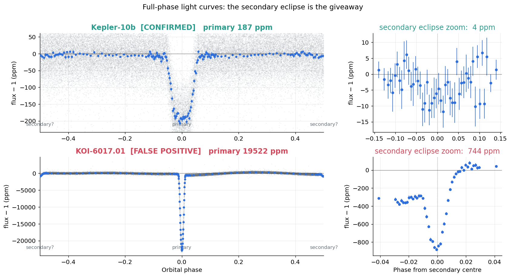
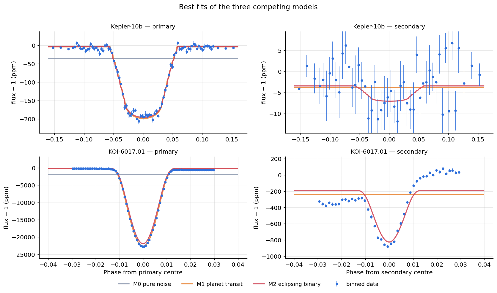
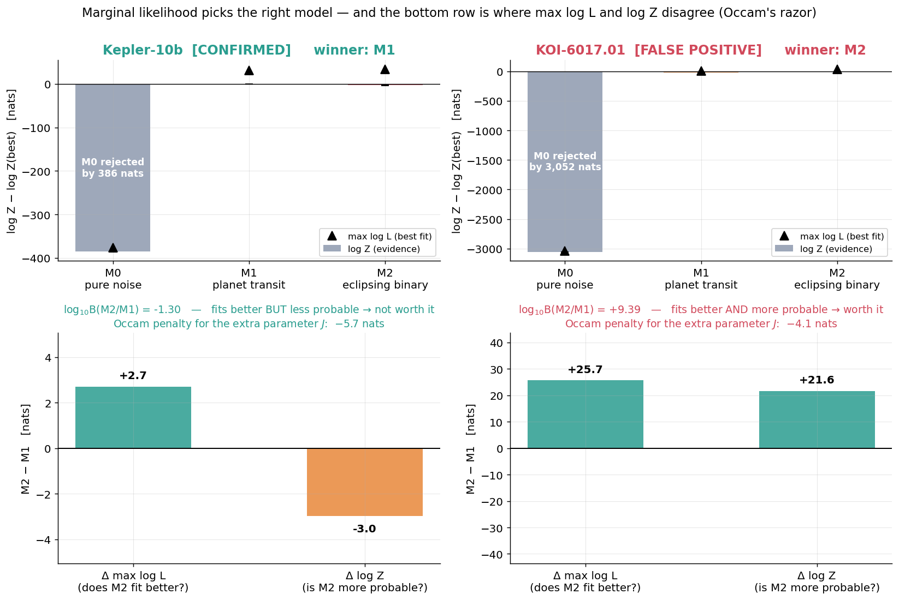
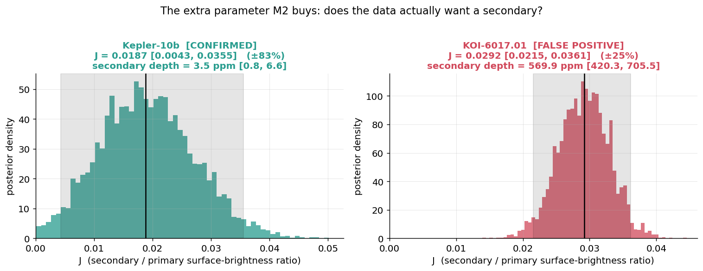
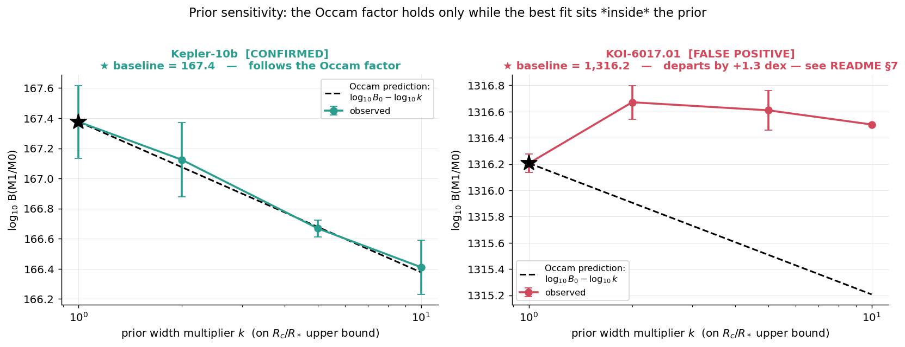
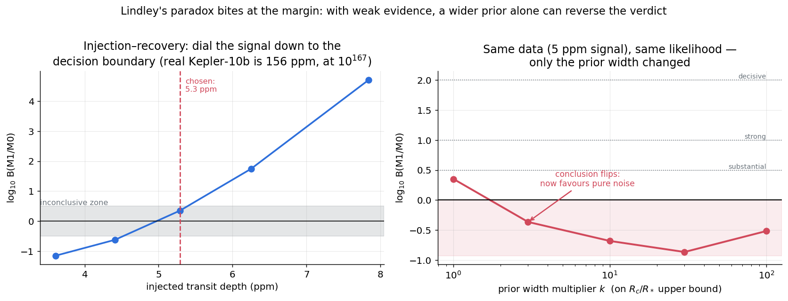

# B2 · 貝氏因子：這到底是不是行星？

## 一句話

> 同一套**邊際似然**流程，對 Kepler-10b 判「行星」、對官方標記 FALSE POSITIVE 的
> KOI-6017.01 判「食雙星」（log₁₀B(M2/M1) = **+9.39 ± 0.14**，決定性）——
> 而我們是從光子重新推導出來的。過程中親眼看到兩件教科書級的現象：食雙星模型在
> Kepler-10b 上**擬合更好卻證據更低**（奧卡姆剃刀，而 BIC 在這裡判到反邊），
> 以及把先驗放寬就足以讓一個邊緣訊號的判決從「有行星」翻成「沒有」（Lindley 悖論）。

對應計劃書 [`../貝葉斯推論_實作訓練計劃.md`](../貝葉斯推論_實作訓練計劃.md) §3 專案 B2。
承接 [B1](../B1_transit_fitting)：同一批光曲線，問的卻是完全不同層次的問題。

## 為什麼這個問題需要貝葉斯

**B1 問「這顆行星多大」，B2 問「這到底是不是行星」——後者不是同一種問題。**

B1 是**參數估計**：在單一模型內求 $p(\theta \mid D, M)$。
B2 是**模型選擇**：要比較整個模型的可信度

$$p(M \mid D) \;\propto\; \underbrace{p(D \mid M)}_{\text{邊際似然（證據）}} \; p(M),
\qquad p(D \mid M) = \int p(D \mid \theta, M)\, p(\theta \mid M)\, \mathrm{d}\theta$$

### 這正是 MCMC 算不出來的那個量

Metropolis 的接受率是後驗的**比值**，$p(D)$ 在分子分母裡消掉了。
這是它不需要歸一化常數的原因——也是它**結構性地**給不出 $p(D \mid M)$ 的原因。
B1 用 emcee 跑得很好，但那套工具在這裡完全使不上力。

**Nested sampling 換一個角度**：把 $d$ 維積分改寫成對「先驗體積 $X$」的一維積分

$$Z = \int_0^1 L(X)\,\mathrm{d}X, \qquad
X(\lambda) = \int_{L(\theta) > \lambda} p(\theta)\,\mathrm{d}\theta$$

再用一群活點由外往內收縮來估 $X$。**它是專門為了直接算 $\log Z$ 而設計的。**

### 頻率派在這裡的困難是真實的

不是「貝葉斯比較潮」，而是這個問題的結構讓標準工具失效：

1. **模型不是嵌套的**。M2 不只多一個參數，它的 $R_c/R_*$ 先驗範圍也不同（0.2 → 1.0）——
   兩個模型體現的是不同的**物理假設**，不是同一個模型的鬆緊。概似比檢定沒有適用對象。
2. **假設落在參數邊界上**。「沒有凌日」$=R_c/R_*=0$、「沒有次食」$=J=0$，都在先驗支撐的邊界。
   邊界上概似比統計量不服從 $\chi^2$（是 chi-bar-squared 混合分布），漸近理論直接失效。
3. **奧卡姆懲罰應該由物理決定**。AIC/BIC 的懲罰項只看參數個數，看不見
   「行星半徑有物理上限、伴星沒有」這件事——而那正是本專案的核心資訊。
   下面有 **BIC 與真實邊際似然判到反邊**的實例。

邊際似然把這三件事一次解決：先驗體積的收縮**天然**帶來奧卡姆因子，
不必外加懲罰項，且懲罰量由先驗——也就是物理假設——決定。

## 資料：一真一假

要證明一套判定方法有用，光是「對已確認的行星說 yes」不夠——**還必須對假的說 no**。

| | Kepler-10b | KOI-6017.01 |
|---|---|---|
| 官方判定 | **CONFIRMED** | **FALSE POSITIVE** |
| 目標 | KIC 11904151（= KOI-72.01） | KIC 5961350 |
| 週期（我們的 BLS） | 0.837489 d | 5.262691 d |
| 主食深度（我們） | **187 ppm** | **19 522 ppm** |
| 次食深度（我們） | **4 ppm** | **744 ppm** |
| 每箱誤差 | 5.0 ppm | 20.5 ppm |
| KOI 表深度（對照） | 190.4 ppm | 22 650 ppm |

FALSE POSITIVE 這個對照組是這樣挑的：

```sql
select kepoi_name, kepid, koi_period, koi_depth, koi_comment from cumulative
where koi_disposition = 'FALSE POSITIVE'   -- 官方判定為假
  and koi_fpflag_ss  = 1                   -- Stellar Eclipse 旗標
```
（NASA Exoplanet Archive TAP，再從結果中挑同時註記 `DEEP_V_SHAPED`（V 字形）
與 `HAS_SEC_TCE`（偵測到次食）的目標。）

**也就是說：官方判它是假行星的理由，正是我們的 M2 模型要抓的兩個特徵。**
這不是挑一個好做的目標，而是挑一個「答案已知、且答案的理由與建模假設對得上」的目標。

### 資料管線上的兩個坑（都跟 B1 不同）

1. **摺疊必須覆蓋完整相位 $[-0.5, 0.5]$**。B1 只取凌日窗就能估參數；B2 要判斷
   「是不是食雙星」，而決定性證據是**次食**——相位 0.5 附近的第二個凹陷。
   只看凌日窗等於把最關鍵的證據丟掉。同理，`flatten` 時要**同時遮罩主食與次食**，
   否則幾百 ppm 的次食會被 Savitzky–Golay 當成趨勢吸收掉。

2. **sigma clip 只能砍上方**。`remove_outliers(sigma=5)` 這種對稱裁切會把 2% 深的食
   **當成離群值刪掉**——實測砍掉 1391 個點，剛好都落在食內；改成只砍上方後只砍掉 1 點。
   **凹陷是訊號不是雜訊。**

分箱採自適應策略：主食與次食附近細分箱、其餘平坦區粗分箱，共 164 箱。
均勻細分箱會讓多數點落在毫無資訊的平坦區，nested sampling 的似然求值成本卻照付。

## 三個競爭模型

建模時最容易犯的錯，是讓 M1 和 M2 差太多——那樣「M2 贏」就分不清是物理還是自由度。
這裡兩者的差別**只有兩處，而且兩處都是真正的天文判準**：

| | **M0** 純雜訊 | **M1** 行星凌日 | **M2** 食雙星 |
|---|---|---|---|
| 參數數 | 2 | 8 | 9 |
| $R_c/R_*$ 先驗 | — | $U(0,\,0.2)$ | $U(0,\,1.0)$ |
| 次食 | 無 | **無** | **有**（深度 $=J\times$ 主食） |
| 物理敘事 | 只是基線加白雜訊 | 行星擋住恆星一小塊 | 兩顆恆星互相遮擋 |

1. **$R_c/R_*$ 的先驗範圍**：行星有物理半徑上限——簡併壓讓它撐不過約 2 $R_{\rm Jup}$，
   即 $R_p/R_* \lesssim 0.2$；食雙星的伴星可以跟主星差不多大。**先驗就是物理假設。**
2. **次食**：行星的次食是幾 ppm 等級（反射 + 熱輻射）；食雙星的伴星自己會發光，
   次食深度是主食的 $J$ 倍（$J$ = 表面亮度比）。

**M2 = M1 + 一個參數 $J$**，只多一個 → 奧卡姆懲罰乾淨可算。
其餘參數（基線 $f_0$、$a/R_*$、撞擊參數 $b$、中天微調 $t_0$、Kipping 臨邊昏暗 $q_1,q_2$、
jitter）三個模型完全共用同一組先驗，否則 $\log Z$ 的差會混進無關的先驗體積差。

## 關鍵結果

### 1 · 次食是分水嶺



左欄一眼看得出差別：Kepler-10b 在相位 0.5 附近**什麼都沒有**；
KOI-6017.01 有一個清清楚楚的次食。右欄是次食區放大。
這張圖就是為什麼「摺疊必須覆蓋完整相位」——B1 的凌日窗會把它整個切掉。

### 2 · 三個模型的最佳擬合



左欄主食、右欄次食。**KOI-6017.01 的次食區裡只有 M2（紅）壓得下去，M1（橙）完全平坦**。
Kepler-10b 的次食區三條線幾乎疊在一起——資料裡沒有多少東西可給 M2 解釋。

### 3 · 判決



| Kepler-10b | 參數 | $\log Z$ | ±(seed 間) | $\max \log L$ | $p(M\mid D)$ |
|---|:-:|---:|---:|---:|---:|
| M0 純雜訊 | 2 | 1341.70 | 0.20 | 1351.5 | 0.000 |
| **M1 行星凌日** | 8 | **1727.26** | 0.40 | 1758.3 | **0.952** |
| M2 食雙星 | 9 | 1724.28 | 0.62 | **1761.0** | 0.048 |

| KOI-6017.01 | 參數 | $\log Z$ | ±(seed 間) | $\max \log L$ | $p(M\mid D)$ |
|---|:-:|---:|---:|---:|---:|
| M0 純雜訊 | 2 | −1939.55 | 0.17 | −1922.6 | 0.000 |
| M1 行星凌日 | 8 | 1091.18 | 0.13 | 1120.5 | 0.000 |
| **M2 食雙星** | 9 | **1112.80** | 0.31 | **1146.2** | **1.000** |

| 貝氏因子 | Kepler-10b | KOI-6017.01 |
|---|---:|---:|
| log₁₀B(M1/M0) | **+167.45 ± 0.19** | **+1316.23 ± 0.09** |
| log₁₀B(M2/M1) | **−1.30 ± 0.32** | **+9.39 ± 0.14** |
| 判決 | **M1 · 行星** ✓ | **M2 · 食雙星** ✓ |

對照 Jeffreys 尺度（log₁₀B > 2 為決定性）：兩個目標都給出決定性判決，**而且方向都對**。
KOI-6017.01 的 log₁₀B(M2/M1) = +9.39 意味著資料偏好食雙星的程度是 10⁹ 倍——
**貝氏因子明確不支持行星模型**，與官方的 FALSE POSITIVE 判定一致。

### 4 · 奧卡姆剃刀的算術

粗略地說 $Z \approx L_{\max}\prod_i(\sigma_{\text{post},i}/\sigma_{\text{prior},i})$，於是

$$\underbrace{\log L_{\max} - \log Z}_{\text{奧卡姆懲罰}}
\;\approx\; \sum_i \log \frac{\sigma_{\text{prior},i}}{\sigma_{\text{post},i}}$$

把 M2 相對 M1 的帳算出來：

| | 擬合改善 $\Delta\max\log L$ | 奧卡姆代價 | **淨值 $\Delta\log Z$** | log₁₀B(M2/M1) |
|---|---:|---:|---:|---:|
| Kepler-10b | **+2.7** | −5.68 | **−2.98** | −1.30 |
| KOI-6017.01 | +25.7 | −4.08 | **+21.62** | +9.39 |

**Kepler-10b 那一列就是通關標準第 4 條的現場**：M2 的最大似然**更高**（擬合確實更好），
邊際似然卻**更低**。多的那個參數 $J$ 買到的擬合改善，抵不過它拉大的先驗體積。
而同一個參數在 KOI-6017.01 上值 21.6 nat——**差別不在模型，在資料**。

這個 2.98 nat 的差距不是雜訊：M1 與 M2 的 seed 間散布是 0.40 與 0.62 nat，
合成 0.74 nat，**差距達 4.0σ**（數值可靠性見下）。

#### 那用 BIC 不就好了？

BIC $=k\ln n-2\ln L_{\max}$ 是 $-2\log Z$ 在「拉普拉斯近似 + 單位資訊先驗 + $n\to\infty$」
下的漸近展開。既然是近似，就該問它在**邊緣案例**上準不準：

| | ΔBIC(M2−M1) | BIC 判 | ΔlogZ(M2−M1) | 證據判 | 一致？ |
|---|---:|:-:|---:|:-:|:-:|
| Kepler-10b | **−0.30** | M2 | **−2.98** | M1 | ✗ **相反** |
| KOI-6017.01 | −46.3 | M2 | +21.62 | M2 | ✓ |

證據壓倒性時兩者一致；**差距只有幾 nat 時，BIC 和真正的邊際似然指向不同的模型**。
這完全符合理論預期——BIC 丟掉了先驗的形狀與寬度，只留 $k\ln n$ 這個粗糙的懲罰，
而本專案的核心恰恰是**先驗承載物理假設**。邊緣案例上，該算的積分就得真的算。

### 5 · M2 多花的那個參數，買到了什麼？



| | $J$（表面亮度比） | 相對不確定度 | 換算次食深度 |
|---|---|---:|---|
| Kepler-10b | 0.0187 [0.0043, 0.0355] | ±83% | ~3.5 ppm |
| KOI-6017.01 | 0.0292 [0.0215, 0.0361] | ±25% | ~570 ppm |

> ⚠️ **這裡有個容易講錯但很重要的細節。**
> 兩個目標的 $J$ **中位數其實是同一個量級**——不能說 Kepler-10b 的 $J$「等於 0」。
> 差別在**相對不確定度**（±83% vs ±25%）與**絕對深度**（幾 ppm vs 幾百 ppm）。
>
> 而且那幾個 ppm **很可能是真的**：Kepler-10b 是超短週期的熾熱岩質行星，
> 已發表的次食（熱輻射 + 反射）約 5–8 ppm，與我們測到的量級吻合。
> 所以 M2 在 Kepler-10b 上多賺的那 2.7 nat，抓到的是**行星自己的次食**，
> 不是食雙星的證據——只是這點改善不值一個參數。
>
> 這也釐清了兩個模型到底在比什麼：**M2 vs M1 檢驗的是「有沒有可測的次食」**，
> 而「是不是行星」還要靠 $R_c/R_*$ 的先驗範圍一起判斷。

### 6 · 先驗範圍在做的事：M1 被擠到邊界上

看兩個模型各自的最佳解——這是「先驗即物理假設」最具體的樣子：

| | M1 的 $R_c/R_*$ | M1 的 $b$ | M2 的 $R_c/R_*$ |
|---|---|---|---|
| Kepler-10b | 0.014（上限的 7%） | 0.70 | 0.013 |
| KOI-6017.01 | **0.187（上限 0.2 的 93%）** | 0.89 | **遠超行星上限** |

**要用「行星」解釋 KOI-6017.01 的光曲線，得假設一顆貼著物理上限的巨行星擦邊掠過。**
M2 沒有這個束縛，給出的伴星與主星同一個尺度、配上 $b>1$ 的部分掩食——
兩顆大小相當的恆星掠射相食，這才是那個 V 字形凹陷的自然解釋。
（$R_c/R_*$ 與 $b$ 強烈簡併，中位數會隨 seed 浮動；穩定的是「M1 頂到邊界、M2 遠離邊界」
這個**定性**結論。）

而 Kepler-10b 的 M1 落在 0.014，離邊界遠得很，完全不吃力。

### 7 · 先驗敏感度：Occam 因子的定量驗證，以及它失效的地方

貝氏因子最常被批評的一點：它對先驗**寬度**敏感，而後驗通常不會。原因就是奧卡姆因子——
先驗放寬 $k$ 倍，高似然區的占比就降 $k$ 倍，於是理論預測

$$\log_{10} B \;\longrightarrow\; \log_{10} B - \log_{10} k$$

這是**可以定量驗證的預測**，不只是定性警告。把 $R_c/R_*$ 的上界放寬 $k$ 倍重算：



| $k$ | $R_c/R_*$ 上界 | **Kepler-10b** log₁₀B | Δ 實測 | **KOI-6017.01** log₁₀B | Δ 實測 | Occam 預測 |
|---:|---:|---:|---:|---:|---:|---:|
| 1 | 0.20 | 167.38 | — | 1316.21 | — | — |
| 2 | 0.40 | 167.12 | −0.26 | 1316.67 | **+0.46** | −0.30 |
| 5 | 1.00 | 166.67 | −0.71 | 1316.61 | **+0.40** | −0.70 |
| 10 | 2.00 | 166.41 | **−0.97** | 1316.50 | **+0.29** | **−1.00** |

**Kepler-10b 完美符合**：放寬 10 倍，log₁₀B 掉 0.97，理論預測 1.00。
圖 5 左邊的觀測點幾乎疊在虛線上——奧卡姆因子被定量證實了。

**KOI-6017.01 卻反過來走。** 這不是數值誤差，是第 6 節那個觀察的直接後果：
**KOI-6017.01 的 M1 把 $R_c/R_*$ 頂在先驗邊界上（0.187 vs 上限 0.2）。**
Occam 因子的推導假設「放寬先驗只稀釋密度、不改變最大似然」——
而當先驗邊界正**截斷**著最佳解時，放寬它會讓 M1 找到更好的擬合，
似然增益抵消掉體積稀釋，淨效應可以是正的。

這個對比比「兩個都符合預測」有價值得多，因為它逼出一件事：

> **先驗範圍不是模型的旋鈕，先驗範圍就是模型的定義。**
> 把 M1 的 $R_c/R_*$ 上限從 0.2 放寬到 2.0，你不是「讓行星模型更寬鬆」——
> 你是把它變成了另一個模型（一個允許恆星尺度伴星的模型），
> 那已經不是在檢驗「這是不是行星」了。

所以在這兩個目標上，先驗敏感度**不改變任何結論**：證據強度是 10¹⁶⁷ 與 10¹³¹⁶ 的量級，
挪動一個 dex 動不了它。把這叫「親眼看到 Lindley 悖論」是不老實的——
悖論咬人的地方在**弱證據**。所以下一節刻意造一個。

### 8 · Lindley 悖論真正咬人的地方

用 Kepler-10b 真實的每箱誤差當雜訊，注入一個深度可調的合成凌日
（**injection–recovery**，天文界評估偵測門檻的標準做法），
把證據精準調到 Jeffreys 的決定邊界附近，再掃先驗寬度：



| 注入深度 | 3.6 ppm | 4.4 ppm | **5.3 ppm** | 6.2 ppm | 7.8 ppm |
|---|---:|---:|---:|---:|---:|
| log₁₀B(M1/M0) | −1.15 | −0.62 | **+0.35** | +1.74 | +4.71 |

挑 **5.3 ppm**（log₁₀B = +0.35，勉強偏向行星）當邊緣案例，**資料完全不動**，只改先驗寬度：

| $k$ | 1 | **3** | 10 | 30 | 100 |
|---|---:|---:|---:|---:|---:|
| log₁₀B(M1/M0) | **+0.35** | **−0.36** | −0.68 | −0.86 | −0.52 |
| 判決 | 支持行星 | **翻盤** | 支持純雜訊 | 支持純雜訊 | 支持純雜訊 |

**先驗只放寬 3 倍，判決就從「有行星」翻成「沒有」。同一份資料、同一個似然函數。**

（$k=100$ 那點回彈到 −0.52 而非繼續下降——這一節用單一 seed，
數值噪聲約 ±0.2 dex；趨勢明確但個別點不必當真。）

**為什麼會這樣**：弱證據時，似然比本身只有 $10^{0.35}$，
而 Occam 因子隨先驗寬度線性增長。兩者量級一相當，先驗就成了決定票。
實務上的應對：

1. **報告先驗，並報告敏感度**——不要只報一個 $B$ 值（本專案的做法）。
2. **先驗要有物理依據**。「$R_p/R_*$ 上限 0.2」不是隨手選的，是行星的物理半徑上限。
   *在貝氏因子裡，「無資訊先驗」不是安全的預設值——它會系統性地懲罰複雜模型。*
3. **弱證據就老實說證據弱**，不要靠先驗把它推過門檻。


## 方法

### 為什麼非 nested sampling 不可，以及它的效能關卡

`prior_transform` 把單位立方 $[0,1]^d$ 映射到參數空間——這是 nested sampling 的標準介面，
也把「先驗是什麼」寫得毫不含糊（先驗體積就是這個映射的 Jacobian）。

> ⚠️ **這個專案最大的效能關卡是抽樣器的選擇。**
> ultranest 預設的 MLFriends 用橢球包絡做拒絕抽樣，維度一高、後驗一簡併，接受率就崩潰。
> 實測 M1（8 維、資料 SNR ≈ 1000）用 MLFriends **跑 12 分鐘還沒收斂**；
> 換成 `SliceSampler`（沿隨機方向切片抽樣，每次迭代成本固定為 nsteps 次似然求值）後
> **63 秒**完成，而且活點數還從 200 提到 400。
> 這不是調參技巧，是 nested sampling 的已知性質——官方建議 $d \gtrsim 7$ 就該換 step sampler。

### 數值可靠性（這一節是必要的，不是保險）

本專案最精緻的結論——Kepler-10b 的 M1 只贏 M2 約 3 nat——差距小到跟數值誤差同量級。
ultranest 回報的 `logzerr` 只涵蓋統計誤差，**不涵蓋** step sampler 走不夠遠造成的偏差。
所以另外做了兩件事：

1. **nsteps 階梯檢查**（在 KOI-6017.01 的 M1 上做）：把 `SliceSampler` 的步數
   $2\times \to 4\times \to 8\times$ ndim，logZ 分別是 **1090.68 / 1091.21 / 1091.35**。

   | nsteps | log Z | 似然求值次數 |
   |---|---:|---:|
   | 16（2×ndim） | 1090.68 | 754 175 |
   | **32（4×ndim）** | **1091.21** | 1 524 040 |
   | 64（8×ndim） | 1091.35 | 3 056 493 |

   擺動共 **0.67 nat**，而且 $4\times \to 8\times$ 只差 0.14 nat——已經收斂，
   正式設定取 $4\times$（再加倍要多花一倍算力換 0.14 nat，不划算）。

2. **多 seed 重複**：主分析每個 $\log Z$ 跑三個獨立 seed（先驗掃描兩個），
   誤差棒用**實測的 seed 間散布**，不用 ultranest 的內部估計。

這兩項合起來才撐得住結論。0.67 nat 的擺動對 KOI-6017.01 的 M2−M1 差距（21.6 nat）
只占 **3.1%**，可以忽略；但對 Kepler-10b 的 M1/M2 差距（2.98 nat）占 **22%**——
所以那個較細緻的結論**另外**靠三個 seed 的散布佐證（4.0σ），不能只靠單次跑的 `logzerr`。
若散布蓋過差距，就必須說「分不出來」，而不是報一個好看的數字。

### 管線一覽

```
lightkurve 下載全部季度 → stitch → 只砍上方的 sigma clip → flatten
  → BLS 精修週期 → 遮罩「主食與次食」後再 flatten → 完整相位摺疊 → 自適應分箱
  → 三個模型各跑 nested sampling（SliceSampler, 400 活點, 3 seeds）→ log Z
  → 貝氏因子 → Jeffreys 尺度 → 先驗敏感度掃描 → injection–recovery
```

## 限制與誠實的部分

1. **M2 是唯象模型**。次食沿用主食的幾何（圓軌道假設），深度乘上表面亮度比 $J$。
   真正的食雙星建模（`ellc`、`PHOEBE`）還要處理橢圓軌道、潮汐變形、掩食與凌星的幾何差異。
   對「有沒有次食」這個判別問題，這個簡化抓住了關鍵自由度，但**不該拿去做雙星參數測定**。

2. **沒有建模相位曲線——而資料裡看得到它**。實測 KOI-6017.01 的食外亮度：
   相位 ±0.25–0.35 是峰（+93 / +260 ppm）、±0.08–0.15 是谷（−113 / −183 ppm），
   週期 $P/2$，正是**橢球變形**（伴星被潮汐拉長）的特徵。這件事有兩層意義：
   - 它是食雙星的**第三個獨立證據**，而我們的判決完全沒用上它——結論其實比報告的更穩。
   - M1 與 M2 都假設平坦基線，這個未建模的調制被 jitter **對稱地**吸收，不偏袒任何一方，
     但確實讓次食深度帶有 ~100 ppm 等級的系統性偏差（圖 2 右下的基線不對稱就是它）。

3. **只測了一個 FALSE POSITIVE**。一個成功案例證明方法可行，**不證明它穩健**。
   要宣稱這套流程可靠，該跑整批 KOI 並給出完整的混淆矩陣（真陽率／假陽率）。

4. **模型空間不完整**。真實的 false positive 還有背景食雙星（BEB）、儀器假訊號、
   恆星黑子等。$p(M \mid D)$ 只在**列出來的**模型之間分配機率——
   贏家永遠只是「候選名單裡最好的」，不是「真相」。

5. **次食位置固定在相位 0.5**（圓軌道）。離心軌道會讓次食偏移並改變時長，
   完整分析要把 $e\cos\omega$ 放進來。

6. **週期不是盲搜來的**。B1 已完整展示從盲搜到對上已發表值 4 ppm 的流程；
   B2 把算力留給 nested sampling，以目錄值為中心做 ±3% 精修。

## 通關標準（計劃書 §3）

- [x] 已確認的行星（Kepler-10b）：log₁₀B(M1/M0) = **+167.45**，遠大於 2
- [x] FALSE POSITIVE 目標：log₁₀B(M2/M1) = **+9.39**，貝氏因子**決定性地不支持行星模型**
- [x] 先驗放寬後貝氏因子明顯改變——見第 7、8 節（並額外用 injection–recovery
      構造邊緣案例，展示結論真的會翻盤）
- [x] 複雜模型 M2 **擬合更好**（$\max\log L$ +2.7）**邊際似然仍更低**（$\log Z$ −2.98）
      ——奧卡姆剃刀現場，且 BIC 在此判到反邊

## 如何重現

```bash
conda activate bayes
python src/run_all.py     # 完整流程（首次含下載）；約 1.5 小時
python src/replot.py      # 只重畫六張圖，讀快取，數秒
jupyter lab notebooks/    # 01 模型選擇主線 · 02 奧卡姆與 Lindley
```

`run_all.py` 會把出圖需要的一切（分箱資料、後驗中位數參數、$J$ 的後驗樣本）存進
[`../data/B_astro/b2_plotdata.npz`](../data/B_astro)，數字存進
[`figures/results.json`](figures/results.json)——所以**調整圖表不必重跑推論**。
光曲線本身快取在 `data/B_astro/b2_*.npz`（`.gitignore` 已排除，執行即自動重建）。
環境見 [`../README.md`](../README.md)。

## 檔案結構

```
B2_bayes_factor/
├── README.md
├── requirements.txt
├── notebooks/
│   ├── 01_model_selection.ipynb     資料 → 三模型 → log Z → 判決
│   └── 02_occam_and_lindley.ipynb   奧卡姆的算術 · BIC 對照 · 先驗敏感度 · Lindley
├── src/
│   ├── data.py       lightkurve 下載 / 全相位摺疊 / 自適應分箱（+快取）
│   ├── models.py     M0 純雜訊 · M1 行星凌日 · M2 食雙星（batman 主食+次食）
│   ├── evidence.py   ultranest 包裝 · 貝氏因子 · Jeffreys · 多 seed · nsteps 階梯
│   ├── plots.py      六張圖
│   ├── run_all.py    一鍵重現
│   └── replot.py     只重畫圖，不重跑推論
└── figures/          01–06 六張圖 + results.json
```
