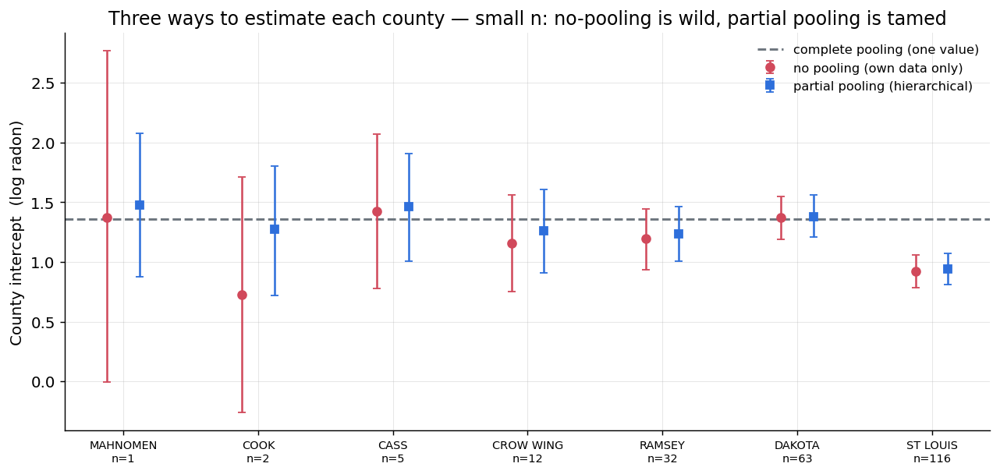
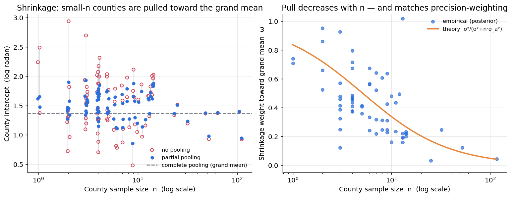
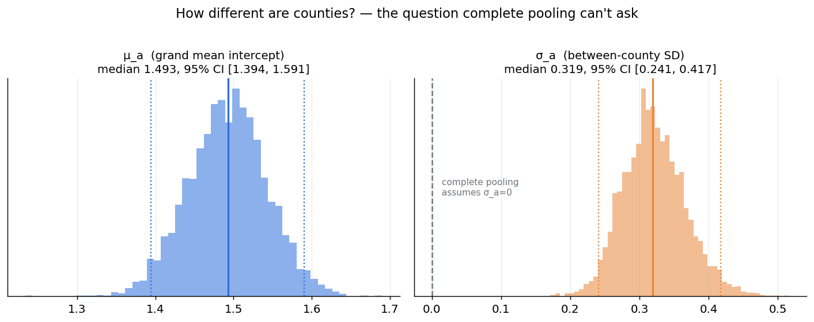
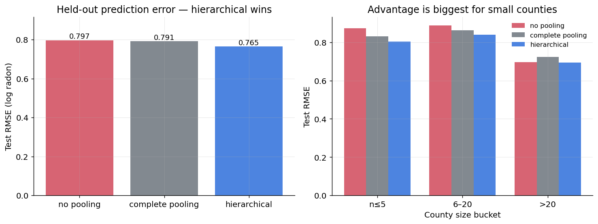
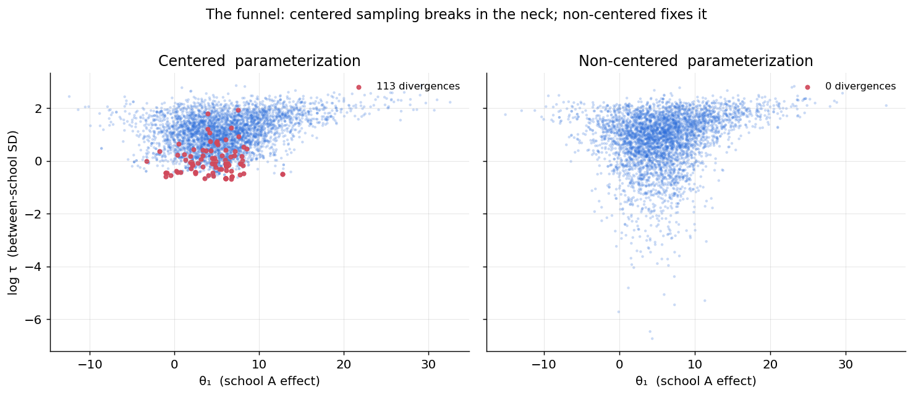

# C1 · 階層模型與「部分匯聚」的魔法

## 一句話

> 在明尼蘇達州 **919 戶、85 郡**的氡氣資料上，用**階層貝葉斯**讓小樣本郡向大樣本借力：
> 樣本數 ≤3 的郡估計被拉向全國平均 **64%**、≥30 的郡只 **14%**（拉力精確等於**精確度加權平均**），
> 測試誤差 **0.765** 勝過完全不匯聚（0.797）與完全匯聚（0.791），**尤其在小樣本郡**。

對應計劃書 [`../貝葉斯推論_實作訓練計劃.md`](../貝葉斯推論_實作訓練計劃.md) §4 專案 C1。

## 為什麼這個問題需要貝葉斯

「某個郡只量了 2 棟房子，該相信它自己的平均，還是全國平均？」

- **完全不匯聚（no pooling）**：每郡各算各的 → 小樣本郡估計極不穩（n=1 的郡可信區間橫跨 0～2.8）。
- **完全匯聚（complete pooling）**：全部混一起 → 完全忽略郡的真實差異。
- **階層（部分匯聚）**：兩個都不要，要一個**按可靠度加權**的中間值——而且「可靠度」是從資料自己學出來的。

## 關鍵結果

### 1 · 三種做法並排


小郡（MAHNOMEN n=1、COOK n=2）的 no-pooling 誤差棒巨大，被部分匯聚**收窄並拉向全國平均**；大郡（ST LOUIS n=116）三者幾乎重合——**資料夠多時部分匯聚自動放手。**

### 2 · 收縮圖 ⭐（本專案靈魂）


**左**：小 n 郡的 no-pooling（紅圈）散得很開，partial pooling（藍）被拉向 grand mean；大 n 郡兩者重合。
**右**：收縮權重 ω 隨 n 遞減（≤3 的郡 **0.64** → ≥30 的郡 **0.14**），且**緊貼理論的精確度加權曲線**：

$$a_j^{\text{partial}} \approx (1-\omega_j)\,a_j^{\text{own}} + \omega_j\,\mu_a,\qquad \omega_j = \frac{\sigma^2}{\sigma^2 + n_j\sigma_a^2}$$

這就是計劃書主題二第二卡的**精確度加權平均**——郡自己的資料是「似然」、母體分佈是「先驗」，只是這次**先驗本身也從資料學出來**（empirical Bayes / 階層貝葉斯）。

### 3 · 郡與郡之間差異有多大？


$\sigma_a$（郡間 SD）後驗中位數 **0.319**、95% CI **[0.241, 0.417]**，質量整個遠離 0——**這正是完全匯聚模型無法回答的問題**（它假設 $\sigma_a=0$）。

### 4 · 預測驗證（10 次切分平均）


| 模型 | 整體 | n≤5 | 6–20 | >20 |
|---|:-:|:-:|:-:|:-:|
| no pooling | 0.797 | 0.873 | 0.888 | 0.697 |
| complete pooling | 0.791 | 0.832 | 0.863 | 0.723 |
| **hierarchical** | **0.765** | **0.803** | **0.840** | **0.694** |

階層模型**整體最低，且在每個郡大小分桶都最好**；對 no-pooling 的優勢在**小郡最大**（0.873→0.803）、大郡趨近（資料夠多時 no-pooling 也夠用）。

### 5 · 為什麼用非中心化參數化（funnel）


用經典 **Eight Schools** 示範：**中心化**採樣器卡在漏斗頸部、**113 個 divergences**；**非中心化** $a=\mu_a+\sigma_a\tilde a$ 把漏斗拉直、**0 divergences**。這就是計劃書 §9 / 主題五第三卡的**重參數化技巧**在 MCMC 裡的救命應用。

> Radon 資料量大（σ_a 識別良好）→ 中心化其實也採得動；Eight Schools 資料少 → 漏斗嚴重。**資料少時務必非中心化。**

## 方法

- **三個 PyMC 模型**：no pooling（獨立截距）、complete pooling（單一截距）、hierarchical（$a_j\sim\mathcal{N}(\mu_a,\sigma_a)$，**非中心化**）。
- **收縮量化**：實際後驗權重 $\omega_j$ 對照理論精確度加權 $\sigma^2/(\sigma^2+n_j\sigma_a^2)$。
- **預測驗證**：每郡保留 ≥1 戶在 train（使 no-pooling 對所有測試郡有估計），10 次隨機切分取平均。
- **funnel 示範**：Eight Schools 中心化 vs 非中心化，比較 divergences。

程式：[`src/data.py`](src/data.py) · [`models.py`](src/models.py) · [`shrinkage.py`](src/shrinkage.py) · [`plots.py`](src/plots.py) · [`run_all.py`](src/run_all.py)。

## 限制與誠實的部分

1. **模型很簡化**：只有變動截距 + 共同 floor 效應，沒有郡層級的預測變數（真實 radon 分析會加郡的鈾含量 `Uppm`，能進一步解釋郡間差異）。
2. **no-pooling 的小郡估計本就不穩**：預測用的輕量擬合中，no-pooling 對 n=1 郡的截距 r̂ 偏高——這**本身就是故事的一部分**（no-pooling 不可靠），不影響點預測比較。
3. **預測差距不大**（0.765 vs 0.791）：radon 郡間差異中等（σ_a≈0.32），階層模型的優勢在**穩健性與可解釋性**（σ_a、每郡不確定性），不只是 RMSE。
4. **σ_a 的先驗**用 HalfNormal(5)（弱資訊）；換強先驗會影響 σ_a 後驗，但資料夠多時結論穩健。

## 通關標準（計劃書 §4）

- [x] 收縮圖上「拉力」隨樣本數遞減（ω：0.64 → 0.14）——部分匯聚的視覺證明
- [x] 階層模型測試誤差（0.765）< 兩個極端（0.791、0.797）
- [x] σ_a 後驗告訴你郡間差異多大（[0.241, 0.417]，明確 >0），完全匯聚無法回答
- [x]（額外）非中心化把 funnel 的 113 divergences 降到 0

## 如何重現

```bash
conda activate bayes
python src/run_all.py        # 三模型 + 五張圖 + 所有數字（約 3 分鐘，含 10 次切分預測）
jupyter lab notebooks/       # 01 部分匯聚與收縮 · 02 funnel 與非中心化
```

環境見專案根目錄 [`../README.md`](../README.md)；相依見 [`requirements.txt`](requirements.txt)。Radon 資料由 `pymc.get_data` 自動提供。

## 檔案結構

```
C1_hierarchical_pooling/
├── README.md
├── requirements.txt
├── notebooks/
│   ├── 01_partial_pooling_shrinkage.ipynb   三模型 → 收縮圖 → σ_a → 預測
│   └── 02_funnel_noncentered.ipynb          funnel 與重參數化（Eight Schools）
├── src/
│   ├── data.py         Radon 載入/切分 + Eight Schools
│   ├── models.py       三個 radon 模型 + eight schools（中心化/非中心化）
│   ├── shrinkage.py    收縮權重與精確度加權理論曲線
│   ├── plots.py        五張圖
│   └── run_all.py      一鍵重現
└── figures/            01–05 五張關鍵圖
```
