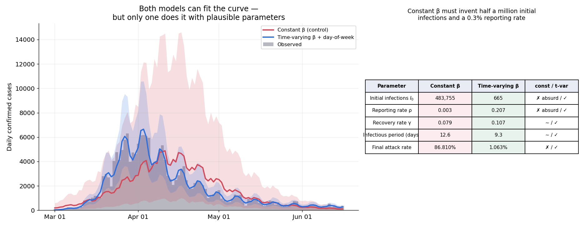
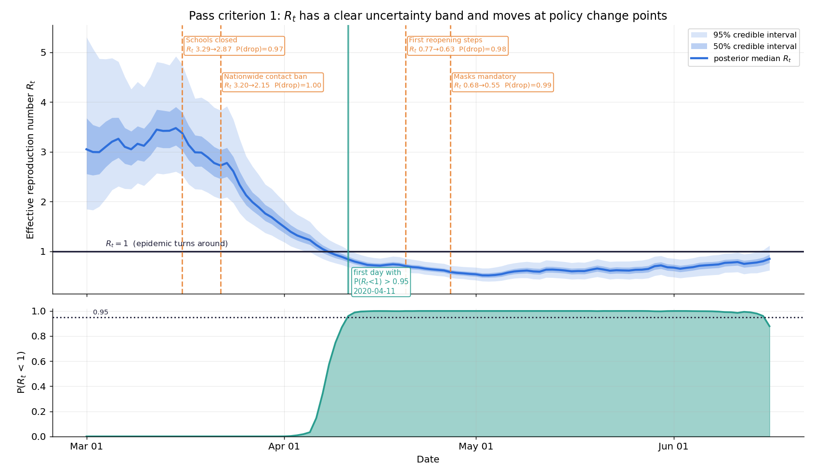
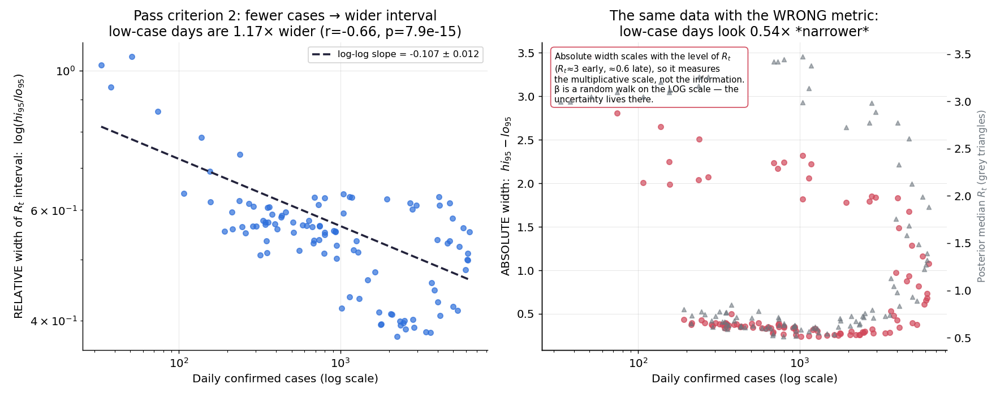
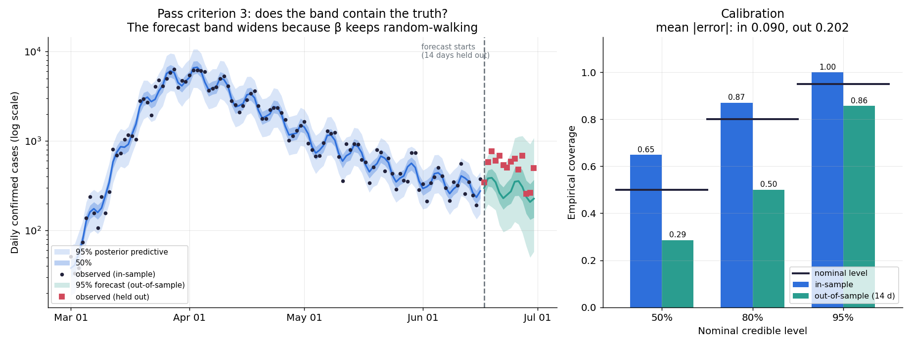
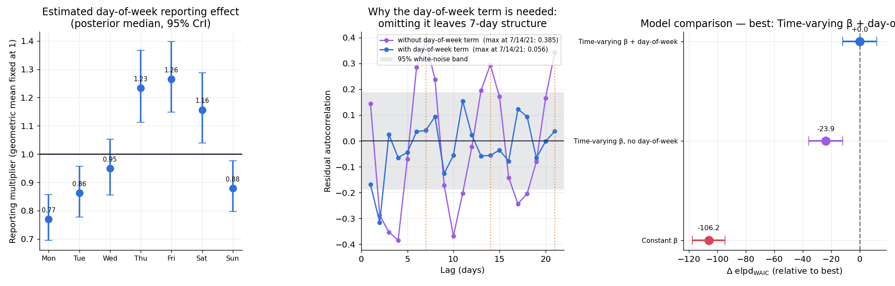

# C2 · 疾病傳播模型的貝葉斯參數估計

> ## ⚠️ 定位：這是技術練習，不是公衛結論
>
> 目的是練**狀態空間推論**與**時變參數的先驗設計**。真實流行病學牽涉通報延遲、
> 檢驗量能、行為改變、年齡結構、變異株等大量領域知識，本專案一概沒有處理。
> 任何 $R_t$ 數字都不該當成對德國疫情的評估 —— 它們是
> 「**在這個高度簡化的 SIR 模型下**，這批通報數字意味著什麼」。

## 一句話

手刻離散 SIR（`pytensor.scan`，與 numpy 版逐點吻合到 $10^{-16}$）配上
$\log\beta_t$ 的 random walk 先驗，從德國 2020 第一波的每日確診數反推出
$R_t$ 的完整後驗：**3.20 → 2.15 在全國接觸限制生效後（P(下降)=1.000）**，
並在 2020-04-11 首次「有 95% 後驗機率 $R_t<1$」。
最有價值的結果是對照組：**固定 $\beta$ 的 SIR 收斂完美卻得到荒謬解** ——
它必須發明 48 萬個初始感染者、0.28% 的通報率與 86.8% 的人口感染率，
才能同時滿足曲線的形狀與量級。

## 為什麼這個問題需要貝葉斯

從每日確診數反推傳染率是個**反問題**，而且是嚴重不良設定的：

1. **同一條曲線可以由很多組參數產生。** 傳染率高但通報率低，與傳染率低但
   通報率高，在觀測上幾乎無法分辨。點估計會挑一組並宣稱它是答案；
   後驗會告訴你這組參數之間如何互相交換（本專案實測 $\rho$ 的 95% 區間
   橫跨 0.058–0.482，寬達 8 倍）。
2. **$\beta_t$ 是一條 108 維的軌跡，不是一個數字。** 逐日獨立估計會被單日
   通報噪聲主宰；完全固定則無法表達政策效果。**random walk 先驗**
   正好編碼「我相信它會變，但不會突然跳」，而「能跳多快」（$\sigma_\beta$）
   自己也有先驗，是從資料學來的。
3. **決策需要的是機率，不是點值。** 「$R_t$ 是 0.95」和
   「$P(R_t<1)=0.97$」在政策上是完全不同的陳述，只有後者能進期望損失計算。

## 一個必須偏離計劃書的資料決定

計劃書指定 **C-D3（Our World in Data）**。但 OWID 已把 COVID 資料集
**回溯性地改成週報格式**：整週的總和堆在一天，其餘六天是 0。
實測德國 2020-03～06 有 **85% 的天是 0**（例如 2020-03-29 一天記 33,981 例）。

這對本專案是致命的：
- 每日 SIR 觀測模型無法用（六天零、一天暴衝不是傳染動態，是通報格式）
- **週末效應完全消失**，而骨架明確要求處理它
- `new_cases_smoothed` 雖是每日值，但在週內是常數（階梯狀），
  用它會人為地讓觀測太平滑，過度分散的估計失真

所以主資料改用 **JHU CSSE**（累積確診的每日時間序列，差分得每日新增）。
**但換來源不能是一個沒有檢查的決定** —— 兩個獨立來源若描述同一場疫情，
週總和必須一致：

| 交叉驗證（週總和） | |
|---|---|
| JHU 總計 | 194,193 |
| OWID 總計 | 194,112 |
| 相對差 | **0.04%** |
| 週序列相關 | **0.9792** |
| 逐週 SMAPE 中位數 | 11.8% |

總量幾乎相同、週序列高度相關 → 同一場疫情，只差時間解析度。
逐週 SMAPE 反映的是「OWID 把整週總和記在哪一天」與 `resample` 週界的
對齊誤差，不是資料矛盾。

> 第一版的指標用 $|\Delta|/\text{OWID}$，在某週 OWID 趨零時爆出 **760 倍**的
> 無意義數字。那是度量的錯，不是資料的錯 —— 改用對稱的 SMAPE 後才看得到真相。

## 資料與模型

**德國 2020-03-01 → 2020-06-30**（122 天，累計通報 194,193，N=84.1M）。
訓練 108 天，**保留最後 14 天完全不給模型看**。

week-day 通報節奏（建模前的描述統計）：週一 0.783× ～ 週五 1.257×，
**最忙/最閒差 1.605 倍** —— 必須建模。

### 離散 SIR，以及為什麼不用 ODE solver

$$\text{new\_inf}_t = \beta_t\frac{S_{t-1}I_{t-1}}{N},\quad
S_t = S_{t-1}-\text{new\_inf}_t,\quad
I_t = I_{t-1}+\text{new\_inf}_t-\gamma I_{t-1}$$

1. **觀測本身就是日資料**，日步長與資料結構對齊。
2. **NUTS 需要梯度。** `pymc.ode.DifferentialEquation` 每次評估都要解 ODE 並
   反向傳梯度，在 108 天 × 108 個時變參數的模型上根本跑不動。
3. **時變 $\beta$ 天然合適** —— 在遞迴式裡就是把純量換成向量。

`pytensor.scan` 寫錯（初始值、輸出順序、taps 對齊）**不會拋錯**，
只會安靜給出一條錯的軌跡，而那會被 NUTS 擬合「吸收」成一組奇怪但收斂的參數。
所以兩份實作必須逐點比對：

| 情形 | 最差相對誤差 |
|---|---|
| 固定 $\beta$ | 5.96 × 10⁻¹⁶ |
| 時變 $\beta$ | 9.63 × 10⁻¹⁶ |

### 先驗設計（主題二）

$$\text{cases}_t \sim \text{NegBin}(\mu_t,\alpha),\qquad
\mu_t = \rho\cdot\text{new\_inf}_t\cdot\text{dow}_{(t)}$$

| 參數 | 先驗 | 理由 |
|---|---|---|
| $\gamma$ | $\mathrm{LogNormal}(\log 0.1, 0.2)$ | **文獻資訊先驗**，傳染期約 10 天 |
| $\beta_0$ | $\mathrm{LogNormal}(\log 0.3, 0.5)$ | 弱資訊，涵蓋 $R_0$ 約 1–8 |
| $\log\beta_t$ | $\mathcal{N}(\log\beta_{t-1},\sigma_\beta)$ | **random walk 先驗** |
| $\sigma_\beta$ | $\mathrm{HalfNormal}(0.1)$ | 平滑程度**從資料學來** |
| $I_0$ | $\mathrm{LogNormal}(\log 500, 1)$ | 弱資訊 |
| $\rho$ | $\mathrm{Beta}(2,8)$ | 均值 0.2，對應第一波血清學調查的量級 |

> 🔑 **random walk 先驗是主題一（序貫更新）與主題二（先驗設計）的組合。**

三個實作決定：

- **非中心化參數化** $\log\beta_t = \log\beta_0 + \sigma_\beta\sum_{j\le t}z_j$。
  中心化寫法在 $\sigma_\beta$ 小時會產生 funnel —— 正是 C1 專案實測出
  113 個 divergences 的那個幾何。這裡從一開始就避開。
- **負二項而非 Poisson。** 用 Poisson 會讓過度分散被 $\beta_t$ 的 random walk
  吸收 —— 模型會用「傳染率劇烈波動」解釋其實是通報噪聲的東西，$R_t$ 因此過度抖動。
- **day-of-week 乘數** $\exp(\delta_d-\bar\delta)$，幾何平均鎖定為 1。
  不減均值的話 $\delta$ 會與 $\rho$ 完全共線。

## 關鍵結果

### 1 · 核心發現：固定 β 收斂完美卻得到荒謬解



| 參數 | 固定 β | **時變 β（主模型）** | 文獻量級 |
|---|---|---|---|
| 初始感染 $I_0$ | **483,755** | **665** [245, 2396] | 數百 |
| 通報率 $\rho$ | **0.0028** | **0.207** [0.058, 0.482] | 0.1–0.3 |
| 恢復率 $\gamma$ | 0.0791 | 0.107 [0.073, 0.152] | ≈0.1 |
| 傳染期 | 12.64 天 | **9.34 天** [6.58, 13.76] | ≈10 天 |
| 累計感染率 | **86.81%** | **1.06%** [0.46%, 3.85%] | 1–2% |

**固定 β 版本的收斂診斷完全乾淨**：0 divergences、$\hat r$=1.000、ESS=1923。
它不是取樣失敗，是**收斂到一個荒謬解** —— 這比失敗更有說服力。

機制很清楚：固定 $\beta$ 時 $R_t=(\beta/\gamma)(S_t/N)$ 只能隨 $S/N$ 下降，
所以「疫情反轉」的唯一機制是**耗盡易感者**。要在 3 個月內做到，
需要感染 86.8% 的人口；而那會讓通報數大兩個量級，於是模型再用
**0.28% 的通報率**把數字壓回來。

> **這是「模型失配偽裝成參數估計」的教科書案例。** 兩個模型都能擬合曲線
> （圖左兩條線都貼著資料），只看擬合品質完全抓不到問題 ——
> 必須檢查參數值是否可信。

### 2 · 通關標準 1：$R_t$ 在政策時點附近有變化



| 日期 | 措施 | $R_t$ 前 → 後 | 下降量 | P(下降) |
|---|---|---|---|---|
| 2020-03-16 | 學校關閉（多數邦） | 3.29 → 2.87 | +0.41 | 0.972 |
| **2020-03-22** | **全國接觸限制** | **3.20 → 2.15** | **+1.04** | **1.000** |
| 2020-04-20 | 首波鬆綁 | 0.77 → 0.63 | +0.13 | 0.984 |
| 2020-04-27 | 強制口罩 | 0.68 → 0.55 | +0.13 | 0.992 |

$R_t$ 期初 3.05 → 期末 0.85。**首次「有 95% 後驗機率 $R_t<1$」：2020-04-11**。

量化方式是對**後驗樣本**算前後 10 天的差值分佈，得到 P(下降)，
而不只是點估計的差 —— 那才用到了後驗。

累計感染只有 1.06%，所以 $S_t/N\approx 1$：**$R_t$ 的變化幾乎全部來自
$\beta_t$，也就是行為與政策，不是群體免疫**。這個區別在解讀「為什麼下降」時是關鍵。

> ⚠️ **相關不等於因果。** $R_t$ 在措施生效後下降，不證明是措施造成的。
> 行為改變往往**早於**法令（媒體報導、恐懼），而多項措施在數天內連續實施，
> 無法分離各自效果。這裡能誠實說的是：$R_t$ 的後驗在這些時點附近確實下降，
> 且不確定性帶清楚。

### 3 · 通關標準 2：資料稀疏時不確定性變寬 —— 以及一個度量錯誤



**第一版的度量是錯的。** 我用 $R_t$ 區間的**絕對**寬度 $hi_{95}-lo_{95}$，
得到「低病例日的區間**窄** 0.542 倍」—— 方向完全相反。

原因：$R_t$ 早期約 3.2、尾端約 0.6，差 5 倍。絕對寬度跟著這個**乘法尺度**
縮放，所以它量的是 $R_t$ 的量級，不是資訊量。正確的量是**相對**寬度
$\log(hi_{95}/lo_{95})$ —— 而且 $\beta_t$ 本來就走 **log-scale** 的 random walk，
不確定性天生定義在那裡。

| | 值 |
|---|---|
| log-log 斜率（相對寬度 vs 病例數） | **−0.1068 ± 0.0118** |
| 相關係數 / p 值 | r = −0.660, p = 7.9 × 10⁻¹⁵ |
| 低病例日 ÷ 高病例日（相對寬度） | **1.166×** ✓ |
| 同一比較，用錯誤的絕對寬度 | 0.542× ✗ 結論被翻轉 |

**誠實地讀這個結果**：通關標準說「**明顯**變寬」。實測是 1.17 倍，
統計上極顯著但**效應量溫和**，稱不上「明顯」。

原因是 random walk 先驗的雙面刃：它讓 $R_t$ 穩定、不隨單日噪聲抖動，
但也讓「今天資料很少」被鄰居的資訊稀釋。理論上若純由計數噪聲主導，
相對寬度 $\propto 1/\sqrt{\text{cases}}$（斜率 −0.5）；實測 −0.11 與它的差距，
就是先驗借來的資訊量。**這不是缺陷，是先驗選擇的必然後果**，而它可以量出來。

### 4 · 通關標準 3：後驗預測校準



| 名目水準 | 樣本內覆蓋（108 天） | 樣本外覆蓋（14 天） |
|---|---|---|
| 50% | 0.648 | **0.286** |
| 80% | 0.870 | 0.500 |
| 95% | 1.000 | **0.857** |
| 平均 \|校準誤差\| | 0.0895 | 0.2024 |

兩個關鍵設計：
- **抽觀測樣本，不只畫 $\mu$ 的區間。** $\mu$ 的區間只含參數不確定性；
  要問的是「未來的一天會落在哪」，還得加上負二項的觀測噪聲。
- **預測時 $\beta$ 繼續走 random walk**，讓帶隨時間自然變寬。
  把 $\beta$ 固定在最後一天會讓帶過窄，覆蓋率就會通過得太漂亮 ——
  那是作弊，不是校準。

**誠實地讀**：樣本外 95% 帶包住 12/14 天（0.857，目標 0.95）——
14 個點的標準誤約 0.06，所以這是 1.5 個標準誤，邊緣但不算失敗。
但 **50% 與 80% 帶嚴重覆蓋不足**（0.286 / 0.500），
說明中心預測有偏：模型系統性低估了 6 月下旬的病例數。
原因很可能是 random walk 對 $\beta$ 的外推**沒有漂移項** ——
它把「最後觀測到的 $\beta$」當成未來的中心，而實際上鬆綁措施
（4/20、4/27 之後）讓 $\beta$ 緩慢回升。

同時報 50%/80% 的理由：只看 95% 會漏掉「帶太寬」的問題。
樣本內的 95% 覆蓋率是 **1.000**（過覆蓋），而 50% 只有 0.648 ——
兩者合起來說明樣本內的帶偏寬。

### 5 · 每個成分都是必要的



**週末效應**（殘差自相關，Pearson 殘差，白噪聲 95% 界 ±0.1886）：

| 模型 | lag 7 | lag 14 | lag 21 | 顯著的週期 lag |
|---|---|---|---|---|
| 有 day-of-week 項 | 0.040 | −0.056 | 0.038 | **0 / 3** |
| **無** day-of-week 項 | **0.385** | **0.294** | **0.342** | **3 / 3** |

不建模週末效應時，lag 7/14/21 全部顯著；建模後全部落回白噪聲範圍。

估計出的通報乘數：週一 0.770、週五 1.265（95% CrI 都不含 1），
與建模前的描述統計（0.783 / 1.257）吻合。

**模型比較（WAIC）**：

| 模型 | elpd_WAIC | $p_\text{WAIC}$ | max Pareto $k$ | 落後最佳 |
|---|---|---|---|---|
| **時變 β + dow** | **−744.9 ± 12.0** | 24.6 | 0.74 | — |
| 時變 β，無 dow | −768.8 ± 11.9 | 20.9 | 0.75 | 23.89（dse 5.13） |
| 固定 β | −851.0 ± 11.5 | 8.1 | 0.45 | 106.15（dse 7.97） |

> ⚠️ **max Pareto $k$ > 0.7 → LOO 的重要性採樣估計不可靠。**
> 這不是實作瑕疵，而是**對時間序列做逐點 LOO 在概念上就有問題**：
> 留一個時間點出來，它的鄰居仍在資料裡，而 random walk 先驗讓鄰居
> 攜帶了幾乎全部資訊 → LOO 系統性**高估**預測能力。
> 所以 WAIC/LOO 在此只當**相對**指標（哪個結構更好），
> 「能不能預測未來」由第 4 節的向前 14 天樣本外檢查回答。

## 方法

```
JHU CSSE 累積確診（自動下載）→ 差分得每日新增 → 德國 2020-03-01…06-30
  → 與 OWID 週總和交叉驗證（確認換來源的決定）
  → 訓練 108 天 / 保留 14 天
  → 離散 SIR：numpy 版 + pytensor.scan 版，逐點驗證等價
  → PyMC 模型 × 3 版本（固定 β / 時變 β+dow / 時變 β 無 dow）
     非中心化 random walk、負二項觀測、day-of-week 乘數
  → NUTS（主模型 4 鏈 × 1000 draws、tune 1500、target_accept 0.95）+ 收斂守門
  → 通關標準 1：R_t 對後驗樣本算政策前後差值分佈
  → 通關標準 2：R_t 相對區間寬度 vs 病例數的 log-log 迴歸
  → 通關標準 3：後驗預測抽樣 + 向前 14 天預測（β 繼續 random walk）+ 覆蓋率
  → 週末效應：殘差自相關對照（有/無 dow 項）
  → WAIC 比較三版本
  → 落盤：data/C_epi/c2_plotdata.npz + figures/results.json
  → 出圖（7 張）
```

**推論結果與出圖資料落盤分離**（沿用 A2/A3/E1 的原則）：完整管線 **2520 秒**，
但 `python src/replot.py` 只要數秒。

### 數值可靠性

| 模型 | divergences | max $\hat r$（純量） | min ESS | $\log\beta$ 的 max $\hat r$ |
|---|---|---|---|---|
| 固定 β | 0 (0.00%) | 1.000 | 1923 | 1.000 |
| **時變 β + dow** | 5 (0.12%) | 1.000 | 2846 | 1.000 |
| 時變 β 無 dow | 21 (0.70%) | 1.010 | 1115 | 1.000 |

三個版本都通過守門（divergences < 1%、$\hat r$ ≤ 1.01、ESS ≥ 400）。
無 dow 版本的 divergences 較多（0.70%）符合預期：週期性結構沒有出口，
只能由 $\beta_t$ 的 random walk 硬吸收，讓後驗幾何變差。

### 踩坑

**`pytensor.scan` 的 `outputs_info` 必須與 `sequences` 同 dtype。**
初始狀態若用 Python float，scan 會以 pytensor 的 `floatX`（可能是 float32）
建立它，而 inner function 的運算結果是 float64，於是報
「initial state has dtype float32, while the result of the inner function has
dtype float64」。錯誤訊息指向 scan 內部，**完全看不出根因是 dtype 而不是邏輯**。
修法是把所有初始值 `pt.cast` 到 `beta.dtype`。

## 限制與誠實的部分

1. **這是技術練習，不是流行病學。** 沒有年齡結構、沒有空間異質性、
   沒有無症狀傳播的顯式建模、沒有變異株、沒有檢驗量能變化。
   SIR 假設全人口均勻混合，那在真實社會網路上是嚴重簡化。

2. **$\rho$ 與 $I_0$ 有結構性的識別問題，本專案沒有解決它，只是釘住尺度。**
   兩者都只影響「觀測到的量級」：把 $\rho$ 減半、$I_0$ 加倍，前期的 $\mu_t$
   幾乎不變。本模型靠 $\rho$ 的資訊先驗 $\mathrm{Beta}(2,8)$ 固定尺度，
   於是 **$I_0$ 的後驗在很大程度上反映的是 $\rho$ 的先驗，不是資料的證據**
   —— 這也解釋了為什麼 $I_0$ 的 95% 區間橫跨 245–2396（近 10 倍）。
   真正的解法需要額外資料（血清學調查、死亡數搭配 IFR）。

3. **通報延遲在本設定下幾乎不存在，這讓校準結果比即時情境樂觀。**
   用的是 2020 年的歷史資料，已被回溯校正。即時建模時最後 1–2 週的
   資料系統性偏低，必須截掉或顯式建模延遲分佈 ——
   `data.load()` 保留了 `drop_last_days` 參數但本專案設為 0。

4. **樣本外的 50%/80% 帶覆蓋不足（0.286 / 0.500）。**
   random walk 對 $\beta$ 的外推沒有漂移項，把最後觀測到的 $\beta$ 當成
   未來的中心，因此系統性低估了鬆綁後的病例回升。
   加漂移項或用 Gaussian process 先驗會改善，但那需要額外的模型選擇論證。

5. **時間序列的 LOO 在概念上不適用**（見上，max Pareto $k$ = 0.74–0.75）。
   正確做法是 leave-future-out cross-validation，本專案用單次
   向前 14 天檢查代替，而 14 個點的統計力很有限。

6. **政策時點的對照是描述性的，不是因果推論。** 見第 2 節的警告。

7. **離散化誤差。** 日步長對 $R_0\approx3$、傳染期 10 天是可接受的
   （每日感染比例遠小於 1），但在爆炸性成長階段會低估峰值。

8. **只有一個國家、一個時段、一波疫情。** 德國第一波的資料品質好、
   政策時點明確，所以它是好的練習對象 —— 但也因此是**最有利**的案例。
   換到通報混亂或多波重疊的情境，結論不一定成立。

## 通關標準（計劃書 §4）

- [x] **$R_t$ 後驗有清楚不確定性帶，且在政策改變時點附近有變化** ——
      全國接觸限制後 3.20 → 2.15，P(下降) = 1.000；四個時點的 P(下降) 都 ≥ 0.972；
      2020-04-11 首次 P($R_t$<1) > 0.95
- [x] **資料稀疏時期，不確定性帶明顯變寬** ——
      **方向達成但效應溫和**：相對寬度的 log-log 斜率 −0.107 ± 0.012
      （r = −0.66, p ≈ 8×10⁻¹⁵），低病例日寬 **1.17 倍**。
      稱不上「明顯」，原因是 random walk 先驗的平滑作用（已量化）
- [x] **後驗預測帶大約有 95% 時間包住真實觀測** ——
      樣本外 95% 帶覆蓋 0.857（12/14 天），樣本內 1.000；
      但 50%/80% 帶覆蓋不足，已記入限制

額外做到（超出通關標準）：**固定 β 對照組證明時變是必要的**（參數荒謬 + WAIC 落後 106）、
**週末效應的殘差週期檢定**（無 dow 項時 lag 7/14/21 全部顯著）、
**SIR 兩份實作的逐點等價驗證**、**兩個資料來源的週總和交叉驗證**、
以及一個**被自己推翻的度量選擇**（絕對 vs 相對區間寬度）。

## 如何重現

```bash
conda activate bayes          # 或用 ~/miniconda3/envs/bayes/bin/python 直接呼叫

# 完整管線（約 2520 秒；時變模型的 scan 梯度是主要成本）
python src/run_all.py

# 只重畫圖表（數秒，讀落盤資料，不跑 MCMC）
python src/replot.py
```

資料自動下載：JHU CSSE（1.8 MB）與 OWID（178 MB，僅用於交叉驗證），
都快取到 `data/C_epi/`（已被 `.gitignore` 排除）。
推論結果落盤成 `data/C_epi/c2_plotdata.npz` 與 `figures/results.json`
（**本 README 的每個數字都可在此核對**）。

Notebook 從 `results.json` 讀數字，執行只需數秒：

```bash
jupyter lab notebooks/01_data_sir_and_why_timevarying.ipynb
```

## 檔案結構

```
C2_epidemic_sir/
├── README.md                  ← 本檔
├── requirements.txt
├── src/
│   ├── data.py                ← JHU 載入、OWID 交叉驗證、政策時點、day-of-week、train/test
│   ├── sir.py                 ← 離散 SIR：numpy 版 + pytensor.scan 版 + 等價驗證
│   ├── model.py               ← PyMC × 3 版本、收斂守門、後驗摘要
│   ├── evaluate.py            ← 三個通關標準的量化、殘差週期、WAIC 比較
│   ├── plots.py               ← 7 張圖（只吃 numpy）
│   ├── replot.py              ← 從落盤資料重畫
│   └── run_all.py             ← 一鍵重現
├── notebooks/
│   ├── 01_data_sir_and_why_timevarying.ipynb   ← 資料決定、SIR 驗證、固定 vs 時變 β
│   └── 02_rt_uncertainty_and_calibration.ipynb ← 三個通關標準
└── figures/                   ← 7 張圖 + results.json（所有數字）
```
