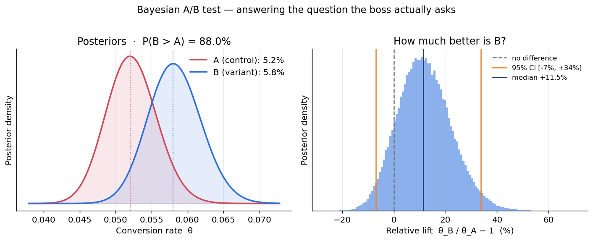
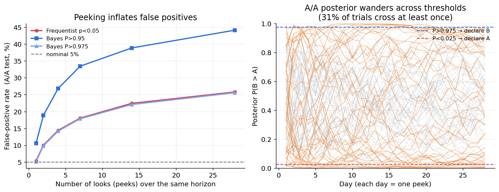
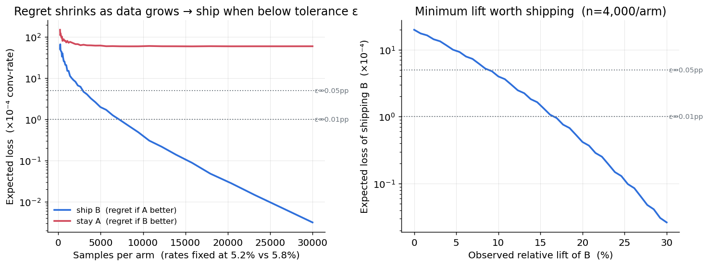
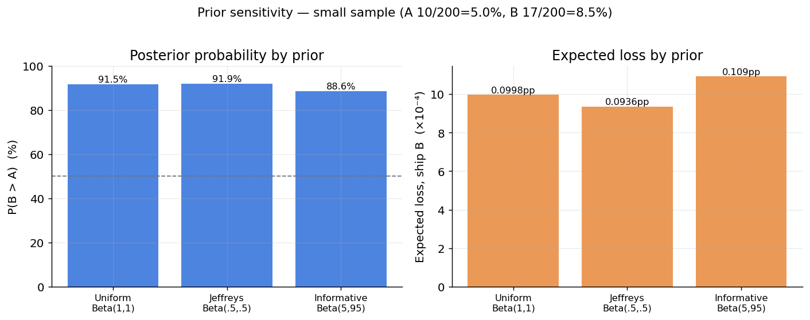

# D1 · 貝葉斯 A/B 測試框架

## 一句話

> 用 **Beta-Binomial 封閉解**回答老闆的「B 比 A 好的機率是多少」，再用**期望損失**把它變成上線決策；
> 並以 **3,000 次 A/A 模擬**證明「逐日偷看」會把假陽性率從 5% 膨脹到 **26%**——
> 而且**貝葉斯後驗門檻在配對條件下同樣不免疫**（這是常被過度宣傳的一點）。

對應計劃書 [`../貝葉斯推論_實作訓練計劃.md`](../貝葉斯推論_實作訓練計劃.md) §5 專案 D1。

## 為什麼這個問題需要貝葉斯

老闆問的是「B 比 A 好的機率」，而 **p-value 在定義上無法回答這個問題**——它算的是「若 A、B 其實相同，看到這麼極端資料的機率」。

以本專案的範例（A 5.2%、B 5.8%，各 4,000 次曝光）：

| 框架 | 輸出 | 老闆能用嗎？ |
|---|---|---|
| 頻率派 | 雙尾 **p = 0.24**（不顯著） | ✗ 「不顯著」不等於「沒差」 |
| 貝葉斯 | **P(B > A) = 88.0%**、相對提升 95% 可信區間 `[−7%, +34%]` | ✓ 直接是決策所需的機率 |

**同一份資料，兩種框架講出截然不同的話。** 這就是業界從 p-value 轉向貝葉斯 A/B 的原因。

## 關鍵結果

### 1 · 回答老闆真正的問題


後驗 `P(B>A)=88.0%`（網格積分 / 蒙地卡羅 / 常態近似三法互驗，皆 0.880±0.001）。
右圖相對提升的 95% 可信區間**涵蓋 0**——「很可能更好，但還不確定」，與 p=0.24 完全一致。

### 2 · 偷看資料如何膨脹假陽性 ⭐


在同樣 28 天視野內、3,000 次 **A/A**（兩組其實相同，故任何宣布都是假陽性）：

| 停止規則 | 只看 1 次 | 逐日偷看 28 次 |
|---|:-:|:-:|
| 頻率派 p < 0.05 | 5.5% | **25.8%** |
| 貝葉斯 P > 0.975 *(門檻匹配 α=0.05)* | 5.2% | **25.6%** |
| 貝葉斯 P > 0.95 *(門檻較鬆)* | 10.6% | **44.1%** |

**這張圖是本專案的重點**：頻率派 p<0.05 與貝葉斯 P>0.975 兩條線**幾乎完全重疊**——
因為 `P>0.975`（雙向）在數學上就對應雙尾 `α=0.05`。**「改用貝葉斯」並不會讓你免疫於偷看。**

### 3 · 決策成本：何時值得上線


把「機率」變成「行動」：上線規則 = **期望損失 < 容忍度 ε**。
- 觀測固定 5.2% vs 5.8% 時，期望損失降到 ε=0.05pp 以下約需 **~3,000 樣本/組**。
- n=4,000/組、ε=0.01pp 時，**值得上線的最小相對提升 ≈ 17%**。

### 4 · 先驗敏感度（誠實）


小樣本（各 200 次）下，一個相當強的先驗（100 個等效觀測）把 P(B>A) 從 91.5% 拉到 88.6%——
資料仍主導，但偏移是真的、**要報告**。樣本更少時先驗影響更大。

## 方法

- **共軛更新**：θ ~ Beta(1+k, 1+n−k)，封閉解、即時計算、不需 MCMC。
- **P(θ_B > θ_A)**：主用網格數值積分 `∫ pdf_A(x)·SF_B(x) dx`（精確可重現），另有 MC 與常態近似互驗。
- **期望損失** `E[(θ_A−θ_B)^+]`：1D 化為 `∫ pdf_A(t)·[t·CDF_B(t) − mean_B·CDF_{Beta(b+1)}(t)] dt`。
- **偷看模擬**：向量化預計算每個「模擬 × 天」的 p-value / 後驗機率 / 期望損失（常態近似，大樣本下與精確網格誤差 < 0.1pp），之後所有偷看排程與規則都只是查表——1,000+ 次模擬秒級完成。

程式：[`src/bayes_ab.py`](src/bayes_ab.py)（核心）· [`src/experiments.py`](src/experiments.py)（偷看模擬）· [`src/frequentist.py`](src/frequentist.py) · [`src/plots.py`](src/plots.py) · [`src/run_all.py`](src/run_all.py)（一鍵重現）。

## 限制與誠實的部分

1. **貝葉斯不是萬靈丹。** 後驗機率的*解讀*在偷看下不失效，但把它*門檻化當停止規則*就重新引入多重比較——長期假陽性照樣膨脹（圖 2 已量出：P>0.975 與 p<0.05 幾乎一致）。
2. **期望損失規則**在逐日偷看下也常「上線」（ε=0.02pp 時 68.8%），但那是**決策論意義的「不在乎誰贏」**（A/A 下後悔本就可忽略），不是 p 值意義的判錯；它控制的是後悔的*大小*，不是宣稱的*對錯*。故未與顯著性規則放同一條軸。
3. **偷看不是一無是處**：B 真的 +10% 時，逐日偷看偵測率 66.8%、平均第 16.5 天就發現，遠快於固定視野的 6.2%。**速度 vs 假陽性，是取捨。**
4. **真正的序貫解法**是 always-valid inference（mSPRT、confidence sequences），不是「改用貝葉斯」。
5. 結論依賴**先驗**（圖 4）與**損失函數 ε** 的設定——這些假設都應明示。

## 通關標準（計劃書 §5）

- [x] 能輸出「**B 優於 A 的機率 = 88.0%**」這種老闆聽得懂的話
- [x] 頻率派偷看的假陽性率**遠超 5%**（→ 25.8%），圖 2 一目了然
- [x] 量化貝葉斯決策規則在偷看下的表現——並**誠實報告**：配對門檻下後驗規則同樣膨脹（比「假裝貝葉斯贏」更有價值）
- [x] 說清楚貝葉斯 A/B **不是萬靈丹**（見「限制與誠實的部分」）

## 如何重現

```bash
conda activate bayes
python src/run_all.py        # 產生 figures/ 四張圖 + 印出所有數字
# 或看敘事版：
jupyter lab notebooks/       # 01 回答老闆的問題 · 02 偷看與最優停止
```

環境見專案根目錄 [`../README.md`](../README.md)；本專案相依見 [`requirements.txt`](requirements.txt)。

## 檔案結構

```
D1_ab_testing/
├── README.md                         ← 本檔
├── requirements.txt
├── notebooks/
│   ├── 01_bayesian_ab_testing.ipynb        回答老闆的問題（決策 + 先驗敏感度）
│   └── 02_peeking_optional_stopping.ipynb  偷看與最優停止（貝葉斯不是萬靈丹）
├── src/
│   ├── bayes_ab.py      Beta-Binomial 核心（後驗 / P(B>A) / 期望損失 / 提升）
│   ├── frequentist.py   兩比例 z 檢定（對照）
│   ├── experiments.py   A/A 偷看模擬與停止規則
│   ├── plots.py         四張圖
│   └── run_all.py       一鍵重現
└── figures/             01–04 四張關鍵圖
```
