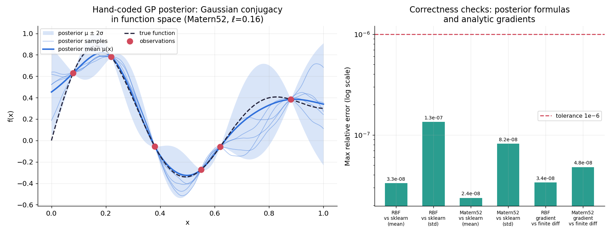
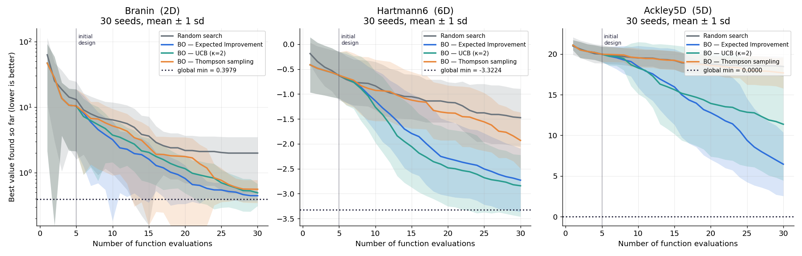
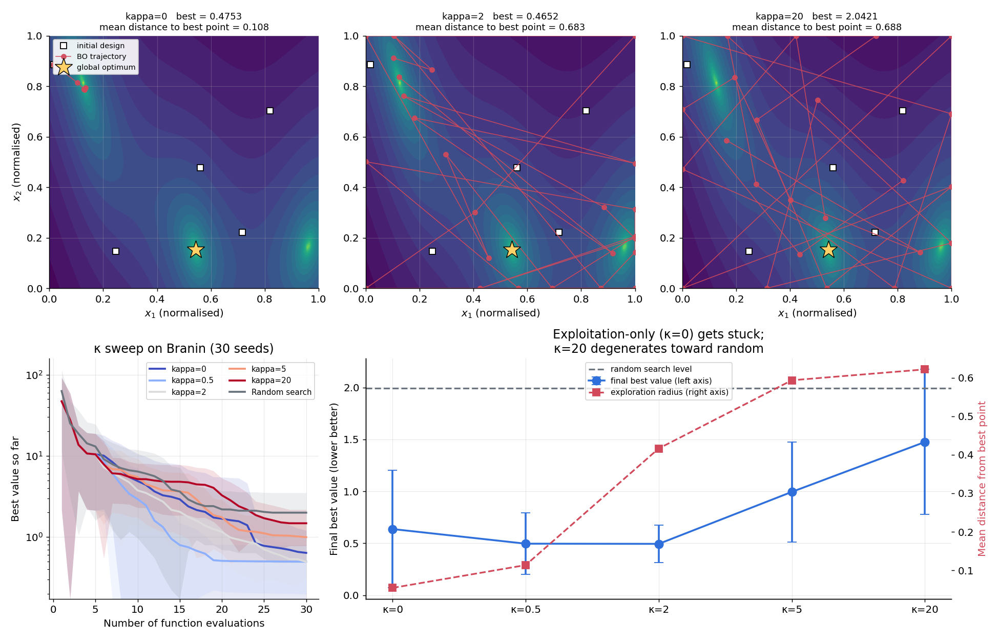
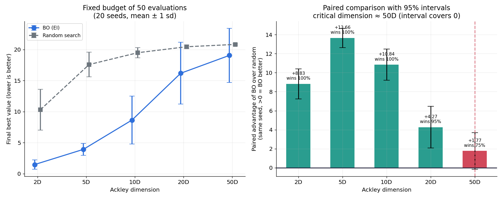
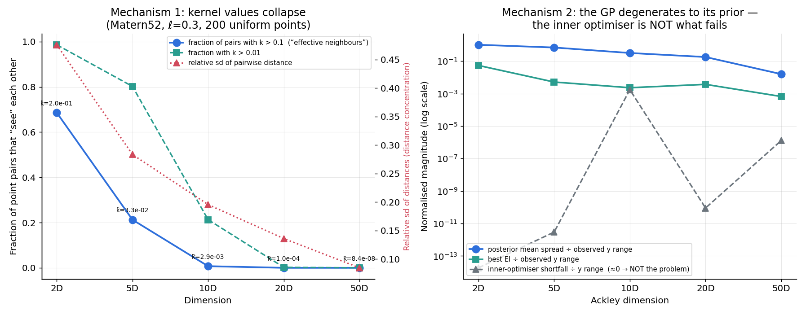
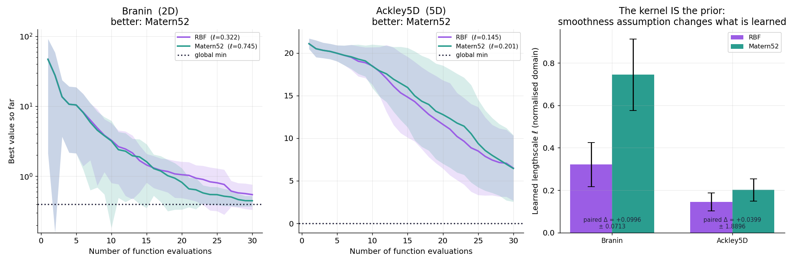
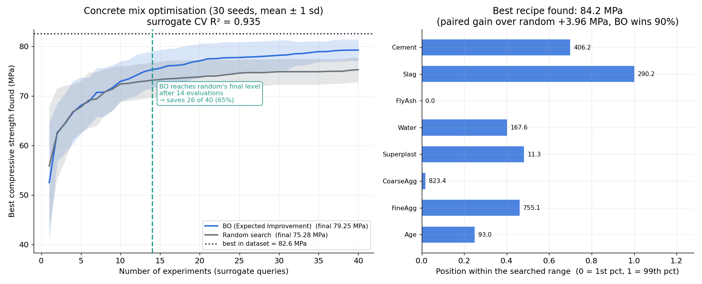

# E1 · 從零實作貝葉斯最優化

## 一句話

手刻高斯過程（Cholesky + 解析梯度，與 sklearn 逐點吻合到 10⁻⁸）與三種 acquisition，
在 30 次評估的預算下讓 Branin 從隨機搜尋的 **1.995** 降到 **0.447**（全域最小 0.398）；
在真實的混凝土配方問題上，BO **只用 14 次實驗就達到隨機搜尋花光 40 次的水準
——省下 65%**；並量出維度詛咒的臨界點（50D，配對優勢的 95% 區間首次涵蓋 0），
過程中**推翻了自己對高維失敗原因的假設**：不是 acquisition 解不動，是 GP 退化成先驗。

## 為什麼這個問題需要貝葉斯

每次實驗要 8 小時。**我只有 30 次機會。第 11 次該做在哪裡？**

要回答這個問題，你需要的不是「目前的最佳猜測」，而是**「我對每個還沒試過的地方
有多不確定」**——因為值得試的地方有兩種：看起來很好的（利用），
以及我完全不知道的（探索）。點估計只給你前者。

GP 給出的是函數空間上的完整後驗，acquisition function 則把
「均值」與「不確定性」合成一個可排序的量，於是「下一個實驗做在哪」
變成一個可以計算的決策問題。這是計劃書主題七第二卡的完整落地。

## 手刻 GP：函數空間的高斯共軛

$$\mu(x_*) = k_*^\top (K + \sigma_n^2 I)^{-1} y, \qquad
\sigma^2(x_*) = k_{**} - k_*^\top (K + \sigma_n^2 I)^{-1} k_*$$

> 🔑 **這兩條式子就是高斯共軛在函數空間的版本**（計劃書主題二第二卡）。
> 有限維的高斯共軛是「先驗均值被資料拉動、變異數必定縮小」；這裡完全一樣，
> 只是「參數」變成了整個函數。第二條式子裡減掉的那一項，
> 就是「觀測帶走了多少不確定性」。

實作要點：

- **一律走 Cholesky**，不呼叫 `inv()`。$\log|K|$ 直接由 $2\sum\log L_{ii}$ 得到。
- **jitter 階梯**：BO 會反覆在幾乎相同的位置取樣（acquisition 收斂時），
  那讓 $K$ 接近奇異。沒有 jitter 時 Cholesky 直接失敗，整個 run 掛掉——
  而在 30 seeds × 多設定的實驗裡，那意味著整批結果消失。
- **超參數用 log 尺度 + 解析梯度**最大化邊際似然：
  $\partial\log p/\partial\theta = \tfrac12\mathrm{tr}\big((\alpha\alpha^\top - K^{-1})\partial K/\partial\theta\big)$
- **多起點重啟**：邊際似然常有兩個吸引盆——「訊號解」（合理的 ℓ、小 noise）
  與「噪聲解」（ℓ→∞、noise 吃掉全部變異，模型退化成常數）。
  單起點很容易掉進後者，而那會讓 BO 完全停止探索。

### 手刻的意義是「確認自己知道套件在算什麼」

所以要驗證，不是聲稱：

| 檢查 | RBF | Matérn 5/2 |
|---|---|---|
| vs sklearn，後驗均值的最大相對誤差 | 3.31 × 10⁻⁸ | 2.37 × 10⁻⁸ |
| vs sklearn，後驗標準差的最大相對誤差 | 1.35 × 10⁻⁷ | 8.17 × 10⁻⁸ |
| 解析梯度 vs 中央差分的最大相對誤差 | 3.36 × 10⁻⁸ | 4.79 × 10⁻⁸ |

兩件事值得說明：

1. **與 sklearn 的比對在固定超參數下進行。** 兩邊的超參數優化器不同（起點、
   收斂條件、參數化都不同），比較「各自優化後」的結果只會測到優化器差異，
   測不到後驗公式對不對。鎖住核參數與噪聲後，差異就只能來自線性代數本身。
2. **梯度檢查是獨立且必要的。** 梯度寫錯時 L-BFGS 仍會「跑完」並回傳看似合理的
   超參數，只是它不是邊際似然的最大值。這種錯誤不拋例外、不會被發現，
   只會安靜地讓 GP 擬合變差、讓 BO 表現變爛。



左圖是「觀測帶走不確定性」的視覺化：觀測點處的帶幾乎收成一條線，遠離觀測處回到
先驗寬度。五條後驗樣本函數顯示 GP 給的不是一條曲線，而是**一整族與資料相容的函數**
——這正是 acquisition 能運作的基礎。

## 三種 acquisition function

本專案全部處理**最小化**問題，所以符號與多數文獻的最大化形式相反：

| 名稱 | 公式（最小化版） | 探索的來源 |
|---|---|---|
| **UCB** | $\mu(x) - \kappa\sigma(x)$ | 顯式的 $\kappa$ 旋鈕 |
| **EI** | $(f^+-\mu)\Phi(Z) + \sigma\phi(Z)$，$Z=\frac{f^+-\mu}{\sigma}$ | 隱式：對改善量取期望 |
| **Thompson** | 從後驗抽一條函數，取它的最小值位置 | 隱式：後驗抽樣的隨機性 |

EI 的一個好性質：$\sigma\to0$ 時整式趨於 0，所以它**天然不會重複取樣已知點**
——這是它比 UCB 少一個旋鈕的原因。

## 關鍵結果

### 1 · 通關標準 1：低維時 BO 明顯勝過隨機搜尋



30 個隨機種子的 mean ± 1 sd。所有方法用**完全相同的評估次數預算**（30 次），
BO 的初始設計（5 點 Latin hypercube）也計入——真實世界裡初始點也要花實驗次數。

| 目標函數 | 隨機搜尋 | BO — EI | BO — UCB | BO — Thompson | 全域最小 |
|---|---|---|---|---|---|
| Branin (2D) | 1.995 ± 1.511 | **0.447 ± 0.077** | 0.494 ± 0.182 | 0.561 ± 0.214 | 0.3979 |
| Hartmann6 (6D) | −1.474 ± 0.582 | −2.729 ± 0.635 | **−2.841 ± 0.620** | −1.931 ± 0.564 | −3.3224 |
| Ackley (5D) | 18.467 ± 1.209 | **6.450 ± 3.910** | 11.365 ± 6.927 | 17.683 ± 1.907 | 0.0 |

> ⚠️ 只跑一次的比較沒有意義。**多次重複 + 誤差帶**是這個專案的專業度所在
> （計劃書 §6 步驟 3）。BO 的單次軌跡受初始設計影響極大，
> 兩個方法的單次曲線交叉多次是常態。

Branin 上 BO-EI 的標準差是隨機搜尋的 **1/20**——不只平均更好，而且**可靠**，
這在「只有 30 次機會」的情境下比平均值更重要。

**Thompson sampling 明顯較弱**，在 Ackley 5D 上幾乎與隨機搜尋無異（17.68 vs 18.47）。
這一部分是我為了控制計算成本降低了它的解析度，見「限制」第 2 點。

### 2 · 通關標準 2：κ 控制探索與利用



UCB 的 $\kappa$ 是三種 acquisition 裡唯一**顯式**的探索旋鈕。除了收斂曲線，
我記錄兩個把「卡住」變成數字的行為指標：

| κ | 最終最佳值 | 探索半徑 | 不重複點比例 |
|---|---|---|---|
| **0**（純利用） | 0.637 ± 0.567 | **0.054** | **0.516** |
| 0.5 | 0.496 ± 0.298 | 0.114 | 0.657 |
| **2** | **0.494 ± 0.182** | 0.416 | 0.983 |
| 5 | 0.995 ± 0.482 | 0.594 | 0.996 |
| 20（近純探索） | 1.476 ± 0.700 | 0.622 | 0.991 |
| 隨機搜尋 | 1.995 ± 1.511 | — | — |

- **κ=0 的「不重複點比例」只有 0.516**——一半的評估花在幾乎相同的位置上。
  探索半徑 0.054 意味所有取樣點都擠在當時最佳點周圍 5% 的範圍內。
  上排左圖看得最清楚：點聚成一小團，**完全錯過了黃星標記的全域最優**。
- **κ=20 的最終值 1.476 已接近隨機搜尋的 1.995**，退化如預期。
- 中間有個最佳區（κ≈0.5–2）。這就是探索與利用的權衡，**而它是可以量出來的**。

Branin 有**三個等價的全域最小值**，所以它特別適合看這件事：純利用的 BO 會鎖死在
最先碰到的那一個附近；κ=2 會在幾個盆地之間分配預算；κ=20 把點撒得像隨機搜尋。

### 3 · 通關標準 3：維度詛咒與臨界維度



設計上兩個刻意的選擇：**固定 50 次評估預算**（不隨維度放大，因為那才對應
「我只有 50 次機會，維度高低不會改變這件事」），以及**配對比較**
（同一個 seed 下比 BO 與隨機搜尋，抵消初始設計的共同噪聲）。

| Ackley 維度 | BO (EI) | 隨機搜尋 | 配對優勢 ± 95% CI | BO 勝率 |
|---|---|---|---|---|
| 2D | 1.478 ± 0.743 | 10.310 ± 3.287 | **+8.83 ± 1.58** | 100% |
| 5D | 3.919 ± 0.942 | 17.577 ± 1.980 | **+13.66 ± 1.02** | 100% |
| 10D | 8.642 ± 3.842 | 19.484 ± 0.832 | **+10.84 ± 1.64** | 100% |
| 20D | 16.173 ± 4.973 | 20.441 ± 0.291 | **+4.27 ± 2.18** | 95% |
| **50D** | 19.049 ± 4.372 | 20.817 ± 0.120 | **+1.77 ± 1.92** | 75% |

**臨界維度 = 50D**（配對優勢的 95% 區間首次涵蓋 0：1.77 − 1.92 < 0）。

誠實地讀這張表：BO 到 **20D 仍顯著勝出**（95% 勝率），優勢在 50D 才落入噪聲。
但趨勢很清楚——配對優勢從 5D 的 +13.7 一路衰減到 50D 的 +1.8，
而隨機搜尋的標準差同時從 1.98 縮到 0.12（高維下**所有**隨機點都差不多爛，
所以它的表現變得極度一致）。

### 4 · 維度詛咒的機制，以及一個被推翻的假設



找出臨界維度只是現象。**機制才有解釋力，而且它決定該怎麼補救。**

我原本的假設是：高維 BO 的失敗來自**內層優化**——「找 acquisition 的最大值」
本身是非凸全域優化，維度一高就解不動了。若如此，補救方式是加大內層預算。

**診斷一 · 核值集中**（$[0,1]^d$ 均勻抽 200 點，Matérn 5/2，ℓ=0.3）：

| 維度 | pairwise 距離相對 sd | 核值中位數 | 「有效鄰居」比例 (k>0.1) |
|---|---|---|---|
| 2D | 0.476 | 2.02 × 10⁻¹ | **68.6%** |
| 5D | 0.284 | 3.32 × 10⁻² | 21.3% |
| 10D | 0.196 | 2.93 × 10⁻³ | 0.7% |
| 20D | 0.136 | 1.04 × 10⁻⁴ | **0.0%** |
| 50D | 0.085 | 8.41 × 10⁻⁸ | 0.0% |

距離集中（相對 sd 從 0.48 掉到 0.085）且一律變大 → 核值跨 **6 個數量級**趨近 0
→ **每個觀測點都「看不到」其他點**。

**診斷二 · 內層優化 vs 模型退化**（8 seeds 平均，都已除以實際觀測到的 y 範圍）：

| 維度 | 後驗均值動態範圍 ÷ y 範圍 | best EI ÷ y 範圍 | 內層優化落差 |
|---|---|---|---|
| 2D | **1.008** | 5.38 × 10⁻² | +0.00000 |
| 5D | 0.685 | 5.12 × 10⁻³ | −0.00000 |
| 10D | 0.315 | 2.29 × 10⁻³ | +0.00360 |
| 20D | 0.178 | 3.69 × 10⁻³ | +0.00000 |
| 50D | **0.016** | 6.60 × 10⁻⁴ | +0.00000 |

**內層優化落差幾乎全是 0**——用 50 個候選點找到的 acquisition 值與用 20000 個
幾乎相同。**我的假設被推翻了：內層優化沒有失敗。**

真正發生的是更根本的事：高維下 GP 退化成先驗，**acquisition 變平坦，
根本沒有最大值可找**。任何預算都會找到同一個平坦值。證據是另外兩欄：

- **後驗均值的動態範圍從佔 y 範圍的 100% 崩到 1.6%** → GP 的後驗均值在 50D
  幾乎是**常數**，它對這批資料什麼都沒學到。
- **best EI 崩掉近兩個數量級** → EI 的最大值是「最值得試的那一點期望能改善多少」，
  它趨近 0 就表示模型認為**到處都不值得試**。

> **補救方式完全不同。** 如果是內層優化的問題，加大候選點預算就好；
> 既然是 GP 退化，要換的是**模型**（降維、加性核、trust region，
> 或認賠改用隨機搜尋）。這就是為什麼機制診斷不能省——它決定下一步該做什麼。

正規化本身也是必要的誠實：Ackley 的函數值範圍隨維度縮小（餘弦項被平均掉），
不除以 y 範圍的話，絕對值的下降會有一部分只是尺度效應。

### 5 · 通關標準 4：核函數就是先驗



| 目標函數 | RBF 最終值 | RBF 學到的 ℓ | Matérn 最終值 | Matérn 學到的 ℓ | 配對差異 ± 95% CI |
|---|---|---|---|---|---|
| Branin (2D) | 0.547 | **0.322** | **0.447** | **0.745** | **+0.0996 ± 0.0713** ✓ |
| Ackley (5D) | 6.490 | 0.145 | 6.450 | 0.201 | +0.0399 ± 1.8896 ✗ |

Branin 上 Matérn 5/2 **顯著較佳**（區間不含 0）；Ackley 5D 上兩者無法區分。

但最有說服力的不是最終值，是**學到的 lengthscale**：Matérn 學到的 ℓ 是 RBF 的
**2.3 倍**（Branin）與 1.4 倍（Ackley）。

機制：RBF 假設函數**無限可微**，在崎嶇的目標上它必須用很短的 lengthscale 才能
擬合觀測，而短 ℓ 讓後驗在觀測點之間迅速回到先驗（於是不確定性被高估、
探索變得盲目）。Matérn 5/2 只要求**兩次可微**，能用較長的 ℓ 描述同樣的資料。
**平滑度假設不是技術細節，它就是先驗**，而它的後果是可以量出來的。

### 6 · 真實應用：混凝土配方最優化



E-D2（UCI Concrete Compressive Strength，1030 筆、8 個配方變數 → 抗壓強度）。
用梯度提升迴歸訓練代理模型當「做一次實驗就能得到的真實強度」
（5-fold CV **R² = 0.935 ± 0.011**）。

| | 40 次實驗後的最佳強度 |
|---|---|
| BO (EI) | **79.25 ± 2.17 MPa** |
| 隨機搜尋 | 75.28 ± 2.42 MPa |
| 配對優勢 | **+3.96 ± 1.16 MPa**（BO 勝率 90%） |

**「省下多少次實驗」**：隨機搜尋花光全部 40 次達到 75.28 MPa，
而 **BO 只用 14 次就達到同樣水準 → 省下 26 次（65%）**。
在「每次實驗 8 小時」的設定下，這是省下 208 小時。

找到的最佳配方預測強度 84.2 MPa。**注意這超過了資料集中的最高值 82.60 MPa**
——那是代理模型在資料點之間的預測，不該當成真的（見限制第 4 點）。

## 方法

```
E-D1 手寫測試函數（Branin 2D / Hartmann6 6D / Ackley nD，全部有已知全域最優）
  → 定義域正規化到 [0,1]^d，統一成最小化問題
  → 手刻 GP：RBF / Matérn 5/2、Cholesky + jitter 階梯、log 尺度超參數 + 解析梯度
  → 驗證：vs sklearn（固定超參數，逐點）+ 解析梯度 vs 中央差分
  → 三種 acquisition：UCB / EI / Thompson，兩階段最大化（候選點掃描 → L-BFGS 精修）
  → BO 迴圈：LHS 初始設計 → 擬合 → 最大化 acquisition → 評估 → 更新
  → 30 seeds（維度實驗 20 seeds）取 mean ± sd，配對比較抵消共同噪聲
  → κ 掃描 + 2D 軌跡可視化
  → 維度詛咒 + 兩個機制診斷（核值集中、acquisition 平坦化）
  → 核函數比較（含學到的 lengthscale）
  → E-D2 Concrete 代理模型 → 配方最優化 → 省下的實驗次數
  → 落盤：data/E_experiment/e1_plotdata.npz + figures/results.json
  → 出圖（7 張）
```

**推論結果與出圖資料落盤分離**（沿用 A2/A3/B2 的原則）：完整實驗 **1430 秒**，
但 `python src/replot.py` 只要 **2 秒**。本專案光是修正 log 軸誤差帶的塌陷問題
就重畫了數次，這個設計直接省下一小時。

### 效能上的一個坑

**Thompson sampling 原本比其他 acquisition 慢 45 倍**（一次 BO run 17.7 秒
vs UCB/EI 的 0.4 秒），整個專案會被這一項主導。原因是 Thompson 需要**聯合**
後驗樣本，而聯合抽樣要對 $m\times m$ 共變異數做 Cholesky → $O(m^3)$，
用 $m=2000$ 個候選點時每次迭代都付一次這個代價。
折衷是在候選點裡隨機取 512 個做聯合抽樣（1.73 秒）。這降低了 Thompson 的
搜尋解析度，見限制第 2 點。

## 限制與誠實的部分

1. **lengthscale 用 isotropic（單一長度尺度）而非 ARD（每維一個）。**
   本專案的測試函數各維對稱，ARD 帶不來好處；而維度詛咒實驗要跑到 50 維，
   ARD 會有 50 個超參數要在 ≤50 個觀測點上估計，那本身就會失敗，
   會把「BO 的維度詛咒」與「超參數估計的維度詛咒」混在一起。
   代價是在各維尺度差異大的真實問題（如 Concrete）上，isotropic 是明顯的簡化。

2. **Thompson sampling 的比較不公平。** 為了控制成本，它只在 512 個候選點上
   抽聯合樣本，而 UCB/EI 用 2000 個候選點加 L-BFGS 精修。
   所以「Thompson 較弱」這個結論**混合了方法本身與我給它的預算**。
   正解是用 random Fourier features 抽出連續的樣本函數（$O(n\cdot D)$），
   那能讓它與其他方法平等競爭，但屬於另一套近似方法，超出「手刻 GP」的範圍。

3. **維度實驗用 20 seeds 而非 30，且 `refit_every=2`。** 20D 的 GP 超參數優化
   最慢（單次 run 約 15 秒），全用 30 seeds + 每步重擬合會讓這一項超過 20 分鐘。
   這是計算預算的選擇，數值記在 `results.json` 裡。降頻重擬合會讓 GP 的超參數
   略微落後於資料，方向上對 BO 不利，所以這個妥協不會誇大 BO 的優勢。

4. **Concrete 的代理模型不是真實世界。** 它平滑掉了真實製程的噪聲與不可行區域，
   所以「省下 65%」是在這個代理上的數字。更要注意 BO 找到的配方預測強度
   84.2 MPa **超過資料集最高值 82.60 MPa**——代理模型在資料點之間的預測沒有
   實驗驗證，真實製程可能根本做不出這個配方（例如水灰比不合工程規範）。
   這個數字應該讀成「BO 在代理上找到了最優」，不是「BO 發現了新配方」。

5. **搜尋範圍取 [1%, 99%] 分位數，這個選擇會影響結論。** 用全範圍會讓代理模型
   在資料稀疏的角落外插出假的高強度；但截斷也可能把真正的最優排除在外。
   若 BO 找到的配方某個成分頂在邊界上（右圖可見），那就是這個問題的徵兆。

6. **臨界維度 50D 是「在這個預算下」的數字。** 它同時取決於評估預算（50 次）、
   初始設計大小（10 點）、目標函數（Ackley 的漏斗結構）、以及核函數選擇。
   換成 200 次預算，臨界維度會往上移。機制論證（核值集中、GP 退化）可以外推，
   具體的臨界維度不行。

7. **acquisition 的內層優化用有限差分梯度。** 解析梯度需要對 $\mu(x)$、$\sigma(x)$
   再對 $x$ 微分，是另一套鏈式法則。診斷顯示內層優化沒有成為瓶頸
   （落差 ≈ 0），所以沒有進一步優化，但在更高維或更緊的預算下可能需要。

8. **沒有與 `scikit-optimize` 做端到端對照。** 它裝在環境裡（計劃書列為選用），
   但本專案的重點是手刻與機制診斷；一個成熟套件的效能對照會是有價值的補充。

## 通關標準（計劃書 §6）

- [x] **低維（< 10）時，BO 明顯勝過隨機搜尋** ——
      Branin 0.447 vs 1.995（sd 小 20 倍）、Hartmann6 −2.841 vs −1.474、
      Ackley5D 6.450 vs 18.467
- [x] **κ=0 卡在局部最優的軌跡清晰可見** ——
      不重複點比例僅 0.516、探索半徑 0.054，2D 軌跡圖上點聚成一團且錯過全域最優
- [x] **高維時兩者收斂接近，量出臨界維度** ——
      配對優勢從 5D 的 +13.66 衰減到 50D 的 +1.77 ± 1.92（區間涵蓋 0）；
      **臨界維度 = 50D**
- [x] **換核函數改變結果** ——
      Branin 上 Matérn 5/2 顯著優於 RBF（配對差異 +0.0996 ± 0.0713），
      且 Matérn 學到的 lengthscale 是 RBF 的 2.3 倍

額外做到（超出通關標準）：**手刻 GP 的雙重驗證**（vs sklearn + 解析梯度）、
**維度詛咒的兩個機制診斷**（含推翻自己的假設）、
**κ 的行為量化**（探索半徑、不重複點比例）、
**真實應用的省下實驗次數計算**、配對 bootstrap 式的統計比較。

## 如何重現

```bash
conda activate bayes          # 或用 ~/miniconda3/envs/bayes/bin/python 直接呼叫

# 完整實驗（約 1430 秒；維度詛咒實驗佔一半以上）
python src/run_all.py

# 只重畫圖表（約 2 秒，讀落盤資料，不跑 GP/BO）
python src/replot.py
```

測試函數全部手寫，無需下載。Concrete 從 OpenML 自動下載並快取成
`data/E_experiment/concrete.csv`。實驗結果落盤成
`data/E_experiment/e1_plotdata.npz`（0.22 MB）與 `figures/results.json`
（**本 README 的每個數字都可在此核對**）。

Notebook 從 `results.json` 讀數字，執行只需數秒：

```bash
jupyter lab notebooks/01_gp_and_acquisition.ipynb
```

## 檔案結構

```
E1_bayesian_optimization/
├── README.md                  ← 本檔
├── requirements.txt
├── src/
│   ├── gp.py                  ← 手刻 GP：核函數、Cholesky、解析梯度、與 sklearn 驗證
│   ├── objectives.py          ← Branin / Hartmann6 / Ackley / Concrete 代理模型
│   ├── acquisition.py         ← UCB / EI / Thompson、兩階段最大化、平坦化診斷
│   ├── bo.py                  ← BO 主迴圈、LHS 初始設計、隨機搜尋對照、多 seed 聚合
│   ├── experiments.py         ← 六組實驗的編排
│   ├── plots.py               ← 7 張圖（只吃 numpy）
│   ├── replot.py              ← 從落盤資料重畫（2 秒）
│   └── run_all.py             ← 一鍵重現
├── notebooks/
│   ├── 01_gp_and_acquisition.ipynb              ← GP 驗證、acquisition、通關標準 1/2
│   └── 02_curse_kernels_and_application.ipynb   ← 維度詛咒與機制、核函數、真實應用
└── figures/                   ← 7 張圖 + results.json（所有數字）
```
