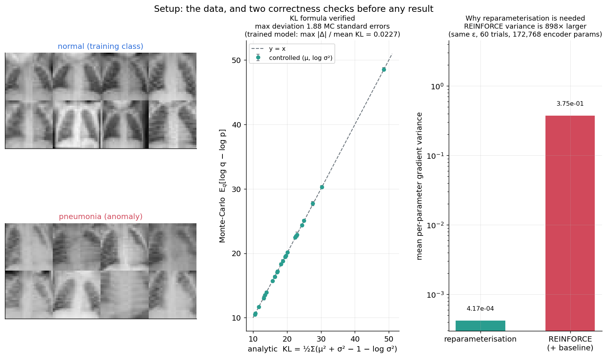
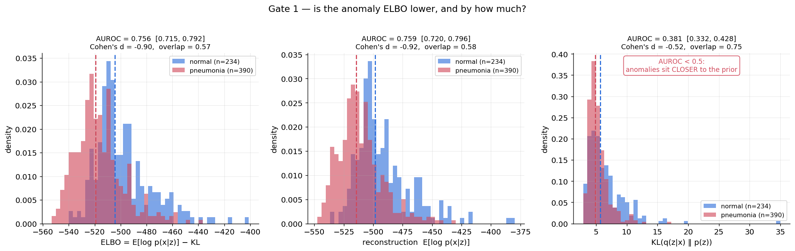
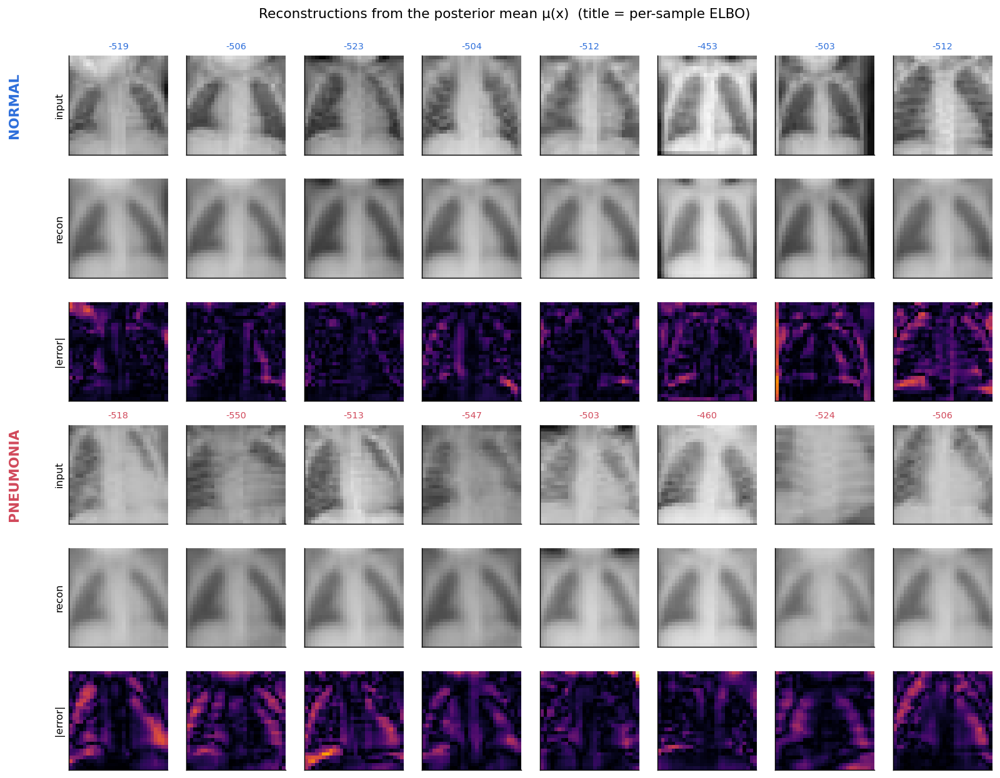
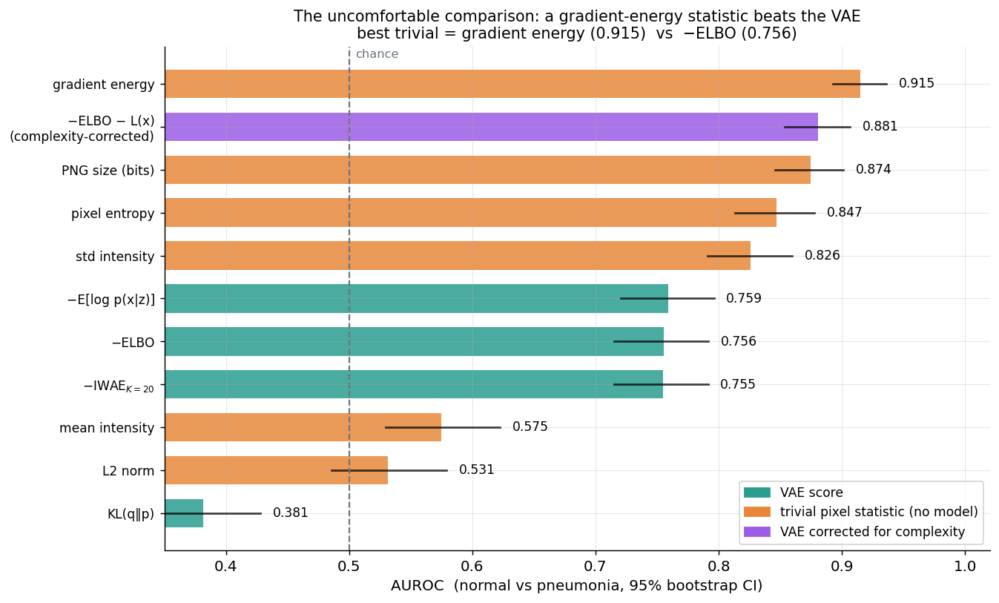
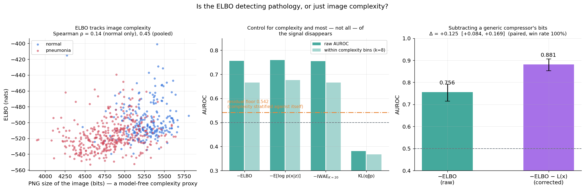
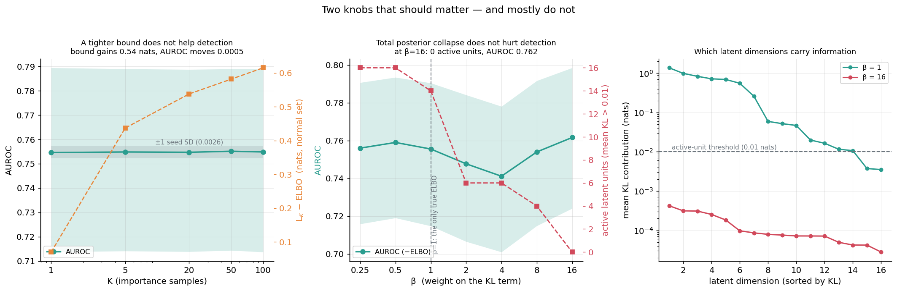
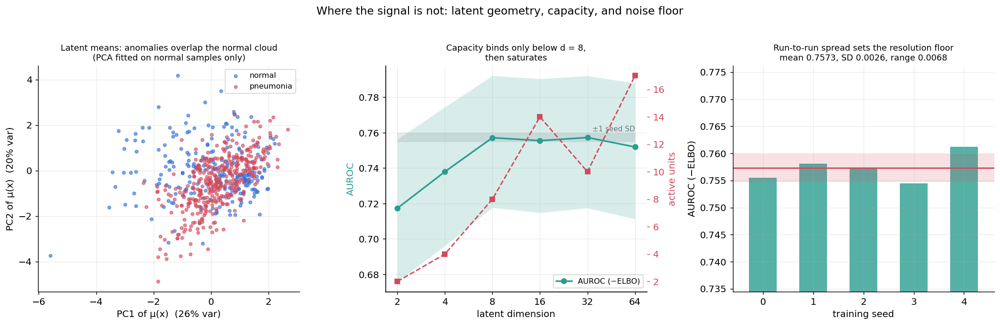

# S1 · 醫學影像的 VAE 異常偵測

> 補充專案，補強計劃書覆蓋偏少的**主題五（變分推論 / ELBO）**。
> 完整規格見 [`../貝葉斯推論_實作訓練計劃.md`](../貝葉斯推論_實作訓練計劃.md) §7。

## 一句話

只用 1214 張**正常**胸片訓練 VAE，用 ELBO 當異常分數偵測肺炎，達成 AUROC 0.756 ——
**然後用一個兩行 numpy 的梯度能量統計拿到 0.915，把自己的模型打敗 16 個百分點**；
追查後證明 ELBO 有一大半在測量「影像多難壓縮」而非病灶，
再以 $S=-\mathrm{ELBO}-L(x)$ 扣掉複雜度成分，把模型分數救回 **0.881（+0.125，配對勝率 100%）**。

## 為什麼這個問題需要變分推論

前面九個專案都在算後驗：A1/C1/C2 用 MCMC，B2 用 nested sampling，E1 用 GP 的解析後驗。
它們有個共同前提 —— **參數夠少**。

VAE 的「參數」是每張影像各自的 latent $z$：1214 張圖就是 1214 個後驗。
MCMC 完全不可行。變分推論換一條路：不抽樣，改成**優化**一族分佈 $q_\phi(z|x)$，
找裡面最接近真後驗的那個。

$$\log p(x) = \underbrace{\mathbb{E}_{q}\left[\log p(x|z)\right] - \mathrm{KL}\left(q(z|x)\,\|\,p(z)\right)}_{\textbf{ELBO}} \;+\; \underbrace{\mathrm{KL}\left(q(z|x)\,\|\,p(z|x)\right)}_{\ge 0,\ \text{近似的代價}}$$

代價是得到的是近似，而且**近似有多差你不知道** —— 那正是右邊第二項。
這個代價在本專案變成一個可以直接測的問題：收緊下界（IWAE）會讓異常偵測變好嗎？
（答案：完全不會，見第 6 節。）

## 資料與設定

**PneumoniaMNIST**（MedMNIST v2，A-D6，重用 A3 已下載的快取）。單通道 28×28。

| 集合 | n | 用途 |
|---|---|---|
| train[normal] | 1214 | 訓練 VAE（**pneumonia 完全不給模型看**）|
| val[normal] | 135 | 以 val ELBO 選最佳權重 |
| test[normal] | 234 | in-distribution |
| test[pneumonia] | 390 | 異常 |

這是**單類別學習**：訓練時只有正常樣本。比二元分類難，但更貼近現實 ——
罕見病的標註樣本本來就湊不齊。

⚠️ 與 A3 專案的關鍵差別：A3 做的是「胸片 vs 時尚商品」那種**跨資料集** OOD。
這裡的 in-distribution 與 anomaly 是**同一台機器、同一個部位、同一種影像**，只差病灶。
直覺上低階像素統計不該分得開 —— 這個直覺在第 4 節被推翻。

## 關鍵結果

### 1 · 先證明工具是對的



談任何 ELBO 數字之前，ELBO 的兩個組成都要各自驗證。

**KL 項**：對角高斯的解析式 $\mathrm{KL}=\frac12\sum_j(\mu_j^2+\sigma_j^2-1-\log\sigma_j^2)$
寫錯一個 $\frac12$、一個符號、漏掉 $-1$ **都不會拋錯**，只會讓訓練往一個略微不對的目標收斂。
用 Monte Carlo 獨立比對：24 個受控案例全部落在 **4 個 MC 標準誤**內（最大偏差 1.88 SE）；
訓練後的模型上再驗一次，max $|\Delta|$ / 平均 KL = **0.0227**。

> ⚠️ **第一版這個檢查「失敗」了，問題出在測試設計**。原本拿未訓練模型的 encoder 輸出來測，
> 那時 $\mu\approx0$、$\log\sigma^2\approx0$，KL≈0.003 —— 相對誤差的分母趨近 0，
> MC 的取樣噪聲讓相對誤差爆到 1.1，看起來像公式錯了。
> 改成直接抽合理範圍的 $(\mu,\log\sigma^2)$（KL 落在 10–49 nats）才真的檢驗到公式，
> **容差也改用 MC 自己的標準誤**而不是猜一個數字。

**重參數化**：$z=\mu+\sigma\odot\epsilon$ 讓梯度能穿過隨機節點。
替代方案 REINFORCE 同樣無偏，差別**只在變異數**：

| 估計器 | 每參數梯度變異數 | 梯度範數 |
|---|---|---|
| 重參數化 | 4.17 × 10⁻⁴ | 18.3 ± 7.6 |
| REINFORCE（含 baseline）| 3.75 × 10⁻¹ | 213.4 ± 139.7 |

**差 898 倍。** 兩邊用完全相同的 $\epsilon$，REINFORCE 還加了 baseline（不加差距更誇張，
那樣的對照不誠實）。這個比值就是「為什麼 2013 年前 VAE 訓不起來」的答案 ——
不是模型不對，是梯度太吵。

### 2 · 通關標準 1：異常的 ELBO 明顯較低 —— 成立，但「明顯」要打折



| 分數 | AUROC | 95% CI | Cohen's d | 重疊係數 |
|---|---|---|---|---|
| −ELBO | 0.7555 | [0.715, 0.792] | −0.90 | 0.57 |
| −E[log p(x\|z)]（重建項）| **0.7591** | [0.720, 0.796] | −0.92 | 0.58 |
| KL(q‖p) | **0.3814** | [0.332, 0.428] | −0.52 | 0.75 |
| −IWAE(K=20) | 0.7547 | [0.715, 0.791] | −0.90 | 0.58 |

三件事值得停下來看：

1. **通關成立但「明顯」過頭了**。直方圖確實右移，但重疊係數 0.57 —— 超過一半的面積重疊。
2. **判別力幾乎全部來自重建項**（0.759 ≈ 完整 ELBO 的 0.756）。latent 那一項對分數幾乎沒貢獻。
3. **KL 項的 AUROC 低於 0.5**，而且明顯低。與直覺相反：
   我原本預期異常影像的 latent 會被推到先驗外圍（KL 大），
   實際上**異常的 latent 比正常的更靠近先驗**（平均 KL 5.3 vs 6.5 nats）。

### 3 · 重建圖解釋了第 3 點



VAE 在 1214 張圖上訓練、容量有限，學到的是「胸片的低頻結構」——
大致的輪廓與明暗分佈。兩組的重建**都很糊**，肋骨紋理誰都沒重建出來。

於是：肺炎影像本身更糊、更平坦（肺泡實變讓肺野的黑色空氣被液體取代），
**反而更接近 VAE 能表達的東西**。encoder 不需要把 latent 推很遠就能生成一張糊圖 → KL 更小。
而重建誤差變大，是因為白色實變區的**絕對強度**對不上，不是因為結構複雜。

ELBO 的兩項在這裡是**互相抵銷**的方向 —— 這就是為什麼完整 ELBO（0.756）
比單獨的重建項（0.759）還低一點。

### 4 · 誠實檢查：模型打得贏兩行 numpy 嗎？—— 打不贏



六個**完全不看模型**的像素統計，每個都試兩個方向並取較好的那個
（等於讓 baseline 偷看標籤選方向 —— 刻意如此，我們要的是「懶惰方法的上界」）：

| 統計量 | AUROC | 方向 | |
|---|---|---|---|
| **gradient energy** | **0.9147** | 反向 | ← 打敗 VAE 16 個百分點 |
| PNG 位元數 | 0.8743 | 反向 | ← 打敗 VAE |
| pixel entropy | 0.8468 | 反向 | ← 打敗 VAE |
| std intensity | 0.8261 | 反向 | ← 打敗 VAE |
| mean intensity | 0.5750 | 正向 | |
| L2 norm | 0.5313 | 正向 | |
| *VAE（−ELBO）* | *0.7555* | | |

**四個 trivial 統計量打敗了 VAE。** 而且方向是「反向」的 —— 異常影像的梯度能量**較低**，
正是第 3 節肉眼看到的「肺炎片更糊」。那個觀察當時看起來是模型的助力，現在變成問題。

> 這**不代表 trivial 統計量是更好的臨床工具**。它抓的是「這張片子模糊」，
> 而模糊可以來自肺炎，也可以來自病人動了、曝光不足、機器不同。
> 它在這個資料集上有效，是因為 MedMNIST 的降採樣把病理特徵壓成了低頻明暗差異。
> 但那正是**必須報告它**的理由：它揭露的是資料集的捷徑，不是模型的能力。

### 5 · 追查：ELBO 到底在測什麼



上面的結果指向一個具體假設：**ELBO 大部分在測量影像複雜度**。
這是深度生成模型的已知病（Nalisnick et al. 2019；Serrà et al. 2020）。
用 PNG 無損壓縮的位元數當「無模型的複雜度代理」，三個角度檢驗：

**(a) 相關**：Spearman(ELBO, PNG 位元數) = **+0.143**（只用 normal）、**+0.447**（合併）。
兩組的平均位元數 5265 vs 4824 —— 異常影像確實比較好壓縮。

**(b) 分層 AUROC**：按複雜度分 8 箱、**箱內**算 AUROC 再以配對數加權。
箱內兩類的複雜度相當，剩下的判別力就不可能來自複雜度。

| 分數 | 原始 | 控制複雜度後 | 95% CI |
|---|---|---|---|
| −ELBO | 0.7555 | **0.6664** | [0.603, 0.722] |
| −E[log p(x\|z)] | 0.7591 | 0.6761 | [0.615, 0.731] |
| −IWAE | 0.7547 | 0.6665 | [0.603, 0.723] |
| *複雜度對自己分層（殘餘底線）* | | *0.5420* | |

> **方法論細節，不藏起來**：分層後複雜度對自己應該掉到 0.5，實際上掉到 **0.542**，
> 因為箱內仍有殘餘的複雜度變異（PNG 位元數連續，8 箱切不乾淨）。
> 我把它當**對照底線**而非瑕疵：模型的分層 AUROC 要跟 0.542 比，不是跟 0.5 比。
> 而「切幾箱」是任意選擇，所以掃過 k=3…30：淨貢獻穩定在 **+0.09 ~ +0.12**
> （k=3 例外，箱太寬使底線被高估）。

**結論**：VAE 確實學到了複雜度以外的東西，但那部分只有約 **+0.10 AUROC**；
原始的 0.756 裡超過一半來自「這張圖多難壓縮」。

**(c) 那就把複雜度扣掉**：$S = -\mathrm{ELBO} - L(x)$，$L(x)$ 是 PNG 位元數換算成 nats。

| 分數 | 原始 | 校正後 | 配對 Δ | 勝率 |
|---|---|---|---|---|
| −ELBO | 0.7555 | **0.8808** | **+0.1253** [+0.0843, +0.1691] | 100% |
| −IWAE | 0.7547 | 0.8807 | +0.1260 [+0.0848, +0.1693] | 100% |

一個兩行的後處理，比任何超參數調整都有效（見第 6 節）。
但誠實地說：校正後的 0.881 **仍然輸給** gradient energy 的 0.915 ——
扣掉複雜度只讓 VAE 從「明顯較差」變成「接近但仍略差」。

### 6 · 三個「該有影響」的旋鈕，以及一個噪聲底線



比較任何設定之前先問：同一設定重跑幾次，AUROC 差多少？
**5 個 seed：0.7573 ± 0.0026**（範圍 0.7545–0.7612）。這是所有掃描的解析度下限。

**(a) IWAE 的 K —— 完全沒用（0.2σ）**

$L_K$ 隨 K 單調上升（更接近 $\log p(x)$）。**為什麼這不是自明的**：
ELBO 的鬆弛量 $\mathrm{KL}(q\|p(z|x))$ 本身帶有「這筆資料的後驗好不好近似」的資訊，
而那對異常偵測可能有用；收緊下界會移除這個訊號。

| K | 1 | 5 | 20 | 50 | 100 |
|---|---|---|---|---|---|
| AUROC | 0.7546 | 0.7548 | 0.7547 | 0.7551 | 0.7548 |
| $L_K-\mathrm{ELBO}$ (nats) | +0.070 | +0.437 | +0.538 | +0.582 | +0.615 |

**下界確實收緊了，AUROC 紋絲不動（全距 0.0005 = 0.2σ）。**
原因：收緊量 0.6 nats 相對於 ELBO 本身的 −496 量級是 **0.1%** ——
近似品質這個成分在總分裡佔比太小，既不是訊號也不是噪聲來源。
**在這個任務上 K=1 就夠了**，IWAE 的 100 倍計算成本買不到任何東西。

**(b) β —— posterior collapse 對偵測幾乎無害，而且方向反了**

| β | 0.25 | 0.5 | 1 | 2 | 4 | 8 | **16** |
|---|---|---|---|---|---|---|---|
| AUROC | 0.756 | 0.759 | 0.756 | 0.748 | 0.741 | 0.754 | **0.762** |
| 活躍單元 /16 | 16 | 16 | 14 | 6 | 6 | 4 | **0** |
| 總 KL (nats) | 14.32 | 9.41 | 5.64 | 2.94 | 0.78 | 0.16 | **0.002** |
| val ELBO | | | **−496.30** | | | | **−507.36** |

**β=16 時 latent 完全塌陷（0 個活躍單元、總 KL 0.002 nats），AUROC 卻是全掃描最高的 0.762。**

差距 +0.006 只有 2.2 個 seed 標準差 —— 小，但方向明確地不是「變差」。
這個模型的 **val ELBO 比 β=1 差了 11 nats**，作為生成模型明顯較劣，
作為異常偵測器卻不輸。合起來就是：
**latent 空間對這個任務本來就沒在貢獻，所以摧毀它也沒差。**
（第 2 節「判別力全來自重建項」+ 第 5 節「重建項大半是複雜度」已經預告了這件事。）

> 這與 A2 專案的教訓同源：那裡是「用後驗區間寬度當模型品質指標會挑到最錯的那一個」，
> 這裡是「**用 ELBO 當模型品質指標，會挑到對下游任務並不更好的那一個**」。
> 生成品質與偵測能力是兩個不同的目標函數。

**(c) latent 容量 —— 只在 d<8 時是瓶頸**



| latent dim | 2 | 4 | 8 | 16 | 32 | 64 |
|---|---|---|---|---|---|---|
| AUROC | 0.717 | 0.738 | 0.757 | 0.756 | 0.757 | 0.752 |
| 活躍單元 | 2 | 4 | 8 | 14 | 10 | 17 |

d=2 明顯較差（15σ），d≥8 完全飽和。**擴大容量到 64 沒有讓模型「連異常也重建出來」**
（那是我原本擔心的失效模式），因為活躍單元停在 10–17 —— 模型自己不用那麼多維度。

左圖的 latent 投影（PCA 只用 normal 樣本擬合，PC1+PC2 解釋 46%）也說了同一件事：
異常的 $\mu(x)$ 落在正常雲團**內部**，沒有離群。

**效應量總表（相對於 seed 標準差 0.0026）**：

| 改動 | 效應 | 幾個 σ |
|---|---|---|
| 複雜度校正 | **+0.1253** | **48.2σ** |
| latent 維度 2→64 | 0.0399 | 15.3σ（幾乎全來自 d=2）|
| β 0.25→16 | 0.0205 | 7.8σ |
| IWAE K 1→100 | 0.0005 | 0.2σ |

## 方法

- **模型**：卷積 VAE，314,721 參數。encoder 3 層 stride-2 卷積 → $(\mu,\log\sigma^2)$，
  decoder 對稱轉置卷積輸出 Bernoulli logits。SiLU 激活。`logvar` clamp 到 [−8, 8]
  （不 clamp 實測會 NaN）。
- **訓練**：AdamW + cosine annealing，300 epochs（早停 patience 40），
  以 **val ELBO** 選權重。主模型**不用** KL warmup —— 好讓 collapse 診斷測到的是
  模型本身的行為，而不是被 annealing 掩蓋的。
- **分數**：逐樣本 ELBO 的重建項用 **8 個 MC 樣本**平均（單樣本估計的噪聲會直接稀釋 AUROC）。
- **IWAE**：`logsumexp` 實作，否則 K 稍大就溢出。
- **統計**：AUROC 用 Mann–Whitney rank 公式（平手正確算 0.5）；
  區間一律**對正負兩組分層重抽**的 bootstrap；比較兩個分數時用**配對** bootstrap
  （同一組重抽索引評兩者，消掉共同變異）。

### 可重現性

沿用 A3 的教訓：只設 seed 不足以可重現。本專案設
`cudnn.deterministic=True` + `benchmark=False`，並在 `run_all.py`
**import torch 之前**設 `CUBLAS_WORKSPACE_CONFIG=:4096:8`。

## 限制與誠實的部分

1. **最強的偵測器不是這個模型。** gradient energy（0.915）打敗校正後的 VAE（0.881）。
   本專案的價值在於**診斷出 ELBO 在測什麼**，不在於做出最好的肺炎偵測器。

2. **Bernoulli 似然是近似的。** MedMNIST 的像素是 [0,1] 的連續值，不是二元。
   用 Bernoulli 交叉熵是 VAE 文獻慣例（原始論文在 MNIST 上就這樣做），
   但它等價於一個**未正規化**的似然 —— 所以 ELBO 的絕對值（≈ −496 nats）
   不能解釋成 $\log p(x)$ 的估計，只能做**相對**比較。
   連續 Bernoulli（Loaiza-Ganem & Cunningham 2019）會修正這點，本專案沒做。

3. **訓練集只有 1214 張。** 這對 VAE 偏少，重建普遍偏糊（見第 3 節），
   模型學到的是低頻結構。更大的資料集**可能**讓 latent 真的學到肺部解剖，
   進而讓 KL 項變成有用的訊號。本專案的所有結論都應理解為
   「**在這個資料規模下**」，而不是「VAE 異常偵測不行」。

4. **28×28 抹掉了大部分病理特徵。** MedMNIST 的設計目的是輕量基準，不是高保真醫學影像。
   真實胸片是 2000×2000 以上，磨玻璃影、支氣管充氣徵在 28×28 上根本不存在 ——
   剩下的就是整體明暗，而那正是 trivial 統計量抓得到的東西。
   **這很可能是「trivial 打敗模型」的主因**，換成全解析度資料結論可能反轉。

5. **複雜度校正的 $L(x)$ 選擇是啟發式的。** PNG 不是 $\log p(x)$ 的無偏估計，
   只是一個「通用壓縮器」代理。用 JPEG2000 或不同壓縮等級會得到不同的校正量，
   我沒有掃這個選擇的敏感度。

6. **分層 AUROC 的殘餘底線 0.542 不是 0.5。** 已在第 5 節說明並當作對照底線報告，
   但它確實限制了這個方法的解析度 —— 淨貢獻 +0.12 的絕對數值依賴底線估得準不準。

7. **β=16 略優於 β=1 只有 2.2σ。** 我報告它是因為方向與「collapse 應該致命」的
   預期相反，但它**不足以支持「應該用 β=16」**這種建議。單一 seed 的掃描，
   換 seed 可能翻轉；要下這個結論需要對每個 β 都跑多 seed。

8. **只有一個異常類別。** PneumoniaMNIST 的 pneumonia 混合了細菌性與病毒性肺炎，
   兩者的影像表現不同。分開評估可能會發現模型在其中一類上明顯較好 ——
   資料集沒提供這個標籤，本專案沒能做。

## 通關標準（計劃書 §7）

- [x] **異常樣本的 ELBO 明顯較低（直方圖可分離）** —— 成立。AUROC 0.756、Cohen's d −0.90。
      但重疊係數 0.57，「明顯」應改成「可測地分開」。
- [x] **同時展示 ELBO 分解、重參數化、OOD 偵測** —— 全部成立。
      分解顯示重建項主導、KL 項**反向**；重參數化 vs REINFORCE 量出 898× 的變異數差距。

**額外做的**（計劃書沒要求，但沒有它們這個專案的結論會是錯的）：
trivial baseline 對照、複雜度混淆的三重檢驗、複雜度校正分數、
IWAE / β / latent 三個掃描、5-seed 噪聲底線。

## 如何重現

```bash
# 完整管線：訓練 20 個 VAE → 全部實驗 → 出圖（約 131 秒，RTX 5070 Ti）
python src/run_all.py

# 只重畫圖表（約 2 秒，讀落盤資料，不訓練）
python src/replot.py

# 快速煙霧測試（約 15 秒，數字無意義，只驗證管線與出圖）
S1_QUICK=1 python src/run_all.py
```

資料由 `medmnist` 自動下載到 `../data/A_medical/medmnist/`
（A3 已下載過就直接重用）。推論結果落盤成 `../data/A_medical/s1_plotdata.npz`
與 `figures/results.json` —— 調圖表不必重跑推論。

## 檔案結構

```
S1_vae_anomaly/
├── src/
│   ├── data.py          PneumoniaMNIST 載入、複雜度統計
│   ├── vae.py           ConvVAE、ELBO、IWAE、KL 驗證、梯度變異數比較
│   ├── train.py         訓練迴圈（β-VAE）、active units 診斷
│   ├── evaluate.py      AUROC、bootstrap、分層 AUROC、PNG 複雜度
│   ├── experiments.py   全部實驗
│   ├── plots.py         7 張圖
│   ├── run_all.py       一鍵重現
│   └── replot.py        只重畫圖
├── notebooks/
│   ├── 01_elbo_and_reparameterization.ipynb   ELBO / 重參數化 / 通關 1
│   └── 02_honest_evaluation.ipynb             對照基準與四個負面結果
└── figures/             7 張圖 + results.json
```

## 相依套件

見 [`requirements.txt`](requirements.txt)。torch 請裝 CUDA 12.8 版（見根目錄 README）。
