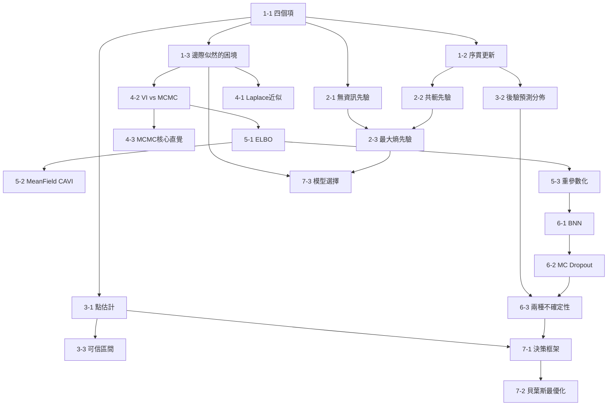

# 貝葉斯推論 · 完整課程

> [!abstract] 這套教材是什麼
> 21 張卡片,七個主題,從貝葉斯定理走到模型選擇。
>
> 教學法是**費曼學習法**:每個概念都必須回答「為什麼要這樣定義?」「不這樣定義會出什麼問題?」
>
> 每張卡片的結構固定:**直覺鋪墊 → 正式定義 → 反直覺例子 → 電機工程類比 → 費曼檢驗**。

---

## 一句話總結整門課

> **貝葉斯推論 = 「先驗 × 似然 → 後驗」這條更新律,**
> **加上「後驗算不出來時該怎麼辦」的一整套工程方法,**
> **再加上「有了後驗之後該怎麼行動」的決策理論。**

---

## 閱讀順序

### 開始之前

- [[A1_數學符號閱讀工具箱]] ← **強烈建議先讀**。如果你看到 $\int p(\theta\mid D)\,d\theta$ 腦中沒有畫面,先把這個工具箱練熟。

### 主線

| 主題 | 卡片 | 核心問題 |
|---|---|---|
| **一 · 貝葉斯定理的真正意義** | [[1-1_四個項的認識論意義]] | 四個項各自在說什麼? |
| | [[1-2_序貫更新與Kalman Filter]] | 為什麼「今日後驗 = 明日先驗」是恆等式? |
| | [[1-3_邊際似然的困境]] | $p(D)$ 為什麼算不出來? |
| **二 · 先驗的設計哲學** | [[2-1_無資訊先驗與Jeffreys]] | 「什麼都不知道」要怎麼編碼? |
| | [[2-2_共軛先驗與指數族]] | 為什麼某些先驗-似然組合會神奇地相配? |
| | [[2-3_最大熵先驗]] | 已知某些約束時,最誠實的先驗是什麼? |
| **三 · 後驗的幾何與解讀** | [[3-1_點估計與損失函數]] | 從後驗這座山,該摘哪一個點? |
| | [[3-2_後驗預測分佈]] | 為什麼用整座山預測比用山頭準? |
| | [[3-3_可信區間vs信賴區間]] | 「95% 機率在這裡」誰可以說? |
| **四 · 精確與近似後驗** | [[4-1_Laplace近似]] | 最便宜的近似策略是什麼? |
| | [[4-2_VI與MCMC兩條路]] | 優化派 vs 採樣派的工程取捨 |
| | [[4-3_MCMC的核心直覺]] | 為什麼 MCMC 不需要算 $p(D)$? |
| **五 · 變分推論的完整推導** | [[5-1_ELBO的第一原理推導]] | 怎麼優化一個含有未知後驗的目標? |
| | [[5-2_MeanField與CAVI]] | 怎麼具體優化 ELBO? |
| | [[5-3_重參數化技巧]] | 梯度怎麼穿過「採樣」這個動作? |
| **六 · 貝葉斯深度學習** | [[6-1_貝葉斯神經網路]] | 神經網路的權重也有後驗嗎? |
| | [[6-2_MC_Dropout]] | 為什麼 Dropout 其實是變分推論? |
| | [[6-3_兩種不確定性]] | 「我不知道」有幾種? |
| **七 · 貝葉斯的決策理論** | [[7-1_貝葉斯決策框架]] | 怎麼從一座山走到一個行動? |
| | [[7-2_貝葉斯最優化]] | 後驗怎麼告訴我下一個實驗做在哪? |
| | [[7-3_貝葉斯模型選擇]] | $p(D)$ 的第二個身份 |

### 附錄

- [[A1_數學符號閱讀工具箱]] —— 讀音表、畫面字典、積分三步驟
- [[A2_三個神問]] —— 三個貫穿全課的關鍵問題與完整回答
- [[A3_全課概念索引]] —— 所有名詞的交叉索引與「原來它們是同一個東西」對照表

---

## 全課依賴關係圖

---

## 走完之後,你能看穿的東西

這門課的最大價值,是把一堆看似獨立的技巧,還原成同一個框架的不同截面:

| 你以為是獨立的 | 其實是 |
|---|---|
| Kalman Filter | 線性高斯下的貝葉斯濾波 |
| EKF | Laplace 近似的動態版本 |
| Particle Filter | 採樣派的動態版本 |
| L1 / L2 正則化 | Laplace / 高斯先驗 + MAP |
| Dropout | 廉價的變分推論 |
| Ensemble | 貝葉斯模型平均 |
| VAE | VI + 重參數化 |
| Diffusion | 層次化的 ELBO |
| EM 算法 | CAVI 的特例 |
| BIC / MDL | 邊際似然的近似 |
| Softmax | 最大熵分佈 |
| 交叉熵損失 | MLE = 最小化 KL |
| ROC / CFAR | 貝葉斯決策的二元特例 |
| Bayesian Optimization | 序貫更新 + 決策理論 |

**這 14 樣東西,全部是同一個框架的不同截面。**

---

## 前置知識

這套教材假設你已經有:

- **第零層數學語言**:線性代數、機率統計、資訊理論(熵、KL 散度、交叉熵、Fisher 資訊)
- **第一層優化核心**:凸優化、Lagrange 乘數、梯度、Hessian
- **MLE 與 MAP**

如果某個地方卡住,回頭查 [[A3_全課概念索引]] 看它依賴哪些前置概念。

---

## 下一站建議

走完貝葉斯推論之後,三條最自然的路:

| 下一站 | 為什麼銜接得好 |
|---|---|
| **Gaussian Process** | [[7-2_貝葉斯最優化]] 只講了皮毛。GP 是貝葉斯在函數空間的完整實現,和 Kalman Filter 直接相通 |
| **統計學習理論** | 補上另一半 —— 貝葉斯講「信念」,統計學習理論講「泛化保證」 |
| **變分推論(深度版)** | 把 [[5-1_ELBO的第一原理推導]] 展開成完整的一個主題 |
